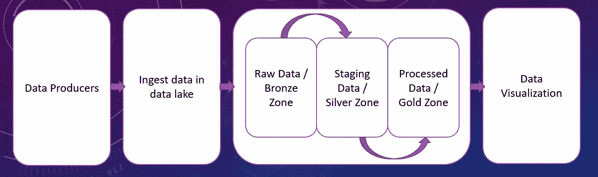
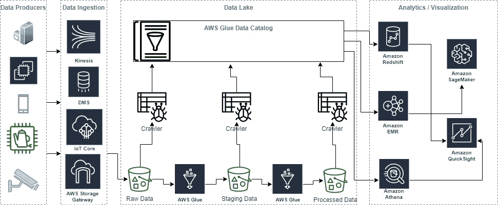

# 在 AWS 中构建数据湖的基础

> 原文：<https://medium.com/analytics-vidhya/fundamentals-of-building-data-lake-in-aws-905ff14300e8?source=collection_archive---------16----------------------->

如果您在这里，那么您可能听说过数据湖，并且非常想了解这意味着什么以及如何构建数据湖。好的一面是，你可能已经建立了一个数据湖，但是你没有意识到这一点。例如，如果您已经构建了一个日志存储解决方案，其中移动了您的服务器或应用程序日志，那么您可能已经构建了一些东西，这是构建数据湖的第一步。让我们详细讨论一下，并理解数据流。
**数据湖不过是一个存储所有结构化和非结构化数据的中央存储库，这些数据随后会被不同的应用程序使用。**服务器或应用程序日志的摄取是在中央位置存储非结构化数据的一个例子。然而，数据湖不仅仅是存储数据，它还根据您定义的模式清理数据并转换成单独的目录。下图解释了数据湖的非常高级但重要的构建块。

下面列出了数据湖的一些重要特性:

*   存储与计算资源的隔离
*   以安全方式存储的数据
*   一个单一的真相来源
*   轻松获取和消费数据
*   可重用模式

让我们解构上面的图形，理解每个方块的含义。
**数据生产者**
数据生产者是那些持续产生数据的资源。这些资源可能像服务器和移动应用一样普遍，也可能像你的咖啡机、你孩子的滑板车甚至你每秒钟心跳的次数一样令人兴奋。如今，数百万台设备生成的数据非常庞大，组织发现很难处理大量数据。这就是为什么他们需要建立数据湖。

**数据摄取**
现在，您已经确定了您的数据生产者，您需要一种机制或流程来捕获数据并将其存储在中央存储库中。其中一个过程称为数据摄取，根据您的使用案例，有几种方法可以做到这一点。

**原始数据或青铜区**
这是数据湖的第一块。数据接收过程主要以原始格式转储数据，这也称为青铜区。这类似于将服务器或应用程序日志转储到某个集中的位置。一些应用程序只需要访问原始数据，这意味着它们不需要对数据结构进行任何额外的转换。然而，如果你在寻找更有意义的结果，而不需要遍历千万亿字节的数据，那么你需要分解这些数据并做一些转换。

**暂存数据或银区**
这个块代表转换后的数据，意味着您已经前进了一步，并根据您的模式定义转换了原始数据。如果您正在构建训练数据集，此过程非常有用，因为它本质上是清理数据，以便您的训练模型针对有意义的数据而不是整个数据集运行。

**处理过的数据或黄金区域**
一旦你转换了数据，你可能需要创建多个单独的目录。它有助于将应用程序与特定目录对应起来，以执行非常明确的流程。存储在此区域中的数据完全专用于特定的使用情形，不能用于一般目的。

**数据可视化**在这个阶段，您将了解数据的价值，以及如何使用这些结果，并可能为一些预测训练您的 ML 模型。

现在我们已经对数据湖块有了基本的了解，让我们在每个数据湖块中加入几个 AWS 服务。下图有助于理解哪种 AWS 服务最适合数据湖的形成。

上图有助于理解 data lake 设置 w.r.t. AWS 服务。既然我们已经讨论了数据湖的基本构建块，我将在我即将发表的一些文章中解释如何在 AWS 中构建一个基本的数据湖。
***快乐学习！***