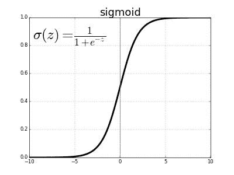
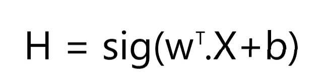
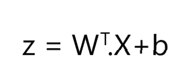
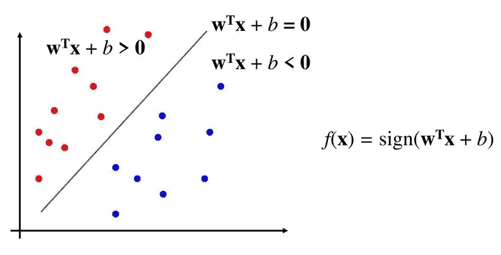
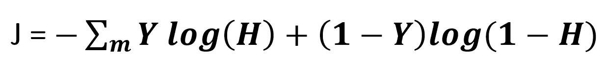
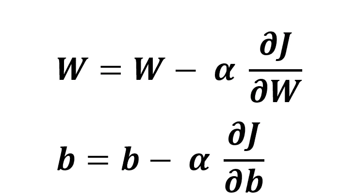
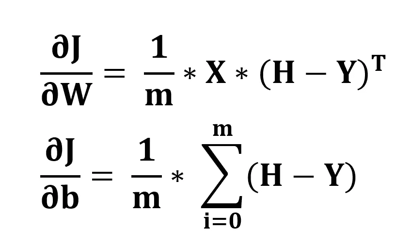
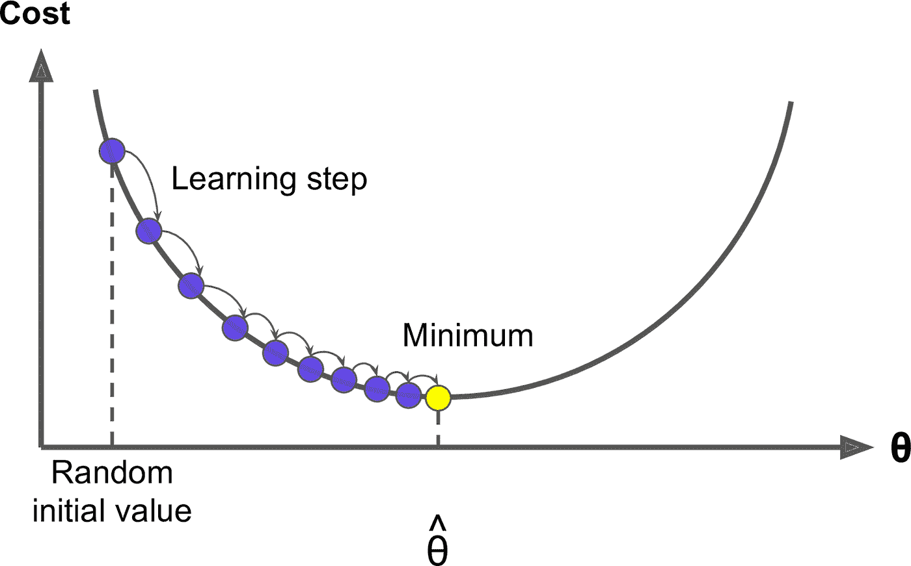

# 逻辑回归基础

> 原文：<https://medium.com/analytics-vidhya/fundamentals-of-logistic-regression-bde451712652?source=collection_archive---------21----------------------->

*这里我们将学习使用逻辑回归的二元分类*

这是逻辑回归系列的第二部分:

1.  逻辑回归基础
2.  [用 Python 从头开始编码逻辑回归](/@omrastogi/coding-logistic-regression-in-python-from-scratch-57284dcbfbff)

逻辑回归是从统计学概念中借用的监督学习系统。“逻辑”这个名称取自逻辑函数，也称为 sigmoid 函数。

sigmoid 函数

显然，这个函数的范围是(0 到 1)，事实本身给出了它在二进制分类中的应用的直觉。

# 假设

在机器学习中，假设是一个等式，用于预测给定输入的输出。假设等式给出了 Y=1 的概率。在我们应用学习算法来改进假设之前，它不应该是准确的。

假设方程

其中，
W →权重矩阵
b →系数矩阵
X→输入矩阵

# 判别边界

z 然后放入 sigmoid

z 是假设的决策边界。

该图显示了决策边界如何划分区域

对于 Z ≥ 0
预测 y = 1，对于 Z < 1 预测 y = 0

# 价值函数

**代价函数** 是一个*函数*，它衡量机器学习模型对于给定数据的性能。成本函数将预测值和期望值之间的误差量化，并以单个实数的形式呈现出来。

其中，
Y →输出
H →假设输出
m →样本数

**成本函数**评分更像是模型的性能报告。这需要通过优化来改进。

# **梯度下降优化算法**

上图是成本与重量的关系曲线。当我们接近理想体重时，成本会明显降低，而当我们超过理想体重时，成本实际上会增加。我们当然希望我们的假设达到最小值。
梯度下降算法背后的思想，是改变权重使之与梯度成比例。如果它更陡，变化将是显著的，对于渐变曲线，变化将是渐进的。

梯度下降的方程式是:

权重和系数的更新

这些梯度的值可以通过计算一些导数来求出。

渐变的值

其中α→学习率。

该程序必须重复**次迭代**，因为下降是以小步进行的。
学习率值对于优化模型学习时间和精度也很重要。将**学习率设置得太低，会减慢训练速度，将学习率设置得太高，根本达不到最小值。**

# 预言；预测；预告

一旦模型建立，假设优化，我们需要预测测试样本的输出。我们知道假设给出了 Y = 1 的预测。因此可以有把握地说:
H≥0.5 → P=1
H < 0.5 → P=0

*希望你喜欢并学会了逻辑回归的概念。我想对吴恩达表达我的感激之情，我最初就是从那里学到这些概念的。*

> 如果你坚持到最后，请鼓掌。这会让我有动力写更多。谢谢你。