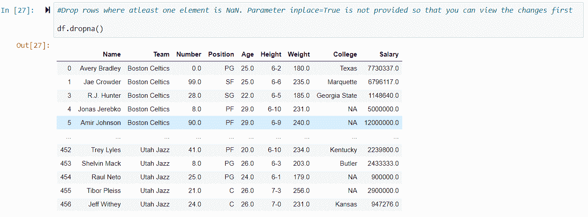

# 熊猫图书馆入门

> 原文：<https://medium.com/analytics-vidhya/fundamentals-of-pandas-library-6182c91114fb?source=collection_archive---------18----------------------->

如果您刚刚开始您的数据科学家/分析师之旅，并且希望从探索一些基本库开始，那么本文就是为您准备的。我将介绍熊猫图书馆，并演示这个图书馆的一些基本但非常有用的功能。

Pandas 是一个 Python 库，主要用于构建数据框，对数据进行某种分析。你可以把 Pandas 想成一个 Excel 电子表格，其中一个电子表格在 Pandas 中被称为**数据框**。

基本上，当你在 Pandas 中读取任何类型的数据时，它会构造一个数据帧，然后你使用几个函数对这个数据帧采取行动。让我们通过做来更好地理解它。和往常一样，我用 Docker 运行带有熊猫功能的 Jupyter 笔记本。

如果你想知道如何用 Jupyter 设置 Docker，请查看我的[文章](/analytics-vidhya/run-pyspark-and-jupyter-notebook-using-docker-bed12ecb755a)。

**导入熊猫并读取数据**
在做任何事情之前，你必须将熊猫导入你的笔记本。完成后，您可以加载数据并构建数据框。您可以使用本地文件或指向 web URL 来加载数据。

在上面的快照中，我在笔记本中导入了熊猫，从本地系统加载了一个数据集，构建了一个数据框并显示了前五条记录。但是我马上想到了一个问题。我的数据集没有标题，这就是为什么熊猫把我的数据的第一行指定为这个数据框的标题。那不是我想要的。让我们纠正这个问题。

如你所见，我添加了一个额外的参数 **header=None** 来避免上述情况。现在我需要解决第二个问题。我需要给我的数据集分配头，这样我就可以理解每个值的含义。

我已经创建了一个标题列表，然后使用 **df.columns** 函数将它分配给我们的数据帧。现在，当您列出数据框的内容时，您可以在顶部看到标题。
现在，我们来了解一下可以在数据框中使用的一些常用函数。

**df.head()和 df.tail()**

**df.dtypes 和 df.describe()**

**处理缺失数据**
数据框中的某些值可能显示为 Nan。NaN 是非数字的简写，它代表缺失的数据。缺失数据也可能是一个？、0(零)、NaN 或简单的空值。
有几种方法可以处理缺失数据。一些受欢迎的是:

*   尝试从数据源获取更多数据
*   用该列的平均值替换缺失的数据
*   删除空值

让我们来看看丢失的数据是如何被替换或丢弃的。
**替换缺失值**

**删除缺失值**
数据可以沿着 axis 定义的行(axis=0，也是默认设置)或列(axis=1)删除。这里有几个例子来证明这一点。

现在基于列删除数据。

我相信一开始就足够好了。由于这篇文章越来越长，我将在接下来的文章中添加更多的函数。
**一如既往*快乐学习！***