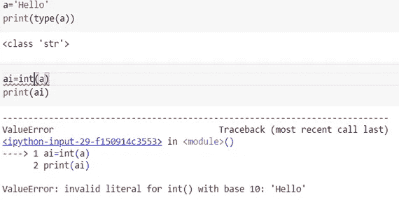

# 数据科学中的 Python 基础

> 原文：<https://medium.com/analytics-vidhya/fundamentals-of-python-in-data-science-a495513f67a9?source=collection_archive---------12----------------------->


[**Python**](http://www.python.org) 是广泛流行且用户友好的通用语言。它被设计成具有高度可读性。Python 是一种解释型语言。这意味着，不像像 *C* 这样的语言及其变体，Python 在运行之前不需要编译。其他解释语言包括 PHP 和 Ruby。


每种编程语言的流行程度。

增长的原因是 Python 对用户友好并且易于调试。它有广泛的库列表，允许我们做比基本脚本更多的事情。对于数据科学来说，Python 作为一种这样的语言大放异彩，因为它有许多库和内置特性，这使得处理需求变得很容易。

在沉迷于 python 基础知识之前，我们应该知道如何[设置 Python 环境](https://docs.python.org/3/using/windows.html)并知道如何使用[文本编辑器](https://realpython.com/python-ides-code-editors-guide/)。现在让我们把注意力集中在 python 的基础上，学习一些关于它的东西。

基本的 Python 教学大纲可以分为以下几个主题

**数据类型:-Int(整数)，Float，Strings**

**数据结构:-列表、元组、字典和集合**

**循环和功能**

**图书馆**

> Python 中的一切都是对象，数据类型是类，变量是这些类的实例。

在深入研究之前，我们应该知道什么是变量。python 中经常使用变量，通常根据变量所代表的内容来命名，以便于解释。基本上，变量是内存中用来存储一些值或数据的位置。

```
x=100
#Here x is a variable and 100 is assigned to Variable 'x'
```

## 数据类型

理解 python 的第一步是它如何解释数据。人们应该永远记住，python 对数据或值有一些理解。有一些广泛使用的数据类型，如整数(int)、字符串(str)、浮点(Float)、布尔

```
a=5            #data type is an integer
print(type(a))**OUTPUT:**
<class 'int'>

                 ****************************************a='Vihaan'    #data type is a stringprint(type(a))**OUTPUT:**
<class 'str'>                  ****************************************a=12.23       #data type is float. It is mainly a decimal number.
print(type(a))**OUTPUT:**
<class 'float'>
```

[**类型转换**](https://www.geeksforgeeks.org/type-conversion-python/) 是 Python 中最重要的基础话题之一。如果可能的话，它基本上是将特定类型的数据或值转换成另一种类型。

```
a='4432'      #a number can be converted into string by using ''
print(type(a))**OUTPUT:**
<class 'str'>ai=int(a)    
print(type(ai))**OUTPUT:** <class 'int'>
```

有时类型转换是不可能的。例如，不能将字符串变量更改为整数变量。Python 会自动弹出一个错误，如下所述。



python 非常优雅的一点是它如何显示错误。对于用户来说，理解他们犯了什么错误以及错误发生在哪里变得非常容易。这也是 python 越来越受欢迎的原因之一。

**琴弦**:用途广泛。基本都是文本数据，他们的操作很有用。其中一些是

使用 *split()* 和 *join()* 方法拆分和连接琴弦。

用 *lower()* 和 *upper()* 方法改变字符串的大小写

用“+”连接字符串

更多详情请参考[和](https://docs.python.org/3/library/string.html)。

## **数据结构**

**列表:**

列表是项目的有序序列。它是 Python 中最常用的数据类型之一，非常灵活。列表中的所有项目不需要属于同一类型。它通常用方括号[]括起来。列表也可以定义为元素的集合。它是一种序列数据结构。


列表是可索引的，这意味着它们有索引值。索引值基本上是分配给列表中元素的值。第一个元素的值从 0 开始。这里举个例子，我们调用列表的第二个值，输出是 3。列表是可变的，这意味着它们可以很容易地被改变。


列表中可以有一个列表，这通常被称为嵌套列表。例如

*A=[1，2，3，'你好'[3，4]]*

我们可以对列表应用一些基本方法。分别是:——*添加*或*扩展列表、排序、反转、删除、追加*等。

**元组:**

元组是与列表相同的有序项目序列。唯一的区别是元组是不可变的。元组一旦创建就不能修改。它们用()括起来。


如果我们试图改变一个现有的元组，Python 将抛出一个错误。


同样，这个错误得到了很好的解释。

元组像列表一样有索引值。元组中可以有元组，这通常被称为嵌套元组。tuple 中有一些重要的方法是 *count()、del()、sort()* 等。

**设定**:

集合是唯一项的无序集合。集合由大括号“{ 0 }”内逗号分隔的值定义。器械包中的物品没有顺序。集合可以用来做数学运算，如并集、交集、对称差。

集合的一个独特之处是它们不允许重复的元素。


集合中使用的一些重要方法是:-

*添加()*

*Pop()* ，从集合中弹出元素并存储到内存中。

*Remove()* ，从集合中完全删除元素。

**字典:**

在 Python 中，字典在大括号{}中定义，每个条目都是一对，形式为 key: value。键和值可以是任何类型。Dictionary 是一个无序的键值对集合。我们可以通过元组列表来创建字典。


关于字典的更多细节，请参考[本](https://www.w3schools.com/python/python_dictionaries.asp)。

## 循环和函数


**循环:**

顾名思义，loop 就是反复迭代，直到条件变为 false。该图清楚地说明了循环是如何工作的。

主要有两种类型的循环值得关注

While 循环

For 循环

**While 循环:**

只要表达式为真，While 循环就用于迭代代码块。


While 循环的语法。

在循环中，缩进非常重要。Python 使用缩进作为语句分组的方法。如果条件为真，循环将遍历所有缩进的代码。

下面是一个 while 循环如何工作的例子。


**For 循环:**

Python 中的 for 循环用于迭代序列(列表、元组、字符串)或其他可迭代对象。遍历一个序列叫做遍历。


For 循环的语法。


For 循环的工作原理。

**功能:**

函数是一组执行特定任务的相关语句。

函数有助于将我们的程序分成更小的模块。随着我们的程序变得越来越大，函数使它更有组织性和可管理性。

[**DRY 原则**](https://realpython.com/lessons/dry-principle/#:~:text=Idiomatic%20Python%20101&text=The%20DRY%20or%20%E2%80%9CDon't,comparisons%20in%20your%20Python%20code.) 即“不要重复自己”,这是一个经常被用来开发实践的原则，以使代码更可重用，更少重复。


上图显示了函数的流程以及调用或使用它的时间。使代码更具可读性，减少冗余，使代码可重用，并节省时间。


举例说明函数如何工作。

我们可以通过在括号内指定适当参数的名称来调用函数。如果没有调用传递的参数数量，它将显示一个错误。例如，这里我们必须传递两个参数来调用函数。

## **图书馆**

在数据科学中，我们使用很多库。举几个例子，我们经常使用 pandas，Matplotlib，NumPy 等。关于库的事情是一个人永远不应该害怕或克制自己去学习新的库，因为事实是只要编程还活着，新的库就会被开发出来。

更新自己是编程和数据科学的口头禅。

如何将库导入工作区？


Math 是 python 中使用的库之一。

要了解更多关于[数学](https://docs.python.org/3/library/math.html)或[数字](https://numpy.org/)的信息，请参考相关链接。

这些库和模块定义了我们可以用来完成任务的类、属性和方法。最重要的是学会如何阅读图书馆的文献。

这将涵盖编程的基础(Python)。这里并没有涵盖所有的内容，但是随着我们继续做不同的项目，我们会变得更加熟悉和习惯。

我们的 Python 编程基础教程到此结束！

谢谢你。

请给予反馈，并询问您的疑问。我很乐意帮忙。

## 参考

[https://www . statista . com/chart/21017/most-popular-programming-languages/](https://www.statista.com/chart/21017/most-popular-programming-languages/)

[https://www.python.org/doc](https://www.python.org/doc/essays/blurb/#:~:text=Python%20is%20an%20interpreted%2C%20object,programming%20language%20with%20dynamic%20semantics.&text=Python's%20simple%2C%20easy%20to%20learn,program%20modularity%20and%20code%20reuse)

[**https://www.w3schools.com/**](https://www.w3schools.com/)

[**https://www.tutorialspoint.com/python/python_loops.htm**](https://www.tutorialspoint.com/python/python_loops.htm)

[**https://www.appliedaicourse.com/wp 内容/上传/2017/11/function _ works . jpg**](https://www.appliedaicourse.com/wp-content/uploads/2017/11/function_works.jpg)

个人网站:-[https://vihaanshah29.github.io/](https://vihaanshah29.github.io/)