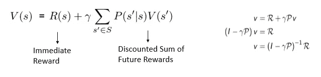

# 强化学习的基础

> 原文：<https://medium.com/analytics-vidhya/fundamentals-of-reinforcement-learning-81deca1b71c6?source=collection_archive---------23----------------------->

## 学习做出与众不同的决定

使用强化学习的学习代理人玩 Atari 游戏(太空入侵者和突围)

# 介绍

由于各种原因，如计算能力的提高、实验资源的可用性等，设计能够学会自己完成工作的机器是近来研究最多的课题之一。，这导致发现重大创新，使生活更简单。如果你只有数据，那么算法将提供见解，或者你训练一个模型，它识别你的脸和我们周围看到的许多其他用例，这些用例是使用机器学习和深度学习建立的。强化学习因其在制定**顺序** **决策**过程中已被证明的能力而获得了很多关注，因此正在蓬勃发展。

# RL 的概念

强化学习基本上由一个**代理**(决策者)组成，它试图从给定环境中的**状态**中学习，它与被称为**环境**的环境交互，并根据在**情节**期间环境提供的反馈采取的某些**动作**来改变其状态。这种反馈是数字的(正、负或零)，被称为**奖励**。代理的最佳行为是学习，这样它总是得到好的反馈，即通过采取适当的行动来最大化回报。因此，在 RL 中，我们向代理提供场景，它可以自己找出答案，或者发现如何以最受欢迎的方式做出决定。

智能体在强化学习中的学习周期

让我们以众所周知的 PUBG 游戏为例来理解 RL 中使用的术语:

*   PUBG 中的玩家在这里是一个**代理**，战场是他的**环境**
*   一个完整的游戏是一个**插曲**，行走、奔跑等是**状态**——帮助选择动作
*   代理有许多**动作**要做，如向左、向右、向前和向后移动、奔跑、射击、杀戮、弯腰、跳跃、换枪等。,
*   代理人在这里得到的奖励是正面的，如果他杀了人，如果他在队友的帮助下生存到最后，奖励为零；如果他被其他玩家射杀，奖励为负面。

为了赢得比赛，我们必须在每个时间段采取适当的行动，以获得最大的回报。简单地说，我们从一个状态开始，采取一个行动，然后改变到另一个状态，并为该行动获得奖励，并重复该过程以了解更多关于环境设置的信息。

RL 面临的挑战很少。其中一些是:

*   权衡:正如我们所理解的，代理人必须优化报酬，还必须不断地与环境互动，即，它需要探索很多。这导致了勘探和开发之间的权衡。它必须选择是否应该继续探索可能导致较低回报的新状态，或者选择已经看到并获得相当多回报的道路。
*   概括:代理能理解或学习在它以前看不到的状态下行为是好是坏吗？
*   延迟后果:我们还需要理解，如果一个代理人在当前状态下给出了很高的奖励，是因为仅仅是这种状态还是它为达到这种状态而采取的一系列决策？

适用于 RL 的关键概念很少。对这些的良好认识将让我们理解智能体决策过程和环境模型的形成。

**马尔可夫性质:**如果一个主体从一种状态变化到另一种状态，这叫做转移，它进行转移的概率叫做转移概率。一般来说，如果我们有一个主体从一种状态到另一种状态的所有概率，那么它就用一个转移矩阵来表示。马尔可夫性质说“*未来独立于过去给定的现在*”。下面的等式描述了在时间 t 内转移到下一个状态 St+1 的概率仅取决于当前状态 St 和在处采取的动作，而与历史无关

这是转移概率矩阵，它包含了所有状态的转移概率。例如，P12 描述了从状态 1 转换到状态 2 的概率，依此类推。

当我们遍历环境中遵循马尔可夫性质的一组状态时，就称之为马尔可夫链。它们可能包括马尔可夫链中的随机状态集，也有转移概率，我们可以计算出导致高回报的最优链。

*   在 RL 中，我们更关心优化代理从环境中获得的总回报，而不是它通过从一个状态转换到另一个状态获得的即时回报。所以我们用一个叫做**回报(Gt)** 的函数来衡量最优性，这个函数是代理人从时间 t(等式 1)收到的回报的总和。
*   在雅达利、阿尔法围棋、国际象棋或 PUBG 等许多游戏中，我们知道游戏会在特定的时间步骤后终止。如果这是设置，那么它被称为**阶段性**任务。如果我们开始另一个游戏，那么我们就开始了新的一集，所以每一集都是相互独立的。还可能存在这样的问题，即它不会像用于个人辅助的某些机器人那样结束，这些机器人直到来自环境的外部信号将其置于终止状态时才终止。这些被称为**连续**任务。

在情节性任务中，我们可以计算回报，这是其奖励的总和，直到终止，但在连续任务中，由于没有终止，在计算回报时，奖励总计为**无穷大**。所以我们引入一个折现因子 gamma **(ɤ)** 通过折现来计算连续任务的收益。它的值从 0 到 1。它在决定我们是重视眼前的回报还是未来的回报方面起着至关重要的作用。如果 **ɤ=0** 那么注意力就在眼前的奖励上，如果 **ɤ=1** 那么就在未来的奖励上。

等式 1 —使用时间步长 t 的折扣系数返回

如果我们有一个问题陈述，说你在接下来的 k 个时间步骤中执行某个动作得到 1 的奖励，折扣因子为 0.8 和 0.2，那么回报将是

γ分别为 0.8 和 0.2

> 我们看到，ɤ=0.8 的 Gt 甚至在未来也有不错的回报，但是ɤ=0.2 的回报仅在当前的时间步长内是高的，在未来几乎趋于零。因此，基于问题陈述，我们可以设置 **ɤ** ，以便于决定**立即**或**未来**奖励的重要性。

我们现在知道一个代理改变了它的状态，并因为这种转变而获得了奖励。让我们通过一个例子来详细了解:

考虑这样一种情况，其中学生是代理，他有四个状态家庭、学校、班级、电影和折扣因子 0.8。从一种状态转换到另一种状态的概率显示在蓝色方框中，奖励显示在棕色方框中。代理可能有许多情节，即一系列的状态遍历。举个例子，

1.Home-> School-> Class-> Home-> termin ate—让我们计算 state Home 的返回。G = 3 + 5*0.8 + 5*0.8*0.8 = 10.2
2。Home->School->School->Movie->Home->termin ate—本集收益为 G = 3+2 * 0.8+(-10)* 0.8 * 0.8+3 * 0.8 * 0.8 =—0.264

很明显，第一集比第二集有更高回报。所以跟着它走是可行的。收益是一个重要的概念，因为它可以决定代理人的最优路径。

# 马尔可夫奖励过程(MRP):

MRP 是一个马尔可夫过程设置，它指定了一个奖励函数和一个折扣因子 **ɤ.**使用下面列出的元组(S，P，R，γ)来正式表示它:

*   s:有限状态空间。
*   P:指定 P(s`|s)的转移概率模型。
*   r:将状态映射到奖励的奖励函数(实数)R(s) = E[ri |si = s]，∀ i = 0，1，.。。。(E 是期望值，I 是每个时间步长)
*   γ:折扣因子-介于 0 和 1 之间。

**状态价值函数:**状态价值函数 Vt(s)是在时间 t 从状态 s 开始的期望收益之和

简单地说，价值函数表示一个代理人在那个特定状态下有多好。在情节中导致高回报的状态之间的转换是最佳的 MRP。我们有不同的方法来评估 V(s)。他们是

1.蒙特卡洛模拟法:在 MRP 中，对每集的收益进行计算和平均。所以状态值函数计算为 Vt(s)= Sum(Gt)/发作次数。

2.解析解:如果时间步长的数量是无限的，那么我们无法计算回报的总和或平均值。在这个过程中，我们定义γ<1 and State value function is equal to sum of Immediate Reward(reward obtained for transitioning from State s to s`) and discounted sum of future rewards. The equation can be represented in Matrix form as V=R + γPV. Rearranging gives V by multiplying inverse matrix of (I − γP) with R.

3\. Iterative Solution: In this method we calculate Value Function at time step t by iterating through its previous value functions at time t-1,t-2 etc., We will look into this in depth soon.

# Markov Decision Process (MDP):

An MDP is simply an MRP but with the specifications of a set of actions that an agent can take from each state. It is represented a tuple (S, A, P, R, γ) which denotes:

*   S : A finite state space.
*   A : A finite set of actions which are available from each state s.
*   P : A transition probability model that specifies P(s`|s).
*   R : A reward function that maps states to rewards (real numbers) R(s) = E[ri |Si = s, Ai=a] , ∀ i = 0, 1, . . . .(state s, action taken a, E here is expected value and i is every time step)
*   γ : Discount factor — lies between 0 and 1\. An episode of a MDP is thus represented as (s0, a0, r0, s1, a1, r1, s2, a2, r2, . . .).

In MRP, we have transition probability of going from one state to the other. In MDP, the notation is slightly changed. We define transition probability with respect to action as well P(Si+1|Si , ai). An example of robot transitioning between different states also depends on the action it takes if its moving forward, left, right or halted. All the other notations of returns(Gt), discount factor(γ) are exactly the same as referred in MRP.

# Policy and Q-Function:

Suppose there is a robot which is currently at a state S1, it can take actions left or right with probabilities al and ar respectively for taking left or right which lands in two different states S2 and S3\. Value function and rewards of that state are also mentioned and discount factor = 0.8

Let us calculate the value function of S1:
V1 = al(R+γ* V2)+ar(R+γ* V3)
= al(2+0.8 * 10)+ar(1+0.8 * 15)
= al * 10+ar * 13.5

如果 a1 = 0.2，ar = 0.8，那么 **V1 = 12.8** ，如果 a1 = 0.8，ar = 0.2，那么 **V1 = 10.7** 显然给出了采取行动的更大概率 **ar** 将给出状态 S1 值方面的更好结果。

> 为了评估过渡到一个状态有多好，我们使用**值函数**，但是为了确定从这个状态采取**动作**‘a’有多好？这就是**政策**概念的由来。

## 政策π:

在 MDP，政策是一种将状态映射到行动的决策机制。对于策略π，如果在时间 t 代理处于状态 s，它将以π(a|s)给出的概率选择动作 a。

给定一个政策 **π** 我们如何评估它是好是坏？直觉和 MRP 一样，我们计算预期的回报。我们可以定义如下:

**状态价值函数**(过渡到一个状态有多好):价值函数在一个代理的给定状态 s，是通过遵循一个策略 **π** 并到达下一个状态，直到我们到达一个终止状态所获得的期望收益。

## 状态-动作值函数或 Q-函数:

状态 s 和行动 a 的状态-行动值函数被定义为从时间 t 时的状态 St = s 开始并在= a 时采取行动，然后遵循策略π的预期回报。它在数学上写为

这告诉我们，在状态 s 遵循策略π的情况下，执行动作 a 的价值。

这些只是 RL 中 MDP 的积木。还有更多的概念，如贝尔曼备份运营商，寻找最佳价值函数和政策和动态规划等。，让我们在我的下一篇博客里看看吧。

希望这篇文章能让你对 RL 的理解有所提升。

感谢您的宝贵时间！