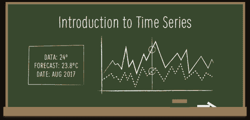
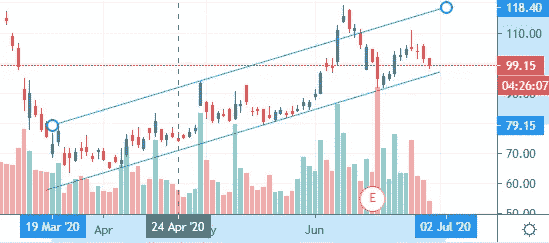
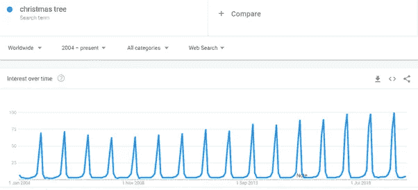
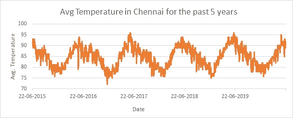
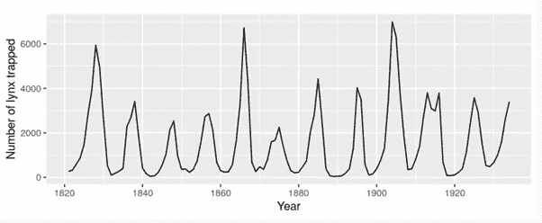
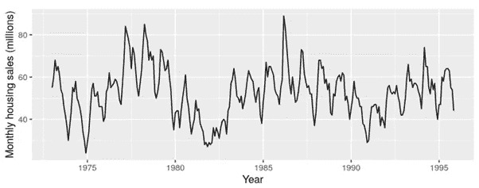
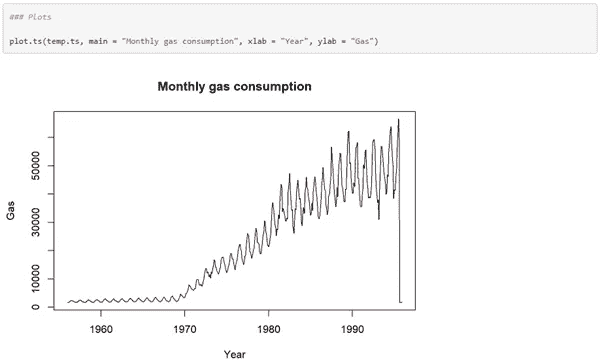
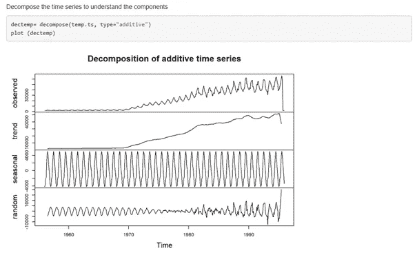
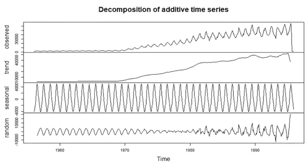
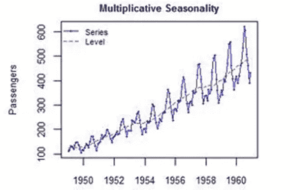

# 时间序列预测基础

> 原文：<https://medium.com/analytics-vidhya/fundamentals-of-time-series-forecasting-315b7b729bcb?source=collection_archive---------27----------------------->

如果你能知道自己下周要花多少钱，那不是很有趣吗？或者你能说出第二天你会睡多少小时吗？

*我完全知道该怎么做，因为人类的大脑在受到挑战时会变得好奇。*

时间序列简介

**那么，该如何着手呢？**

数据科学中有一个独立的部分让我们做准确的事情——基于历史数据的预测。这种预测的数据最好是在连续的时间段内收集的数据点，按时间顺序排列。这种特殊的数据称为“时间序列”。

这种数据在以下方面不同于其他表格数据

*   数据点需要在点时间上连续。
*   数据点不是独立的。

由于这些特征违反了大多数基本的统计模型，这种数据只能用一种独特的建模技术——“时间序列分析”来处理。

# 基础优先…

甚至在我们进入建模的本质之前，我们需要确保我们对时间序列在预测中的独特性有一个基本的了解。任何时间序列数据都可能有以下几个或几个组成部分。

*   趋势
*   季节性
*   周期性
*   随机性

趋势、季节性和周期性是“系统”的组成部分，表明有一个潜在的模式。然而随机性不能归因于一个单一的原因。

那么，我们如何观察一个趋势呢？

例如，让我们看看下面的图表。它包含了塔塔汽车公司过去三个月的股票价格。乍一看，我们可以看出这是一个时间序列数据，因为，

我们知道这样一个事实，即数据点是定期收集的。

我们还知道数据没有断点。

为了进一步保证，数据点不是独立的。我们知道昨天的股价对今天的股价有很大的影响。

我们可以看到，在这三个月中，数据点呈现出积极的趋势。因此，趋势线显示整体上升。

这解释了如何定位趋势。

**季节性怎么样？我们如何发现季节性数据？**

在谷歌上搜索“圣诞树”。摘自谷歌趋势。

上图显示了谷歌搜索“圣诞树”的次数。因此，在节日期间——大约在 11 月到 12 月——人们在谷歌上搜索圣诞树的次数会出现一个高峰。以上数据可以确认为季节性数据。

季节性数据的另一个例子可以是温度数据。例如，下图显示了过去 5 年钦奈的平均气温。说明每年夏季有一个高峰，冬季有一个低谷。总的来说，气温是有季节效应的，这才有意义。

钦奈的平均温度在 5 月至 6 月达到峰值，在 11 月至 12 月达到低谷

好吧。现在我们知道什么是季节性，什么是趋势。现在让我们理解什么是循环性。简单地说，术语“循环”指的是在一段时间内定期发生的事情。

但是，季节性也是如此。对吗？我的意思是，温度通常在夏天达到最高点，在冬天下降。

那么，是否意味着气温数据是周期性的，而不是季节性的呢？

让我们更深入地探讨一下。

当数据呈现非固定周期的*上升和下降时，存在**循环**模式。*

**季节性**模式存在于序列受季节性因素影响时(例如，一年中的季度、一个月或一周中的某一天)。季节性总是有一个固定的和已知的时期。

下图生动地解释了这两个术语。

显示每 35-40 年循环模式的图表。

上面的图显示了几乎每十年重复的行为。(8 或 9 次)。因此，y 轴上升和下降的周期不是恒定的。因此，这些数据对应于循环数据集。

现在，让我们以下面的图为例。

显示每年季节性数据的图(固定)

这里我们可以看到一年之内有一个模式，每年都在不断重复。所以这里波动的周期是恒定的——1 年。因此，该数据对应于季节性数据集。

有趣的是，在上面的图中，房屋销售每 6 到 10 年增加和减少一次，这表明数据也可能是周期性的。

这就给我们留下了最后一个要素——“随机性”

每个时间序列都有一些不可预测的成分，使其成为一个随机变量。这种随机性可能是由于所考虑的数据集中存在异常值而造成的。

**让我们举一个例子，在 r 中处理它。**

在本文中，我考虑了 R—“gas”的“timeseries”包中的内置数据，该包包含了从 1956 年到 1995 年澳大利亚每月天然气产量的数据。

首先要做的是绘制数据，并检查四个不同组件的视觉线索。执行 plot.ts()命令为我们提供了以下图形。

一个内置 R 时间序列数据的曲线图——“气体”

首先看一下图表，我们知道

在 1970 年至 1997 年期间，出现了明显的积极趋势。

每年都有季节性，年中有一个高峰。

这些年来没有数据循环移动的迹象。

**让我们仔细看看这些组件。**

为了详细分析时间序列，我们需要将时间序列分解为其核心部分。我们通过使用**分解()**函数来实现。

时间序列数据的分解版本，显示了三个组成部分。

上图是分解()函数的输出。它由四个部分组成

1.观察到的-具有包含原始数据的图

2.趋势——TS 的趋势部分

3.季节性——TS 的季节性成分

4.随机——TS 的不规则或随机成分

**分解系列可以通过两种方式完成**

**相加分解—** 相加后的成分给出了实际观察到的数据。这种类型的分解是在对季节性强度每年不变的数据建模时完成的。全世界圣诞树的销量每年都是 100 万棵。这里的季节性被假定为常数，因此我们更喜欢一个附加模型。

加法时间序列的一个例子

当你看到上面的图时，你可以推断出季节成分的强度在一年中是不变的。因此，对于像上面这样的数据集，附加建模将是更可取的。

**乘法分解** —这是分量相乘后给出实际观察数据的地方。这种类型的分解是在对季节性强度每年增加或减少的数据建模时完成的。如果我们举同样的例子，如果全世界圣诞树的销量每年增长 10%，我们会选择一个乘法模型。

乘法时间序列示例

虽然上图显示，季节性成分的强度在一年内有所不同。因此，在这种情况下，乘法模型将是首选。

# 后续步骤...

现在，我们都熟悉了时间序列的基本原理，是时候深入研究时间序列数据的更高级建模技术了，如 ARIMA 和指数平滑。