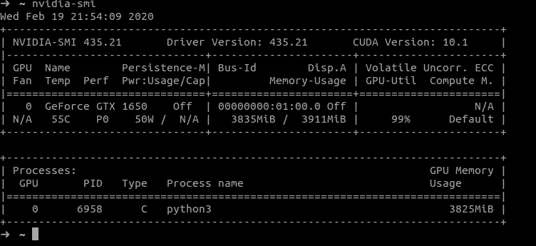
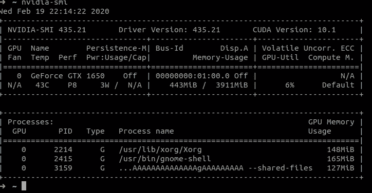
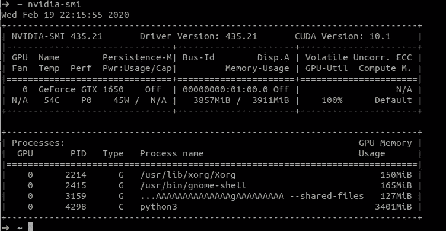
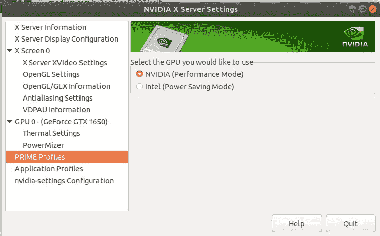
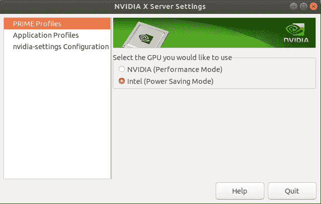
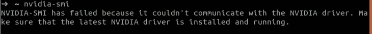
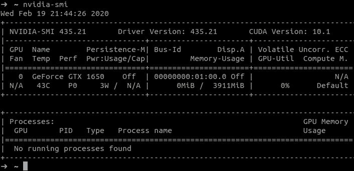

# 进一步调整以改善 ML 训练体验

> 原文：<https://medium.com/analytics-vidhya/further-tweaks-to-improve-ml-training-experience-2ec73ae59f07?source=collection_archive---------16----------------------->

这是上一篇文章[ML 入门…](/@lijojose/getting-started-with-ml-without-much-of-software-installation-dependencies-1ce37f14b603) 的继续。

在这里，我们将讨论更多关于调优系统以获得更好性能的几点。

# 对 ML 使用完整的 GPU

(在本文中，假设 nvidia gpu 和英特尔集成 gpu 都在计算机中。)

1.  运行命令 *nvidia-smi* ，查看使用 GPU 的进程列表。你将能够看到，nvidia GPU 被其他一些应用程序所使用。(主要是显示驱动程序)。

2.运行培训后，您将能够看到 GPU 内存并未完全用于 ML 培训，如下所示。

3.第一件事将是改变显示的 GPU。为此，你必须打开 nvidia 设置(通过运行命令 *nvidia-settings* )。您将能够看到，nvidia 被选中，而不是英特尔，如下所示。

4.换成 Intel，重新登录(**最好重启**)。

5.现在，如果您运行 nvidia-smi，您将能够看到 nvidia gpu ̶i̶s̶ ̶f̶r̶e̶e̶驱动程序没有加载。

6.当我用 gpu 在 tensorflow docker 上运行培训时，我看到了下面的屏幕

我让我的 GPU 完全用于我的训练…

7.一旦我停止跑步训练，我就可以完全免费使用 nvidia GPU。

试试这个。您将能够像这样配置培训服务器，以充分利用 GPU。

接下来还有更多调整…

下一部分是[这里是](/@lijojose/docker-tensorflow-gui-matplotlib-6cdd327d4a0f)