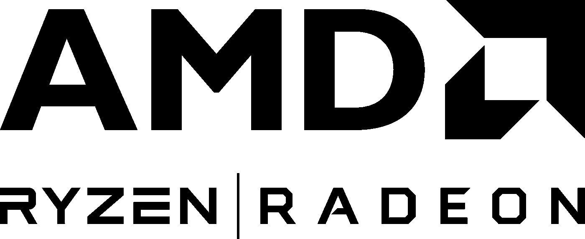
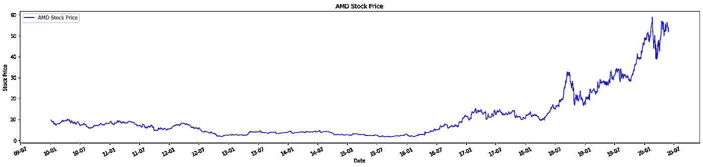
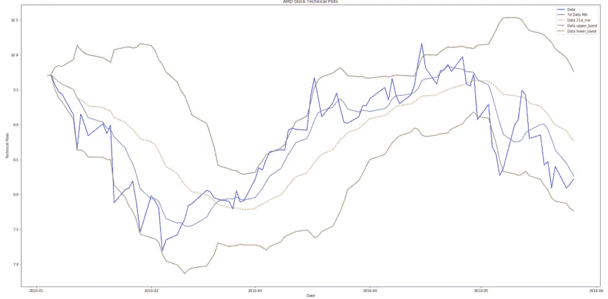
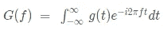
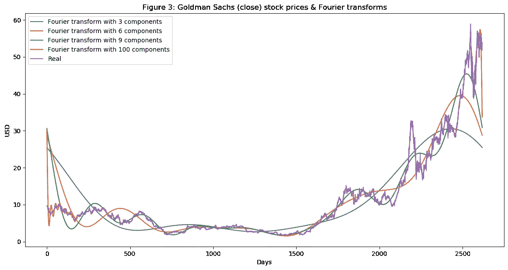
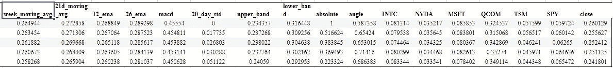
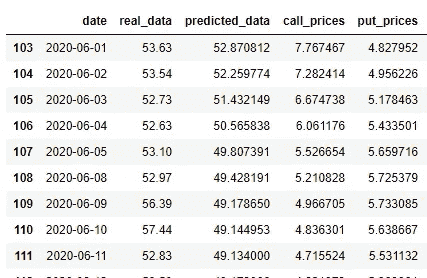

# 通过生成数据使用深度学习来预测看涨和看跌价格

> 原文：<https://medium.com/analytics-vidhya/future-prediction-of-call-and-put-prices-using-deep-learning-by-generating-data-7d08079ffe93?source=collection_archive---------11----------------------->

# 简介:

code:[https://github . com/maagalamharsha/Future-Prediction-of-Call-and-Put-Prices-using-Deep-Learning/tree/cf 17 bbad 010 e 00d 66 b 86 AE 0ec 598 C1 dbbc 09 bcac](https://github.com/maagalamharsha/Future-Prediction-of-Call-and-Put-Prices-using-Deep-Learning/tree/cf17bbad010e00d66b86ae0ec598c1dbbc09bcac)

AMD 标志

股市预测一直是仅次于计算机视觉的深度学习的最广泛应用之一。这些将用于各种对冲基金，以产生最大的投资回报。我们正在解决的问题是缺乏未来日期的数据，即我们没有未来日期的实时数据。我们将对没有数据的未来日期进行预测。这可以应用于我们给定的相关行业的任何股票价格。

在这篇博客中，我将通过几个其他公司的股票价格数据来展示对 AMD 的预测。请注意，对于未来的日期，我们将不会获得任何与新闻极性相关的数据(即基本面数据)，我们只会使用技术数据进行预测。

# 数据:

我们考虑 2010 年 1 月 1 日至 2020 年 5 月 31 日的培训数据，所有数据均从 Tingo API 获取。请考虑截止日期为 2020 年 5 月 31 日。这是因为在写这篇博客的时候，我们可以得到 2020 年 10 月 11 日的数据，但是我们想要一些真实的数据来比较。

让我们看看 2010 年的数据。

自 2010 年以来的 AMD 股价图

我们可以像往常一样看到，自 2007 年金融危机以来，该股一直在上涨，自 2017 年以来，由于锐龙宣布推出 CPU 系列，该股已大幅上涨。对于这个模型，我们还将考虑其他各种公司数据。我们不能认为 AMD 是唯一的公司，在金融界所有的公司都是相互关联的。
例句:AMD 和 Intel 是竞争对手，大多数时候它们的动向是成反比的。

因此，我们会考虑英特尔(INTC)、英伟达(NVDA)、微软(MSFT)、高通(QCOM)、TSMC(TSM)、S&P 交易所交易基金(ETF)等公司的股票收盘价。

# 目标:

我们将预测 AMD 未来 10 天的股价，即从 2020 年 6 月 1 日到 2020 年 6 月 12 日，而不考虑未来的数据。

**技术特征:**
利用目标公司的收盘价，我们增加了一些财务技术指标特征。
**7 日移动平均线:**是滚动的 7 日移动平均线。这是一个非常接近实际股价的特性。
**21 日移动平均线:**与 7 日移动平均线相同，但窗口宽度更大，为 21 日。
**均线敛散性:**是一种趋势动量指标，表示股价的两条均线之间的关系。
MACD 的计算方法是从 12 期均线中减去 26 期指数移动平均线(EMA)。
**布林线:**这是两个最大值和最小值指标，显示距离 20 日简单移动平均线有 2 个标准差。

这是所有技术特征的绘图样本

**傅立叶变换:**
傅立叶变换是一种统计函数，它输出一系列正弦波，这些正弦波是实际函数的近似。它的工作原理是对实际函数去噪，得到的函数是近似函数。我们将增加傅立叶变换的两个方面，**角度**和**绝对值** ( **震级**)

傅立叶变换公式

不同通道傅立叶变换的示例图

**相关公司:**
现在我们再加上其他公司同期收盘价。这就像，当我们希望 AMD 成为我们的目标时，我们将把其余公司的收盘价作为独立变量。

**Ex:**
1)当 AMD 是我们的目标变量时，其余的公司像英特尔(INTC)、英伟达(NVDA)、微软(MSFT)、高通(QCOM)、TSMC(TSM)、S & P ETF(SPY)都将是我们的因变量。
2)当英特尔是我们的目标变量时，其余公司如 AMD(AMD)、Nvidia(NVDA)、微软(MSFT)、高通(QCOM)、TSMC(TSM)、S & P ETF(SPY)将是我们的因变量。

预处理后的数据格式

**方法论:**
目的是在没有提供数据的情况下进行预测。所以我们必须运行一个循环来保存我们需要预测的天数。对于每一个循环，我们需要得到我们数据集中所有公司的预测。有了当前可用的数据，我们可以得到 2020 年 6 月 1 日的预测，但未来几天我们没有数据。这里是预测的使用，我们知道我们可以使用其他公司和技术特征数据来获得 AMD 的预测。同样，我们可以获得其余公司的预测，这样我们就可以获得数据集中所有公司 2020 年 6 月 1 日的预测收盘价。

我们将 2020 年 6 月 1 日的预测纳入实际数据集，同样的过程将持续到循环结束。请注意，在预测未知数据的未来数据时，我们将无法捕捉任何与基本新闻相关的数据，这些数据是进行微观调整的结果。

为了进行预测，我们需要一个模型。我们使用一个有 500 个单元的基本 LSTM 网络。该模型的输入将是 70 天的历史数据。

数据看起来像是 **t-70** 、 **t-69** 、 **t-68** … **t** 。并且该特定观察的目标将是目标公司在时间 **t** 的价格。

培训和生产伪代码

**期权定价:**

它是一种通过支付溢价以特定的未来固定价格购买资产的方式，并且仍然拥有行使它的选择权。当我们知道股票的未来价格时，通常是在月底，这种策略就会奏效。

如果我们确定了月末股票价格的波动范围，我们可以购买一个看涨期权，并在月末以低于市场价格的价格行使它。

我使用布莱克-斯科尔斯定价模型，用预测价格计算看涨和看跌价格。

**布莱克-斯科尔斯定价模型:**布莱克-斯科尔斯模型，又称布莱克-斯科尔斯-默顿(BSM)模型，是期权合约定价的数学模型。特别是，该模型估计了金融工具随时间的变化。它假设这些工具(如股票或期货)的价格将呈对数正态分布。利用这一假设，并考虑其他重要的变量，该方程得出了一个看涨期权的价格。(来源:[https://www.investopedia.com/terms/b/blackscholes.asp](https://www.investopedia.com/terms/b/blackscholes.asp))

执行价格:在到期日买入/卖出股票的价格

买入价格:一种在到期时以执行价格买入股票的期权，与股票的实际市场价格无关

看跌价格:一种在到期时以执行价格出售股票的期权，与股票的实际市场价格无关

使用预测价格数据预测买入和卖出价格(买入价格:50 美元)

**未来工作:**
随着**生成对抗网络**的最新进展，我们可以生成几乎看起来像真实数据的数据。GANs 在计算机视觉应用程序中非常流行，用于生成人类的假图片(深度假)。

当你看彩色图像的数据时。我们会得到一组数字。因此，GAN 会生成我们的数据集中没有的新数组。

GAN 包含两个网络 1)发生器和 2)鉴别器。所有实际数据将被标记为 1，来自发生器的假数据将被标记为 0。我们交替更新生成器和鉴别器中的权重。我们继续训练这些模型，直到鉴别器中的损失非常高，并且它不能确定假样本和实际样本之间的差异。

因此，同样的方法也可以在我们的应用程序中实现，我们可以向鉴别器提供 10 天的实际数据，并生成一个样本作为第二天的数据。但是由于 gan 是概率模型，所以结果不会每次都相同，并且还需要考虑时间复杂度。gan 很难训练，而且生成的数据通常不可靠。想象一下，一家投资公司生产氮化镓，而数据不可靠，这可能要花费数百万美元。

我也尝试过 GANs，但是生成的数据并不代表实际数据。这将是未来继续研究的一个领域。(如有任何成果，将发布)

**推荐人:**
[鲍里斯 B](https://towardsdatascience.com/aifortrading-2edd6fac689d) :
我从他的工作中学到了很多，学会了如何应用计算机视觉应用软件 GANs 在股票市场上的应用。还有我博客中用到的一些技术指标。
[杰森·布朗利](https://machinelearningmastery.com/time-series-forecasting-long-short-term-memory-network-python/):

我能够理解 LSTMs 和 LSTMs 所需的数据准备，它帮助我开发了一个基本的 LSTM 网络，该网络足以获得非常准确的预测。

[量化交易中基于组合优化的长短期记忆网络股票预测](https://www.mdpi.com/2076-3417/10/2/437/pdf):

这有助于我识别数据的来源。我所有的数据都是从这篇研究论文中列出的来源获得的。

[应用人工智能课程](https://www.appliedaicourse.com/):

LinkedIn: [哈莎·瓦尔登·马加拉姆](http://www.linkedin.com/in/mharsha-vardhan)