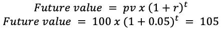
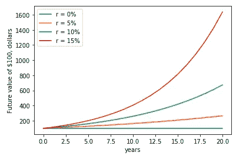
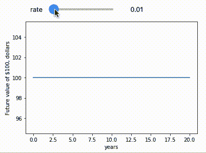

# 未来值和 Ipywidgets

> 原文：<https://medium.com/analytics-vidhya/future-values-and-ipywidgets-ce45e4d6a076?source=collection_archive---------16----------------------->

*如何使用 Ipywidgets 可视化不同利率下的未来值？*


T 这里有一些计算，通过可视化他的术语，甚至变得更容易。此外，我们越早开始投资，未来的收益就越多。当然，在“为未来节省资源的游戏”的等式中还有几个其他变量，但现在这里将呈现两个变量:**利率** **和**时间**。**

## 未来价值

金融学最基本的原理是:*今天一块钱比明天一块钱值钱。*这意味着金钱具有时间价值。

如果你在银行账户上投资 100 美元，年利率为 5%。第一年，您将获得 0.05 美元 100 美元 5 美元的利息，您的投资价值将增长到 105 美元:



## 如果我们能“看到”这个呢？

现在，上面的等式可以用 python 来表示。我们可以使用未来值公式或者利用库 [*Numpy 财务*](https://numpy.org/numpy-financial/latest/) *。*

numpy 财务模块包含函数 future value，*。fv(rate，nper，pmt，pv)* ，它允许您像以前一样用几个简单的参数计算投资的未来价值:

*   **收益率**:投资的收益率
*   nper:投资的寿命
*   **pmt** :每期期初或期末的(固定)付款(本例中为 0)
*   **pv** :投资的现值

需要注意的是，在这个函数调用中，如果 pv 参数表示负的现金流(现金流出)，则必须将负值传递给 PV 参数。

首先，我们必须导入库:

```
# Importing the libraries
import numpy as np
import numpy_financial as npf
import matplotlib.pyplot as plt
```

然后，用 Numpy 的。fv()函数，计算两年内每年回报率为 5%的 100 美元投资的未来价值。

```
# Calculate investment
investment = npf.fv(rate=.05, nper=2, pmt=0, pv=-100)
print("$" + str(round(investment, 2)))$110.25
```

## 利率越高，你的储蓄增长越快

接下来，您将看到如何在同一个图表中绘制投资 100 美元的不同利率(0%、5%、10%和 15%)。

```
plt.figure(figsize=(10,8))
y = [npf.fv(rate=np.linspace(0,0.15,num=4), nper=i, pmt=0, pv=-100) for i in range(21)]
```

在 rate 下使用函数 np.linspace(0，0.15，num=4)允许在 0 和 0.15 之间的范围内绘制 4 条曲线(num=4)。

```
plt.plot(y)plt.legend(["r = 0%", "r = 5%","r = 10%" , "r = 15%"])plt.ylabel('Future value of $100, dollars')
plt.xlabel('years')
```

由于比率是由函数绘制的，将图例写成数组是表示四种比率的一种方式。



图 1 —不同利率下的投资增长

## 与 Ipywidgets 交互

查看利率对未来价值影响的另一种方法是在数据中应用交互式工具。Ipywidgets 是一个使用界面(UI)控件以交互方式浏览代码和数据的库。

```
import ipywidgets as widgets
from IPython.display import display
%matplotlib inlinedef show_fv(rate):
    plt.figure(figsize=(10,8))
    y = [npf.fv(rate, nper=i, pmt=0, pv=-100) for i in range(21)]plt.plot(y)plt.ylabel('Future value of $100, dollars')
    plt.xlabel('years')

controls = widgets.interactive(show_fv,rate=(0, .20, .01))
display(controls)
```

结果是下面的图形交互:



图 2 —图表显示了不同利率下的不同未来值

图 2 展示了使用 Ipywidgets 库的代码输出。这是一种使用这种工具的方法，并且知道当时变量对结果的影响。