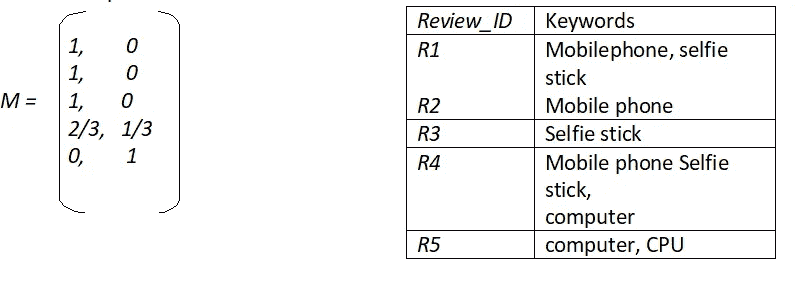
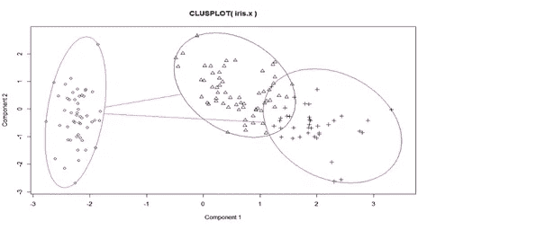
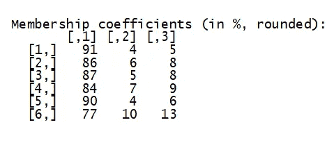
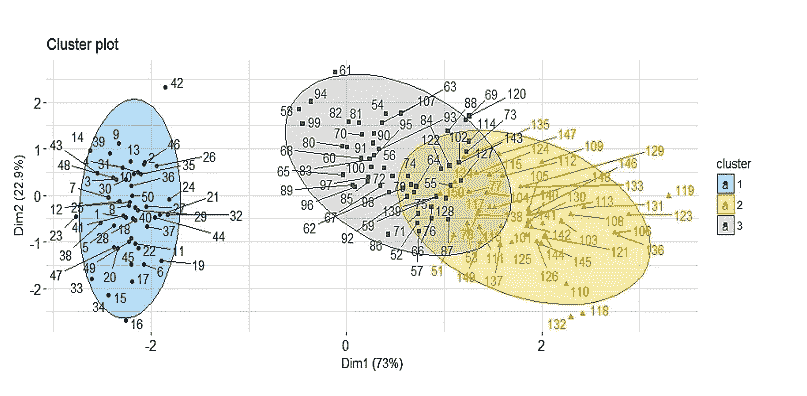
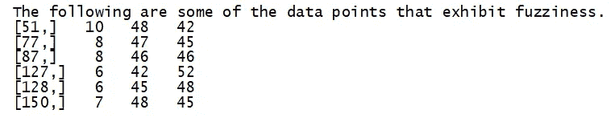
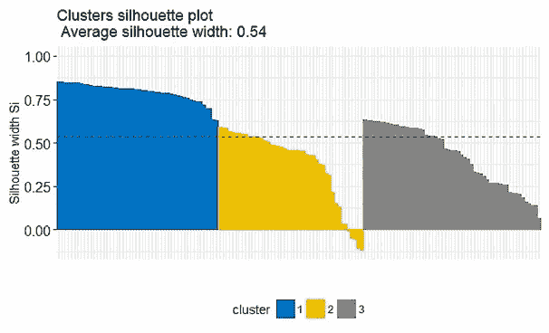
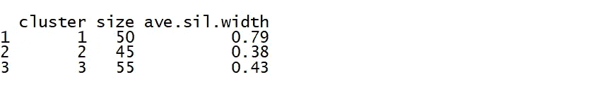

# 模糊聚类

> 原文：<https://medium.com/analytics-vidhya/fuzzy-clusters-e1fdbf8934af?source=collection_archive---------0----------------------->

给定一组数据点，传统的聚类技术将数据划分成几个组，使得一个组内的关联程度强，而不同组中的数据之间的关联程度弱。内部聚类中的点之间的相似性高，而内部聚类中的点之间的相似性低。传统的聚类技术会产生这样的分区，其中每个数据点只能属于一个聚类。相比之下，模糊聚类允许数据点属于多个组。因此，得到的分区是模糊分区。每个聚类都与一个隶属函数相关联，该隶属函数表示各个数据点属于该聚类的程度。

**模糊聚类**

模糊聚类也被称为软聚类，因为它允许一个对象属于多个聚类。考虑以下场景:

一家名为 MMcart 的在线电子商店在日志中记录顾客的浏览行为。这里的数据挖掘任务是使用客户的日志数据，根据他们的搜索意图对他们进行分类。在他呆在网上商店的整个时间跨度中，他一定浏览了关于特定产品的信息，或者可能搜索了客户服务信息。事先很难知道客户的搜索意图。由于这个问题听起来像一个无监督的学习，聚类分析很有帮助。这里，集群是包含相似用户浏览活动的集群。

让每个会话成为客户在浏览中花费的时间。有时，可能会出现并非每个会话都只属于一个集群的情况。例如，假设涉及购买移动电话的用户会话形成一个集群，比较膝上型计算机价格的用户会话形成另一个集群。如果用户在一个会话中订购了一部手机，同时比较了几台笔记本电脑，会怎么样？这样的会话属于两个集群。这些类型的聚类被称为模糊聚类。因此模糊聚类提供了灵活性，允许一个对象参与多个聚类*。*

**模糊集合**

给定一组对象，X= {x1，x2，…xn}模糊集 *S* 是 *X* 的子集，它允许 *X* 中的每个对象具有介于 0 和 1 之间的隶属度。一般来说，一个模糊集， *S* ，可以定义为一个函数 Fs: X - > [0，1]

如果售出的手机数量越多，特定品牌的手机就越受欢迎。一部手机的受欢迎程度，O，是用它的销量来衡量的。为了计算电话的受欢迎程度，使用以下公式。


函数 Popularity (O)定义了流行手机的模糊集合。比如手机在 MMCart 的销量如表所示。流行手机的模糊集合是{ A (.07)，B(1)，C(.89)，D(.36) }其中隶属度写在括号中。


假设 MMCart 在线商店有六条评论。表中列出了这些综述中包含的关键词。我们可以将评论分成两个模糊的群， *C* 1 和 *C* 2。 *C* 1 代表“手机”和“自拍杆”， *C* 2 代表“电脑”。

划分矩阵如下图所示:



误差平方和(SSE)可用于衡量模糊聚类对数据集的拟合程度。模糊聚类也称为软聚类，因为它允许一个对象属于多个聚类。

*k* 均值聚类可以认为是模糊聚类的一个特例。

**用 R 编程语言实现**

让我们采用具有 3 个类别的虹膜数据集。

```
library(cluster)data(iris)iris.x <- iris[, 1:4]cl3 <- pam(iris.x, 3)$clusteringop <- par(mfrow= c(2,2))clusplot(iris.x, cl3, color = TRUE)
```

图中显示了为三个类别形成的聚类。



我们调用 R 中的 fanny object 来找出每个数据点对特定聚类的隶属系数。

```
> fanny_iris<-fanny(iris.x,3)> fanny_iris
```

显示了三个聚类的前六个数据点的隶属系数。



```
> library(factoextra)> fviz_cluster(fanny_iris, ellipse.type = "norm", repel = TRUE,+              palette = "jco", ggtheme = theme_minimal(),+              legend = "right")
```



```
> fviz_silhouette(fanny_iris, palette = "jco",+                                    ggtheme = theme_minimal())
```



上面给出了集群及其大小。

对于一些应用，如医学和生物科学中的基因模式研究，模糊聚类比硬聚类更合适。

感谢阅读。你可以在 [linkedin](https://www.linkedin.com/in/malathi-murugesan/) 和我联系