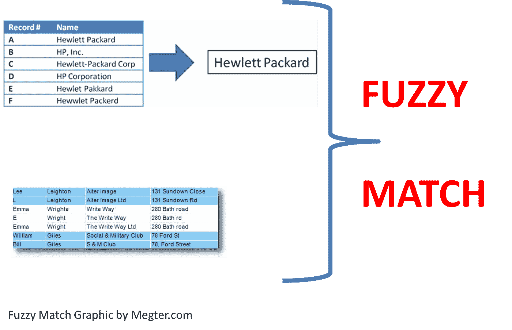
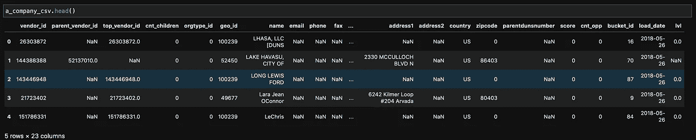
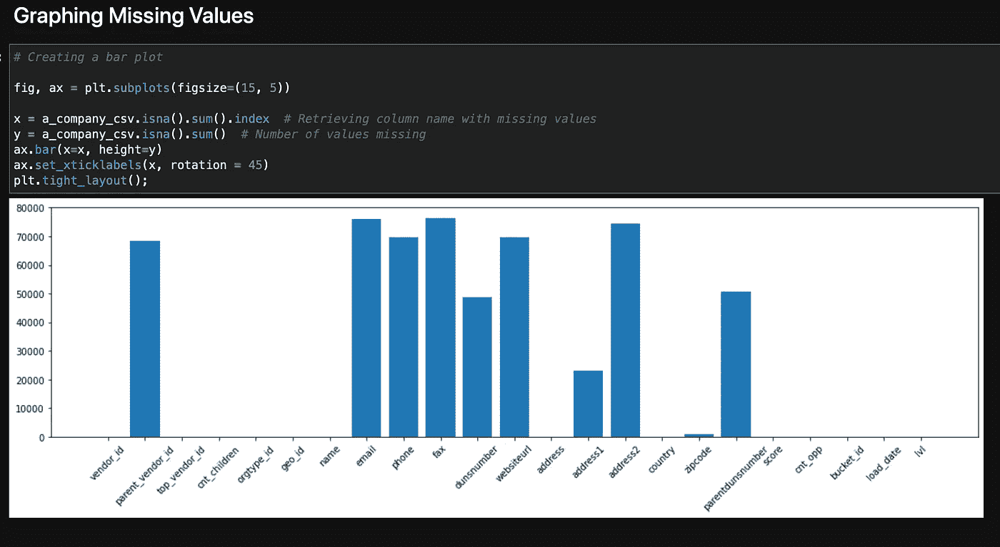
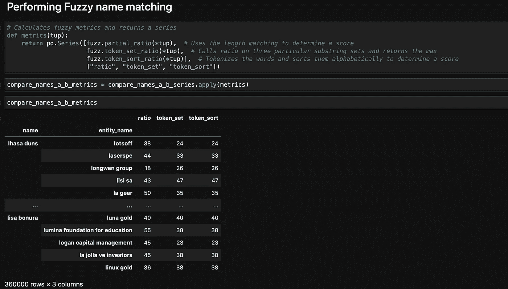

# 模糊名称匹配数据集

> 原文：<https://medium.com/analytics-vidhya/fuzzy-name-matching-datasets-1ae28884f226?source=collection_archive---------12----------------------->

一个客户给了你几个数据集，他想在多个不同的数据集中匹配实体。您的目标变量是实体，您的特征可以是实体的地址、国家、邮政编码、供应商 ID 等。

客户提供的数据集

所有这些特性无疑都有助于您搜索相同的实体，但唯一的问题是，客户端为您提供了一个数据集，其中每个有用的列都有许多缺失值，这些值可以极大地帮助您进行搜索。

每列中缺失值的数量

上图显示了可以用于帮助 NLP 的列的缺失值，但是它们填充了太多的缺失值以至于无法移除，填充它们并不理想。最好的选择是删除每一列，只保留供应商 id 和名称。

## 预处理

在对数据进行 EDA 之后，下一步是对数据进行预处理。进行 NLP 预处理时，看起来像:

1.  将文本数据放入语料库
2.  将所有单词变为小写
3.  删除方括号
4.  删除标点符号
5.  删除停用词
6.  删除任何其他特殊字符

这确保了你的文本数据尽可能地与你试图处理 NLP 问题的其他数据集相似。

下一步是使用标记化。标记化是指将文本数据分成更小的单词或字符单元。

对文本数据进行标记后，下一步是矢量化。单词矢量化将单词标记到范围中，并赋予其特定值。这使得在数据集之间匹配实体变得更加容易。

## 模糊名称匹配

现在是时候做一个机器学习模型，匹配数据集之间的实体了。

我使用的库是 Fuzzywuzzy 和方法，部分比率，标记排序比率和标记集比率。所有这三个函数都用于匹配不同数据集之间的实体。