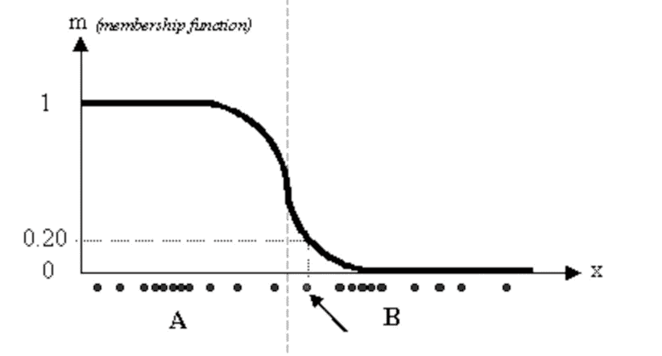

# 模糊集&模糊 C 均值聚类算法

> 原文：<https://medium.com/analytics-vidhya/fuzzy-sets-fuzzy-c-means-clustering-algorithm-ac5c4386396b?source=collection_archive---------8----------------------->

我们过去研究的所有分类算法，大部分都是基于软计算的。基于软的计算意味着，正如我们从算法中给出的预测，点 j 属于哪个集合 I(其中 I 可以取从 0 到集合数的任何值),但是也存在我们称为基于模糊的计算的类别，其基本上意味着，如果存在点 I 和 n 个集合，则它不一定只属于一个集合，但是有一个称为**隶属函数**的东西，它表示该点可以属于多个集合。简而言之，输出基本上是指示该点属于特定集合的概率的数字。

实际上，如果你能感觉到简单集合和模糊集合之间的区别，那么你就在正确的轨道上，否则在简短的注释 ***中，你可以说简单集合包括将只属于一个类的元素，但是模糊集合可以包含可能属于多个集合的元素*** 。这个规则叫做模糊逻辑。

例如，让我们以人的身高为例，你可以将人分为高或矮两类，但现在要考虑

1.  基于软计算:你会说，如果输入大于某个阈值，则高，否则矮。
2.  基于模糊的计算:如果输入距离阈值非常远，那么我们对输出非常确定，但是如果输入非常接近阈值，那么实际上你不能说它是高还是低，那么他们的模糊逻辑就会出现在图片中，它会告诉你概率。所以隶属函数看起来像这样:

所以现在，我想你们一定对模糊集很清楚了。

在进入 FCM 算法之前，让我们再了解一个叫做模糊 c 划分的东西。模糊 C 划分类似于将集合**的**划分为 **C** 类。其中模糊 c 划分由元组**(，S)** 定义，其中表示大小为(i*j)的矩阵，I 是点数，j 是类别数。 **(i，j)** 表示第 j 个类的点 I 的隶属值。每个类要成为 fuzzy-c 划分的类都必须遵循一些规则。

规则是这样的:

1.  矩阵中的每一行的总和应该是 1。
2.  矩阵中每一列的总和应该小于集合中的总点数。

因此，当我们完成了建立模糊 c 均值算法的基础。一个有趣的事实是模糊 c 均值(FCM)聚类是由 J.C. Dunn 在 1973 年开发的，并由 J.C. Bezdek 在 1981 年改进。

现在，该算法类似于 k-means，但它的工作方式不同。

1.  选择一些集群。

*   为聚类中的每个数据点随机分配系数。
*   重复直到算法收敛。
*   计算每个聚类的质心。

因此，fuzzy-c means 算法不会像 k-means 算法那样过度拟合用于聚类的数据，它会将数据点标记为多个聚类而不是一个聚类，这比将该点给一个聚类更有帮助。

**为什么要用模糊 C 代替 k 的意思是:**

主要原因是它的工作等同于 k 均值算法，但它与其他算法的唯一区别在于，它是区分可以分配给多个聚类的点的最佳方法。

我希望你们从中学到了什么，如果没有，请随时提问。

谢了。