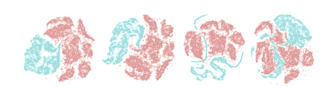

# G2D:生成以检测异常

> 原文：<https://medium.com/analytics-vidhya/g2d-generate-to-detect-anomaly-a06d127b6c77?source=collection_archive---------21----------------------->

在不同时期的训练期间，由在正常(目标类)样本(红色)上训练的 GAN 生成的实例(蓝色)。我们使用 T-SNE 来表示二维样本。正如在更早的时代可以看到的，GAN 的发生器产生与正常样品完全不同的样品。但是随着学习过程的继续，随着时代的增加，两种类型的样本逐渐彼此接近。

O ne-Class 分类(OCC)的任务是检测不可见或超出目标分布的样本。换句话说，OCC 方法寻找异常，即在训练数据中不(或很少)发生的意外行为或事件。受深度学习解决方案，特别是生成式对抗网络(GANs)的成功启发，已经提出了一些用于离群点检测的方法。简而言之，这种方法对立地学习两个深度神经网络，一个用于生成虚假数据，另一个用于区分正常样本和异常值。虽然他们已经取得了有希望的结果，但与所有其他基于 GAN 的方法一样，学习找到最佳参数是一个麻烦的过程。此外，对于 OCC 任务，在没有任何离群类验证样本的情况下，找到停止学习过程的适当时间以实现最佳性能是非常具有挑战性的，并且需要反复试验。

为了应对上述挑战，我们提出了一种非常简单而有效的方法来检测异常样本。类似于前面的方法，我们利用了对抗性学习，但是以完全不同的方式使用它。以前提出的方法集中于对立地学习正态数据的分布，并将所有与参考模型有重大偏离的实例视为异常值。与这些解决方案相反，我们提出了一种简单直接的方法来生成不符合正态数据分布的不规则样本。生成的不规则体旁边有可用的正常实例，可以简单地用于训练一个二元分类器。

不规则性检测的任务是找到不存在或存在低可能性的样本。异常或不规则样本可以是与预期和通常行为的任何偏差，或者是与目标类数据不相似的任何情况。因此，它们是非常多样的，研究人员更喜欢学习训练数据中的共享概念，即规则实例。在这种情况下，具有不同概念的样本被认为是不规则的。在[这篇论文中，](https://arxiv.org/pdf/2006.11629.pdf)我们跟进了一种新的不规则检测方法。尽管对离群样本建模很困难，但生成它们却很简单。由于不规则性的高度多样性，随机生成的样本可以被认为是关于目标类的异常实例，具有高概率。我们使用二元分类法来检测(G2D)异常。我们的方法，即 G2D，由三个主要模块组成:(1)不规则发生器网络( ***I*** )，(2) ***C*** ritic 网络，以及(3)检测器网络( ***D*** )。

***I*** 作为不规则发生器，完全不知道有这样的样本。关键思想是在正常样本上训练 GAN，并在完全收敛之前利用其生成器。事实上，生成的不规则数据应该与正常情况有一些偏差。由 ***I*** 连同可用的正常样本一起生成的不规则性，形成用于优化卷积神经网络(CNN)的参数的信息训练集，如 ***D*** 以区分正常和异常样本。我们提出的方法的草图如下所示。 ***I*** 、 ***C*** 和 ***D*** 的详细信息在以下章节中描述。

我们提出的方法的概要。(左:)不规则发生器，(右:)不规则检测器。 **I** + **C** 网络在正态类数据上联合对抗训练。在训练期间，几个模型( **I** 具有不同的权重)被认为是异常检测器。作为二元分类器的 **D** 网络在所有可用的正常样本上进行训练，并通过 **I** 1:k 生成不规则样本。在训练过程之后， **D** 充当不规则检测器。

***I*** 是为从看不见的类数据中生成样本而定制的。这个网络接收一个从高斯分布采样的随机噪声向量，即 Z∈ N(μ1，σ1)作为输入，然后将其映射到一幅图像上。这种网络可以容易地产生不遵循目标类别分布的样本，即使不需要训练过程并且仅基于随机初始化的参数。 ***I*** 网络逐渐得知目标阶层的分布。 ***I*** 网络逐渐学习目标阶层的分布。

***D*** 网络是用于区分正常样本和模拟异常的分类器。在训练过程之后，有足够的可用数据来训练二元分类器。

# **训练: *I* + *C* 和*D***

为了避免传统氮化镓的缺点对我们的工作造成负面影响，我们使用了 Wasserstein 氮化镓(WGAN)。歧视 WGANs 人的人通常被称为批评家。***C***WGAN 的网络类似于 GAN 的 G 网络，但取消了 sigmoid 功能。在 WGAN 中， ***C*** 网络输出的是标量分数而不是概率。这个分数可以解释为输入图像的真实程度。换句话说，它衡量一个状态(输入)有多好。在训练期间， ***I*** 模型已经被保存用于每个时期。因此，在 n 个时期之后，我们有 n 个不同的模型。选择 n 个保存的模型的 k 个网络作为不规则生成器可以以两种方式完成:(1)使用包括正常和异常数据的验证集，以及(2)通过分析 *I* 网络损耗。事实上，没有任何样本来自离群类。因此，使用验证样本是不可行的，也就是说，这种方法完全违背了我们的主要假设。为了遵循第二种解决方案，不规则网络选择如下

损失函数值与网络行为的关系。

我们的目标是提出一个端到端的神经网络来检测不规则样本。因此，如前所述，仅 ***D*** 网络在视频中起到异常检测器的作用，在图像中起到异常检测器的作用。二进制分类问题，在我们的情况下是 OCC 任务的转换版本，可以简单地公式化为:

其中α是预定的阈值(在我们的例子中，α等于 0.5)。

Caltech-256 数据集上的结果。从一、三或五个选择的类别中随机抽取内联者。此外，不规则性是从类别 257-杂波中随机选择的。前两行:内标物来自一类图像，50%是外标物；两个第二行:内标物来自三类图像，50%为外标物；最后两行:内含物来自五类图像，而离群值占样本的 50%

要了解更多信息，你可以在这里找到我们的论文。G2D 是#WACV2021 上被接受的论文之一。你可以在 [Github](https://github.com/masoudpz/G2D_generate_to_detect_anomaly) 找到源代码。请随意询问关于纸张和代码问题。