# 模式的游戏:具有向前推进分布的不同轨迹预测

> 原文：<https://medium.com/analytics-vidhya/game-of-modes-diverse-trajectory-forecasting-with-pushforward-distributions-315b1b30d5e6?source=collection_archive---------2----------------------->

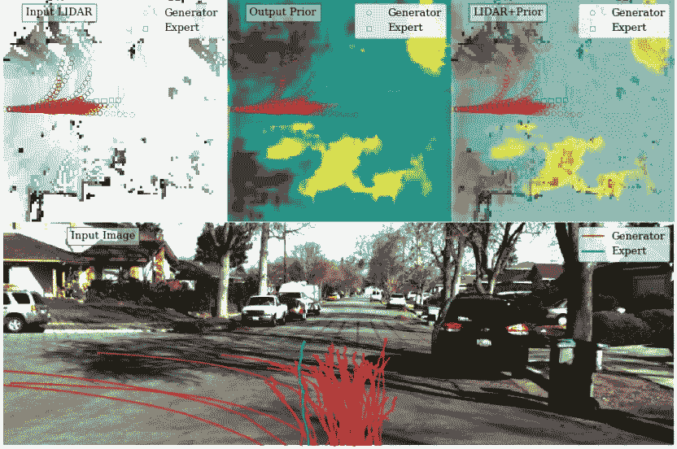

我刚刚从论文的补充[材料](http://www.cs.cmu.edu/~nrhineha/papers/r2p2-supp-camera-ready.pdf)中拍了第一张照片。

嗨！不久前，我在一家[无人驾驶汽车公司](https://zoox.com/)实习，在那里我专门研究轨迹预测。到目前为止，这可能是实现该技术的最大障碍，但关于它的文献相对较少。到目前为止，这项研究使用了 RNNs 的[序列预测，或者](http://cvgl.stanford.edu/papers/CVPR16_Social_LSTM.pdf)[最大熵 IRL](http://www.cs.cmu.edu/~kkitani/pdf/KZBH-ECCV12.pdf) ，或者如果它真的很奇特，两者的[组合](https://arxiv.org/abs/1704.04394)。

当我还是实习生的时候，我看到了这篇 [R2P2 论文](http://openaccess.thecvf.com/content_ECCV_2018/html/Nicholas_Rhinehart_R2P2_A_ReparameteRized_ECCV_2018_paper.html)；除了在 CVPR 2018 的一个[研讨会上的讲话，这篇论文似乎相对来说不太引人注意，所以我想在这里分享一下它的新颖贡献。在这篇文章中，我将试图用我对模仿学习仍处于萌芽状态的知识来准确地解释论文中的新颖概念。](https://www.youtube.com/watch?v=JbNeLiNnvII)

**为什么轨迹预测如此困难？**

这个问题问得好。轨迹/运动预测的目标是获取环境的某种表示，并为每个相关实体产生该实体未来的时空轨迹的上下文条件分布。虽然这听起来对 ML 来说很容易(我的意思是，它现在甚至可以让随机的人跳舞)，但有一些因素使它成为类固醇的预测问题(或者至少是严格锻炼制度下的蛋白粉的预测问题)。

1.  *场景上下文推理*:与其他序列预测问题不同，轨迹预测需要的远不止过去的运动轮廓。在路线图中有许多静态上下文，在与感兴趣的实体交互的其他代理中有许多动态上下文。许多最近的论文(如这里的[和这里的](http://www.cs.toronto.edu/~wenjie/papers/intentnet_corl18.pdf)[关注这个问题，在一些空间参数化中试验传感器数据的中高级表示，并将其输入不同的递归和卷积架构。](https://arxiv.org/pdf/1812.03079.pdf)
2.  *多模态:*也许理论上更有趣的问题是，通常有多种可能的轨迹(想到一个交叉点)，一个模型应该足够多样，以涵盖所有这些模式。反过来，模型也必须足够精确，以避免产生不良轨迹。

在这两个问题中，R2P2 主要关注后者。历史上，序列学习是通过最大似然估计，或者等效地，最小化交叉熵损失来完成的，

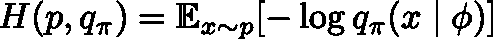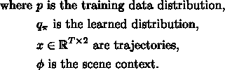

快速查看一下这种损失的边缘情况，可以看出，它对未能覆盖训练分布的一些模式给予了很高的惩罚，但对完全丢失基础分布给予了很低的惩罚。如果我们翻转交叉熵中两个分布的方向，我们会得到相反的行为。本文中的一个图表对此进行了最好的总结:

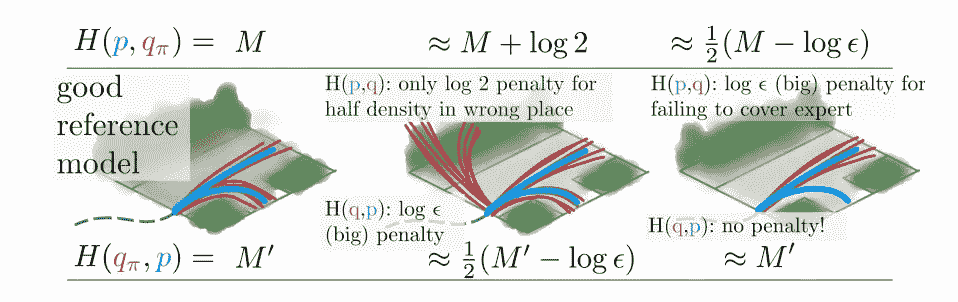

因此，这两个交叉熵的目的是互补的，论文的作者决定将它们合并成一个对称损失。

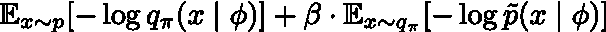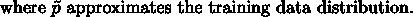

现在，即使对于那些在跟随鲍勃·罗斯绘画教程时创造性高潮包括添加额外的树的人来说，我觉得达成对称损失并不是一个巨大的飞跃([类似的东西](https://arxiv.org/pdf/1804.03782.pdf)已经在 KL divergence 中完成)。然而，通过梯度下降来优化表达式是行不通的，因为第二项是不可微的(并且还存在寻找先验近似的问题)。一个没有创意的方法，也是我会怎么做的，是使用 RL 的[加强](http://www0.cs.ucl.ac.uk/staff/d.silver/web/Teaching_files/pg.pdf)方法，只要学习的分布在其参数中是可微的，就可以使用，但是本文使用了一个更酷、不那么愚蠢的高方差方法。

**前推式分布建模**

相反，这篇论文提出的是一个模拟器，它将噪声从简单的分布映射到预测的轨迹。这样，损失就可以通过变量的改变来重写。具体来说，他们引入了一个模拟器，

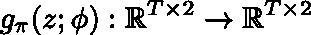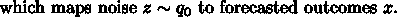

现在，轨迹的分布由简单的噪声分布和模拟器决定(因此噪声的*向前推进*)。这是论文中的另一张图来说明这一点:

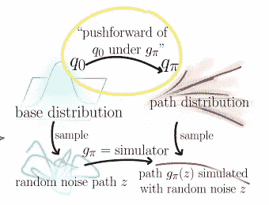

将基本分布推进到轨迹分布。

如果模拟器是可微分的和可逆的，那么我们可以使用变量变化公式来推导，

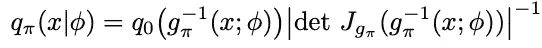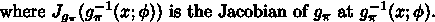

通过某种简单的替换，我们可以重写之前的对称损耗，

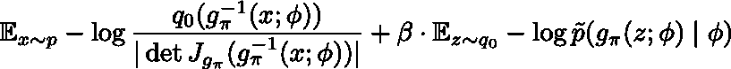

下一步是选择一个可逆和可微的模拟器；幸运的是，轨迹预测任务有助于随机动力系统中一些非常引人注目的任务。作者选择了随机一步策略，

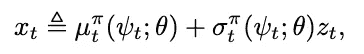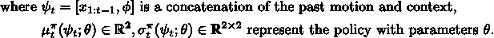

这为我们提供了一种迭代的方式，使用过去的运动轮廓和上下文沿着轨迹生成下一个点。只要随机项是可逆的，并且两项都是可微的，使用这种策略的模拟器也将是可逆的和可微的。

例如，如果噪声分布是标准正态分布，那么轨迹分布也是正态分布，

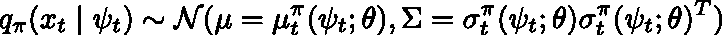

现在，使用一步到位的策略(如建议的策略)可以轻松计算我们的对称损耗值。即，

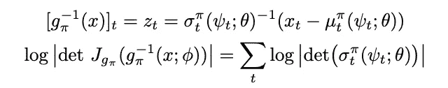

像斯蒂芬·库里的三分球一样微不足道，对吗？(我被告知要加入一个体育参考，让自己看起来很酷。)

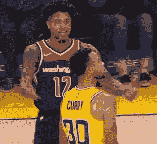

好吧，对于那些不同意的人(包括我自己，因为我在很多线性代数课上睡觉)，我将展示一些算出的数学。它取决于这样的观察，即轨迹点不依赖于后面时间步长的点，这使得雅可比下三角形，

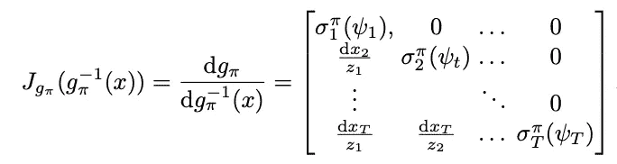

这种矩阵的一个特殊性质，你可以很容易地通过[行/列扩展](http://mathworld.wolfram.com/DeterminantExpansionbyMinors.html)来验证，就是它们的行列式正好是对角线元素的乘积。这给出了结果，

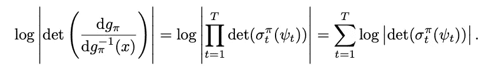

最后，我们必须重新讨论一下这个问题，我在 5 分钟前承诺过——近似底层数据分布，因为我们无法直接评估底层的 PDF。重要的是，这个固定的近似值是合适的，因为如果它严重低估了某个区域的训练分布，它可能会增加不必要的高惩罚。

一种这样的方法是假设时间步长上的轨迹分布因子，即参数化，

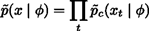

然后，对于每个时间步长，我们将可能点的区域离散成 L 个可能的位置。我们本质上将每个时间步长的概率分布建模为一些离散的网格图，其可以通过具有 L 个类的逻辑回归来训练，

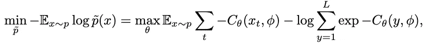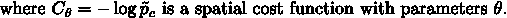

该文件显示了一些学习空间成本函数的例子。正如你所看到的，它通常给所有可驾驶的表面带来较低的成本，给障碍物带来较高的惩罚。学习分布肯定有一些可疑的部分，但至少它的支持(低成本地区)覆盖了所有可能的轨迹。

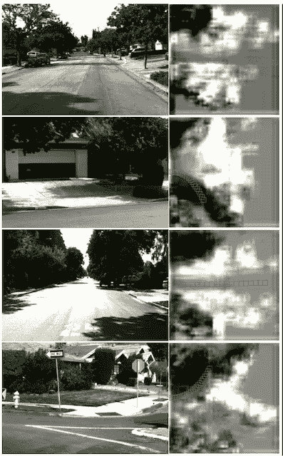

已学先验(白:高成本，黑:低成本)。蓝色表示专家演示的轨迹。

恭喜你。这基本上涵盖了论文的新颖组成部分。剩下的就是实现架构的细节和实验，我将会非常简要地介绍一下。

**结果**

我们已经多次提到上下文，但没有明确说明它是什么；正如你所料，它只是过去的运动轮廓和表示场景地图的空间网格的连接(看起来像激光雷达数据的自上而下的 2D 投影)。

在 R2P2·RNN 模型(论文中表现最好的模型)中，地图被输入 CNN 以产生静态上下文的特征编码；然后，过去的历史被编码在 GRU-RNN 中，该系统也使用特征化地图来迭代预测轨迹的点。

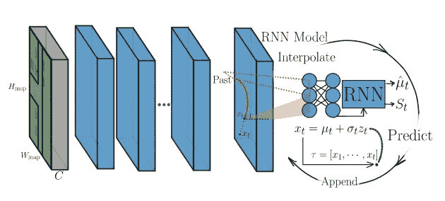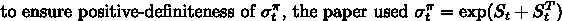

建筑细节相对简单直观，我很喜欢；我也很基础，很直观(香草是我最喜欢的冰淇淋口味，蓝色是我最喜欢的颜色，黑熊是我最喜欢的熊)。

这篇论文的另一个贡献是汇编了一个新的数据集，他们称之为 CaliForecasting 数据集。它更大，应该包含比 [KITTI 数据集](http://www.cvlibs.net/datasets/kitti/)更多的多模态例子。他们将他们的 R2P2 方法与一些基线生成模型相比较，其中之一是 [CVAE](https://pdfs.semanticscholar.org/3f25/e17eb717e5894e0404ea634451332f85d287.pdf) (这是变分推理的一个非常酷的应用)。

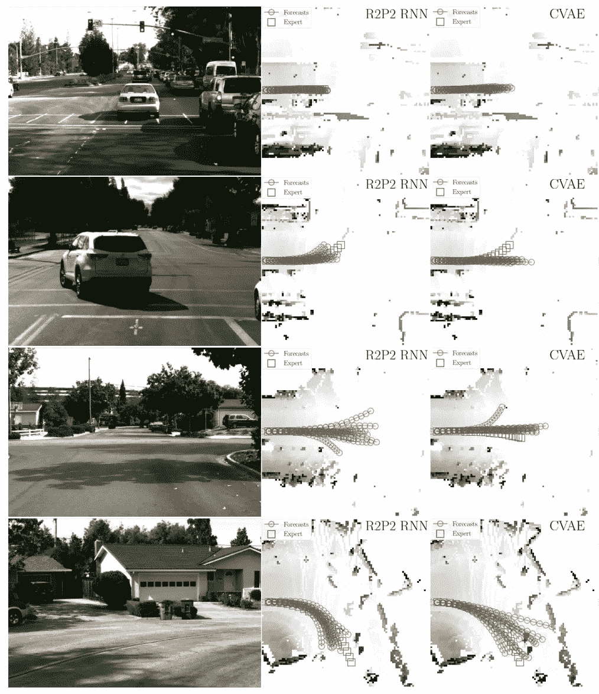

R2P2 和 CVAE 的比较(一个相当流行的生成模型)。

CVAE 从随机潜在编码中获得其多样性，这是从标准正态抽样的，但很容易看出，当多重存在时，R2P2 覆盖了更合理的模式。这个[视频](https://youtu.be/JbNeLiNnvII?t=9091)也显示了 R2P2 连续工作，只是为了确认随着时间的推移，生成的轨迹没有太多的闪烁。

我跳过了论文中的其他贡献，例如应用他们的差异化模拟器创建了一个低成本的盖尔变种(创造性地称为 R2P2 盖尔)。我只是没有包括它，因为我认为它是次要的，主要的，提出的方法，老实说，我觉得没有足够的信心解释盖尔没有普遍的数学误差。

**最终想法**

虽然本文特别关注轨迹预测，但使用对称损失和前推建模代替 RL 的高方差、差收敛方法的新方法应该适用于许多其他类型的数据。我的观点是，这种方法可以潜在地用于 NLP 中的语言生成模型，这在 ML 社区中没有分量。不管怎么说，大脑在竞相思考其他潜在的应用途径。

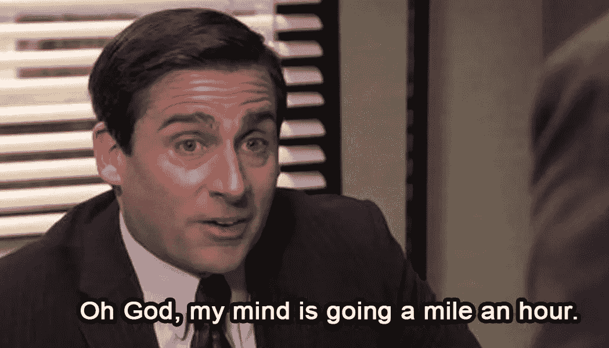

别担心，我也是。

**参考文献**

1.  尼古拉斯·雷恩哈特，克里斯·m·基塔尼，保罗·韦尔纳扎。**【R2P2:一种重新参数化的推进策略，用于多样化、精确的生成路径预测。*欧洲计算机视觉会议(ECCV)，2018 年，第 772–788 页*