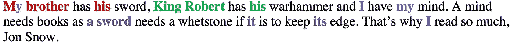
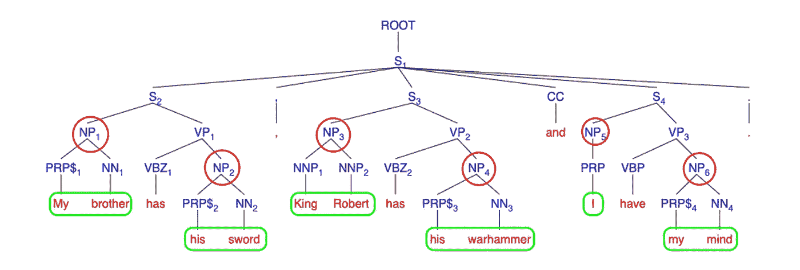
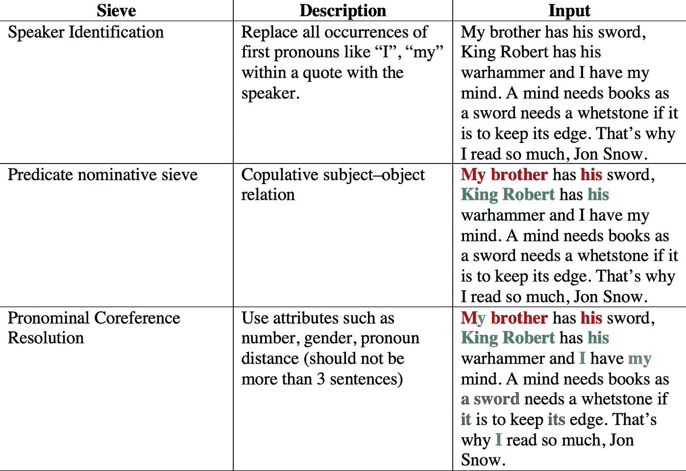

# 命名实体的游戏——第二部分

> 原文：<https://medium.com/analytics-vidhya/game-of-named-entities-part-2-4c540fabbbbc?source=collection_archive---------23----------------------->

奥拉朋友们！希望这篇文章能让你健康、快乐、安全地待在家里。自从我们最后一次与多莉相遇已经有一段时间了，但是我又带来了一个有趣的故事，希望能再次逗你开心。

从我们痛苦地提炼出来的人物开始，我们描述他们的工作仍然是一场艰苦的战斗。叹气。但是谢天谢地，我偶然发现了这个伟大的框架来帮助我们——[斯坦福核心 NLP](https://stanfordnlp.github.io/CoreNLP/)；特别是他们称之为[共指注释器](https://stanfordnlp.github.io/CoreNLP/coref.html)的东西，它构建了一个实体的所有引用的链。*自豪地竖起衣领使用谷歌搜索*

很自然地，就像我们所有"*高效的* *懒人*"所做的那样，我最初的本能反应是将它与一个样本进行比对，看看它是否让我印象深刻，然后进一步调查。嘿，别评判我！这就是我们所说的“**黑盒测试**”吧？不管怎样，事实证明，多莉和我都很震惊。

为了演示起见，请允许我引用多莉认为迄今为止最聪明、最风趣的角色——提利昂·兰尼斯特。

> 我哥哥有他的剑，劳勃国王有他的战锤，而我有我的思想。一个人需要书籍，就像一把剑需要磨刀石才能保持锋利。这就是为什么我读了这么多书，琼恩·雪诺。

把你从可怕的语法、威胁性警告和致命错误中拯救出来，让我们跳到结论的亮点。

正如你可能想到的，颜色编码的单词代表一个实体，或者说算法是这样声称的。很酷吧？这引起了我对所说的“**黑匣子**的兴趣，我决定打开它。嘣。以下是我的发现——相互参照算法分两个阶段工作，如下所述。

# 值得“一提”吗？

甚至在我们深入到共同引用之前，我们需要识别实体——或者用外行的术语，值得描述的主题，或者用更简单的术语 Dory 可能感兴趣的事物/人。我们该怎么做？魔法？差不多吧。嗯，提及基本上是从解析树中的**名词短语**节点中挑选出来的。希腊人？让我们附上一些照片。

该算法在解析树的*从左到右广度优先遍历中挑选名词短语节点作为**候选提及**。当然，我们留下了包括停用词、量词或其他形容词形式的国家或民族。*

# 像筛子一样的头脑？

一旦我们有了亲爱的被提及者，我们就让他们通过一堆筛子，每一个筛子都把他们认为相关的人分组。当然，为了获得精确的结果，我们一开始就使用了优秀的筛子。这是一个通过筛子的样本。

当然，这只是过程的 10000 英尺视图，但它服务于我们的目的。显然，仍有许多东西有待探索。我很快就会带着我的发现回来；同时，祝你在一个平行世界中快乐编码！😊