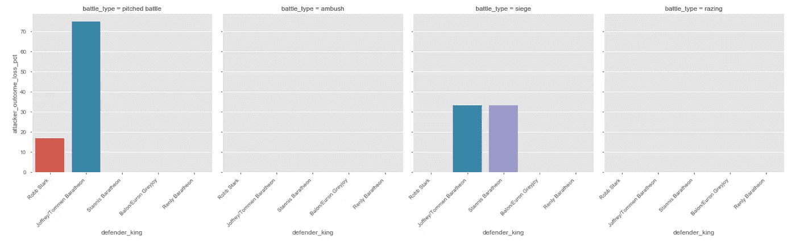
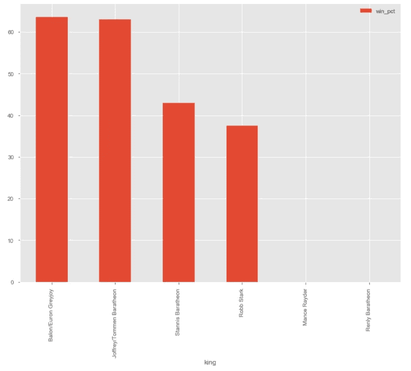
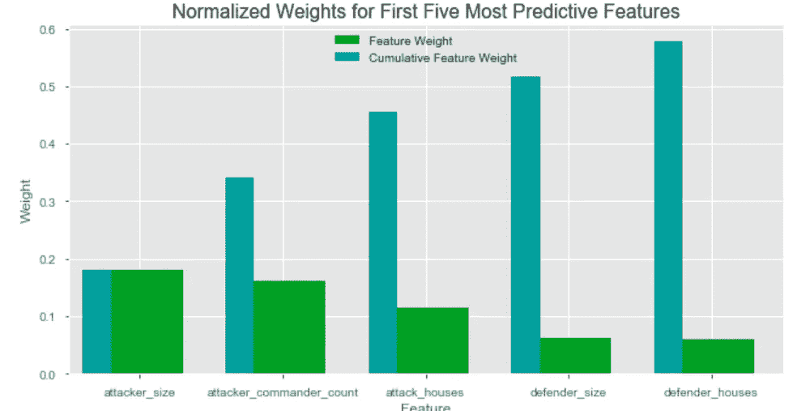

# 《权力的游戏》——战斗分析和胜利预测

> 原文：<https://medium.com/analytics-vidhya/game-of-thrones-battles-analysis-and-predicting-victory-6197d961f587?source=collection_archive---------10----------------------->

权力的游戏——私生子之战，盾墙(第六季第九集)

## **Udacity 数据科学家 Nanodegree 博文**

《权力的游戏》是一部受欢迎的奇幻电视剧，改编自乔治·RR·马丁写的一系列书籍。

作为这部热播电视剧的粉丝，每一季的战斗场面都让我惊叹不已。我最喜欢的一场战斗是第六季第九集的“私生子之战”。我喜欢这场战斗的原因是琼恩·雪诺成功地说服了自由民加入他的军队与波顿家族作战。就参与战斗排序的人数而言，这一集导演得很好，而且在这几集中有许多详细的攻击。

我的博客文章分析了克里斯·阿尔邦的“五王之战”数据集，可以在[这里](https://github.com/chrisalbon/war_of_the_five_kings_dataset)找到。这是一个伟大的系列中所有战斗的集合。

另外，如果你想跳到实际的代码，我的 GitHub repo 可以在这里找到。

# **关键问题**

我计划解决战斗数据集中的三个关键问题:

在任何情况下，哪家赢得的战斗最多？

**2)给定进攻军队的规模，防守军队的预期规模是多少？**

什么因素促成了一场战役的胜利？

# **数据集**

我将展示数据集的一小部分，但是可以在 Kaggle 上的[这里](https://www.kaggle.com/mylesoneill/game-of-thrones#battles.csv)找到全部数据。

“battles.csv”的样本数据集

# **探索性数据分析**

**攻击者赢/输百分比**

分析的第一部分，我看了以下进攻王的胜败百分比:

*   巴隆/攸伦·葛雷乔伊
*   乔佛里/托曼·拜拉席恩
*   罗柏·史塔克
*   史坦尼斯·拜拉席恩
*   曼斯·雷德

攻击国王的赢/输百分比

葛雷乔伊以 183 人的小规模军队赢得了他们作为攻击王的所有七场战斗，而曼斯·雷德却输掉了他唯一一场以 10 万人攻击只有 1240 人的防守军队的战斗！数据中的另一个缺失因素是曼斯·雷德把墙作为一个障碍，在我看来，它可以被转换成一个军队的规模来进行比较。看起来如果没有对手，一支小而灵活的军队肯定能赢得一场战斗！

乔佛里/托曼·拜拉席恩以 4330 人的平均进攻规模赢得了大部分战役(13 场或 92.9%)，并与 2559 人的守军作战。

罗柏·史塔克以 4122 人的平均攻击军队规模赢得了 80%的战斗(10 场战斗中的 8 场)，并与 4963 人的防御军队作战。

最后，史坦尼斯·拜拉席恩以 8875 人的平均进攻兵力赢得了 50%的胜利(4 战 2 胜),并击败了 8862 人的守军。有趣的是，进攻和防守的军队规模非常相似。

**攻击者胜败百分比——战斗类型**

有四种类型的战斗:

*   激战(14 场战斗)
*   围攻(12 场战斗)
*   伏击(10 场战斗)
*   夷平(2 场战斗)

激战、围攻和伏击是房屋面临的常见战斗。房屋面临夷为平地的情况很少，但一旦发生，就不会有重大的死亡或重大的捕获。

**攻击者胜率——战斗类型**

当这些战斗被分解成攻击王与攻击王的胜率时，我们可以看到葛雷乔伊在每种类型的战斗中都赢了。

史塔克家族在激战中表现不佳，因为他们损失了三分之二的进攻时间。然而，他们作为进攻者在围攻和伏击中总是获胜

与此同时，史坦尼斯·拜拉席恩赢得了 50%的激战和围攻。

最后，乔佛里/托曼·拜拉席恩赢得了 83.3%的激战，但所有的围攻和伏击。

**防御者胜败百分比——战斗类型**

当这些战斗被分解为防守国王对进攻国王的损失百分比时，我们看到乔佛里/托曼·拜拉席恩作为防守者赢得了 75%的激战，但只幸存了 1/3 的围攻。

罗柏·史塔克只赢得了 1/6 的激战，而作为防守者却输掉了所有的伏击和围攻。

史坦尼斯·拜拉席恩也幸存了 1/3 的围攻，同时输掉了所有的激战。

**权力的游戏对战联盟**

如果这些战斗和国王被格式化成一个体育联盟，它会是这样的:

巴隆/欧隆·格雷乔伊和乔佛里/托曼·拜拉席恩的胜率几乎不分上下(分别为 63.6%和 63.0%)，而史坦尼斯·拜拉席恩的胜率为 42.9%，罗柏·史塔克的胜率为 37.5%。

这使得巴隆/欧伦格雷乔伊在胜率上成为赢家。

**结论**

即使葛雷乔伊在战斗中进攻时有 100%的成功率，我也不会说他们是强者，因为他们没有和一支防守的军队打过仗(基于缺乏数据)，所以我会取消他们的资格。

## **乔佛里/托曼·拜拉席恩赢得最多对抗防守军队的战役！**

# 预测建模

我将使用两种模型来回答这两个问题:

**2)给定进攻军队的规模，防御军队的预期规模是多少？** →线性回归模型

什么因素促成了一场战役的胜利？ →分类模型

# 线性回归模型——预测敌方军队规模

为了创建一个线性回归，攻击者的规模将被绘制成防御者的规模。我想了解这两个变量之间的关系。对于该数据集，异常值和军队规模 0 在建模前被移除。

**进攻者体型 vs 防守者体型**

该图显示弱线性相关性为 0.438731，相关系数为 0.192 (R 平方)，这意味着只有 19.2 %的方差在因变量中得到解释。图中有两个不同的部分，因此将数据分组可能会给出军队规模之间更好的线性关系。

**攻击者体型与防御者体型——根据战斗类型划分**

**攻击者体型与防御者体型——根据战斗类型划分**

**进攻者体型与防守者体型——伏击**

**伏击** —当按战斗类型分割数据时，线性模型显著改进。这里，相关系数(R-Square)是 0.839，这意味着只有 83.9 %的方差在过滤到伏击战斗的因变量中得到解释。这个模型可以用来估计防御军队的规模，如果攻击的房子被伏击，但实际上，防御军队不会准备好这种类型的攻击。

**进攻者体型 vs 防守者体型——激战**

**激战** —当按战斗类型分割数据时，线性模型显著改善。这里，相关系数(R-Square)是 0.468071，这意味着在因变量滤波器中只有 46.8 %的方差被解释为激战。有一个 0.68 的很强的相关性，所以这个模型可以用来估计防御军队的规模，如果攻击房屋涉及一场激战。

由于缺乏数据，没有为攻城战生成好的模型。

**结论**

如果一支军队卷入了伏击或激战，他们可以使用线性模型来估计对方军队的规模，但使用伏击模型会比激战模型更准确。

# 分类模型——预测战斗胜利

现在是帖子有趣的部分。我将预测战斗结果，并使用各种分类模型找出有助于战斗胜利的因素:

*   逻辑回归(基线模型)
*   随机森林
*   XGBoost

战斗数据集中只有不到 40 条记录，所以我必须尽可能地清理数据集。

**特征工程**

*   创建新的功能，如攻击者指挥官计数，防御者指挥官计数，攻击房屋(参与进攻的房屋数量)，防御者房屋(参与防御的房屋数量)
*   删除了战斗名称、位置、攻击指挥官、防御指挥官等列
*   将分类变量转换为二进制变量，如攻击者国王、防御者国王、攻击者 1、防御者 1、战斗类型和区域
*   日志转换了攻击者规模和防御者规模，以减少数据中的差异
*   归一化的数字特征，如攻击者房屋数、防御者房屋数、攻击者指挥官数、防御者指挥官数，以及上一步中经过对数变换的攻击者和防御者规模

**混洗和分割数据**

我使用 75%的数据作为训练数据(28 条记录)，25%作为测试数据(10 条记录)，并在三个模型中使用它们。我还使用了 20 k 倍交叉验证，这是一种用于在有限数据样本上评估机器学习模型的重采样程序。

**模型结果**

使用逻辑回归的准确度是 91.6%，标准偏差是 0.2327，我们已经有了一个好的基线分类模型，这是一个好消息。

使用随机森林的准确度为 95.0%，标准偏差为 0.119。准确度提高了约 3.6%，标准偏差降低了近一半。

令人惊讶的是，XGBoost 的性能比随机森林模型差(92.5%)，但它仍然是一个好模型。

**随机森林的准确率最高，达到 95%，所以我会用这个模型来进一步改进这个模型。**

# **最重要的五个功能是:**

*   攻击者规模
*   攻击指挥官计数
*   攻击房屋
*   后卫尺寸
*   辩护律师事务所

# 实现-提取特征重要性

我将数据集缩减为前五个重要特征，并再次将其插入随机森林模型。

结果如下:

随机森林缩减模型提高到 96.6%，标准差略有提高。

# **重述**

1.  乔佛里/托曼·拜拉席恩赢得了最多的防御战，因为葛雷乔伊从未与人数超过零的防御军作战。
2.  如果一支军队卷入了伏击或激战，他们可以使用线性模型来估计对方军队的规模，但使用伏击模型会比激战模型更准确。
3.  使用随机森林模型决定胜利的重要因素是攻击者规模，攻击者指挥官数量，攻击房屋，防御者规模，防御者房屋。

[2020 年 2 月 21 日更新]在通过我的同行进行进一步咨询后，我发现随机森林模型可能不适合这种类型的数据集，因为有更多适合的模型可以预测成对比较的结果，如 [Bradley-Terry 模型](https://en.wikipedia.org/wiki/Bradley%E2%80%93Terry_model)。如果我有更多的时间，我将致力于这个模型的 Python 实现，并更新我的帖子。

点击这里查看我的 GitHub repo！

# 东尼迪

# ***“他们知道我拯救了这座城市。他们知道我赢得了战争”——乔佛里·拜拉席恩***

