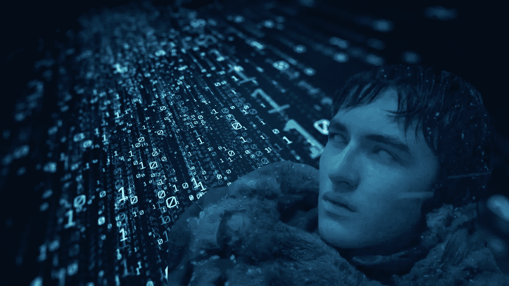

# 利用 Tensorflow 中的 LSTM 和递归细胞生成《权力的游戏》剧集脚本

> 原文：<https://medium.com/analytics-vidhya/game-of-thrones-episode-script-generation-using-lstm-and-recurrent-cells-in-tensorflow-c0c40d415a8b?source=collection_archive---------1----------------------->

《权力的游戏》第八季确实令人失望，似乎导演们无法从前几季中学习模式，但不用担心，LSTMs 不会错过任何模式，并将帮助你提供更好的剧本，一个人工智能生成的剧本。

[利用高级人工智能进行品牌预测](https://www.google.co.in/url?sa=i&source=images&cd=&cad=rja&uact=8&ved=2ahUKEwiH65CIsuzjAhVP8HMBHXUsDD0Qjhx6BAgBEAM&url=https%3A%2F%2Fhackernoon.com%2F15-reasons-why-my-game-of-thrones-ai-went-viral-and-how-im-going-to-do-it-again-8d1f307a5294&psig=AOvVaw16CRaG8EBNn7Ui5KYn5e97&ust=1565117051533071)