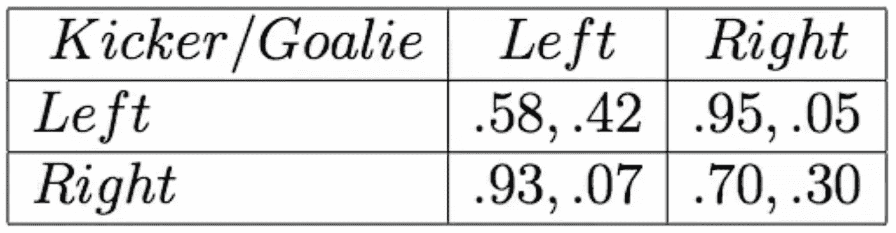

# 博弈论 101:使用标准形式游戏在竞争场景中做出决策

> 原文：<https://medium.com/analytics-vidhya/game-theory-101-decision-making-in-a-competitive-scenario-using-normal-form-games-2c0624a0da13?source=collection_archive---------13----------------------->

# 概观

*   博弈论对竞争场景中的决策有极大的帮助
*   理解博弈论背景下范式博弈的概念
*   我们还将通过真实世界的例子来介绍博弈论的应用

# 介绍

让我们以一个游戏的例子开始这篇关于博弈论的文章(我喜欢它的象征意义！).足球是世界上最受欢迎的运动，所以我们将从那里考虑一个场景。

假设一个队获得了点球。这种情况使前锋和守门员展开了一场斗智。守门员必须决定是向左跳还是向右跳(还是原地不动)。前锋也有类似的困境(选择哪个方向)。

现在有一个问题要问你——你会怎么做？如果这个点球练习重复 10 次，你作为门将会扑出哪一方来最小化进球？或者你会在哪里出击以最大化你的得分？如果你从过去的比赛中推断出踢球手和守门员的表现，你会采取什么行动？

那是一个艰难的决定。在这里，我们可以应用博弈论，得出符合个人利益的逻辑结论:

*   博弈论将在处理决策时考虑所有大数据
*   它会分享它建议的决策背后的基本原理，这样你就知道它是如何做出那个决策的
*   通过使用博弈论，团队将知道为什么以及如何做出这个决定

> *从商业角度来看，考虑到最有可能的结果可以通过推理和博弈论来预测，这一战略决策是明智之举。*

在这篇文章中，我们将主要着眼于范式博弈或同时博弈，并计算各自博弈的纳什均衡。我们还将学习如何计算纯策略和混合策略博弈中的纳什均衡。最后，我们会在上面的点球例子中找到纳什均衡策略。

*我建议在继续前进之前先阅读一下关于博弈论的第一篇文章***。这将让你鸟瞰博弈论，并了解博弈论是如何在人工智能领域使用的。**

## *目录*

1.  *什么是博弈论？*
2.  *博弈论——为范式游戏搭建舞台*
3.  *纯策略纳什均衡*
4.  *混合策略纳什均衡*
5.  *使用博弈论推导解决方案*

*博弈论对数据科学专业人士有什么用？*

# *什么是博弈论？*

> **简单来说，对于任何给定的数据科学家来说，博弈论都是一门非常专业的学科。它允许以最佳方式基于数据推断做出决策，这种方式基于在进行大数据分析后做出的推断。**

*从商业角度来看，战略决策是一种明智的举措，因为考虑到最有可能的结果可以通过推理和博弈论来预测。*

*博弈论有助于预测理性的人将如何做出决策，从而帮助数据科学家在战略环境下做出有效的数据驱动型决策。你可以在这里了解更多的细节[。](/analytics-vidhya/game-theory-for-ai-an-illustrated-guide-for-everyone-2d103eeb170d)*

# *博弈论——为范式游戏搭建舞台*

*在我们深入范式游戏的概念之前，请修改一下我们在[介绍文章中提到的博弈论的关键术语。](/analytics-vidhya/game-theory-for-ai-an-illustrated-guide-for-everyone-2d103eeb170d)*

*为了便于您参考，我将快速修改以下术语:*

***游戏**:一般来说，一个游戏由一组玩家、行动/策略和最终的收益组成。例子:拍卖、象棋、政治等。*

***玩家/代理**:玩家是参与任何游戏的理性实体。例如:*

*   *拍卖环境中的投标人*
*   *参加选举的政治家等。*

***动作:**它们是每个代理在游戏中可以采取的一组动作。需要注意的一点是——根据游戏的不同，对任何代理的操作可能相似或不同*

***博弈矩阵:**它是基于每个代理选择的行动的所有可能结果和回报的系统表示。我们很快就会看到这一点*

***奖励/回报:**这只是当所有代理的联合行动取得成果时，任何代理收到的奖励*

**

*现在我们对博弈论中的基本术语有了一个概念，让我们讨论一些假设，我们将在本文中遵循这些假设来理解范式游戏。*

## *假设 1:完全信息博弈*

*在博弈论的背景下，我们必须特别注意每个代理拥有的信息量。有些情况下，代理相互之间一无所知。另一方面，有些情况下，代理人知道彼此的一切。*

*由于我们刚刚开始学习博弈论，我们将会讨论完全信息博弈(后一种情况)。*

*在完美信息环境中，每个代理都有以下信息:*

*   *其他代理可以执行的所有操作*
*   *关于另一个代理的动机*
*   *关于所有可能结果的知识*
*   *为每个可能的结果奖励其他代理*
*   *其他代理正在采取什么行动*
*   *所有的代理人都是理性的*

*或者说本质上:*

**

*但也有不完美和不完全信息的博弈。然而，我们将在以后的文章中重点关注它们。*

## *假设 2:同时行动*

*在正常形式的博弈中，我们假设所有的代理人同时采取行动，他们无法预知另一个代理人将要玩什么。*

**

*石头剪子布是同时博弈的一个例子。*

*然而，**存在代理人玩回合制游戏的场景——这些被称为扩展形式游戏**。我们将在我的下一篇文章中探索这些游戏形式。*

# *理解范式游戏*

*我假设你已经熟悉了我们在正规游戏中使用的游戏矩阵。在上一篇文章中，我们详细讨论了囚徒困境的例子。它看起来像这样:*

**

> **现在，最简单的开始就是使用这个游戏矩阵，学习这个游戏是如何定义的。记住——一个游戏被定义为一个元组{玩家、动作、效用}。**

*让我们来看看上面的这个博弈矩阵分别代表了什么。*

## *玩家:*

*这是参与任何游戏的玩家数量。在这个游戏中:**玩家= {艾伦，本}** 。*

## *动作:*

*动作表示每个代理可以采取的一组动作。我们应该记住，不是所有的玩家都能采取所有的行动。在这个游戏中:*

*   ***本的行动= {坦白，沉默}***
*   ***艾伦的行动= {坦白，沉默}***

## *效用/回报:*

*每个参与者的效用或报酬是每个代理人得到的与他们两人所做的行为相对应的报酬。它是使用它们的动作的函数来定义的。*

***如果我们将艾伦的动作表示为{ Aconfess，Asilent}，将本的动作表示为{Bconfess，Bsilent}** ，那么效用函数可以定义为:*

1.  ****a 确认，b 确认= {-10，-10}****
2.  ****a 确认，Bsilent = {0，-15}****
3.  ****Asilent，Bconfess = {-15，0}****
4.  ****Asilent，Bsilent = {-1，-1}****

*为了理解这个符号，让我们分解第三个效用函数。上面说 ***当艾伦保持沉默，本坦白时，他们分别获得-15 和 0 的效用/奖励。****

*这是正常形式的游戏！*

*既然我们已经建立了对正常形式博弈的理解，这里是另一个博弈矩阵:*

**

*在我们继续之前，我想让你做点事。继续尝试为此游戏矩阵定义游戏{玩家、动作、效用}。它将真正帮助你巩固我们在这一节中所涉及的概念。把你的答案贴在下面的评论区吧！*

# *纯策略纳什均衡*

*现在我们已经理解了范式博弈的细微差别，让我们看看如何找到这些博弈的纳什均衡。如果你读过上一篇文章，你应该熟悉纳什均衡的含义。如果您没有，请不要担心，我将在这里简单介绍一下。*

> *纳什均衡被定义为每个代理的策略，使得该策略是对所有其他代理的最佳响应。*

*或者，*

> ***纳什均衡是每个代理人采取的一套策略，使得没有人想偏离或改变他们的策略。***

*在 ***纯*** 策略纳什均衡中，纯代表单一行动是对所有其他代理的最佳反应。而且，这种纯策略均衡通常被称为 ***支配策略*** 。*

*请特别注意两个词——***支配和被支配*** 。它们听起来非常相似，可能会引起混淆。我们很快就会用到这两个词，所以请记住这一点。*

## *劣势策略的迭代去除(IRDS)*

*为了找到纯策略中的纳什均衡，我们遵循一种叫做 ***【迭代去除劣势策略(IRDS)】***的方法。这是一个简单的方法，即我们可以从玩家的行动中移除受**支配的**行动，如果它明显被其他更好的行动所支配的话。*

*让我们回到囚徒困境的例子，来测试这个策略:*

**

*让我们先把 IRDS 应用到艾伦的行为上:*

**

*对艾伦来说，有两种可能性取决于本做什么:*

*   *如果本选择坦白，艾伦坦白是理性的，因为 10 年的惩罚比 15 年的惩罚好*
*   *如果本选择保持沉默，艾伦坦白是合理的，因为没有惩罚比一年的惩罚更好*

> ****结果，无论本选择什么，坦白对艾伦来说都是一种霸道的策略。或者说，背离忏悔会招致艾伦更多的惩罚。*** 因此，我们排除了 ***支配的动作(无声行为 Alan 变灰)*** *。**

*现在让我们将 IRDS 应用于本的行为。根据艾伦的行为有两种可能性:*

**

*   *如果艾伦选择坦白，本坦白是理性的，因为 10 年的惩罚比 15 年的惩罚好*
*   *如果艾伦选择保持沉默，本坦白是合理的，因为没有惩罚比一年的惩罚更好*

*我们可以清楚地观察到，去除纯劣势策略后，**我们只剩下囚徒困境中的纳什均衡{坦白，坦白}** 结果效用是{-10，-10}。*

*我希望你在下面的游戏矩阵中尝试 IRDS 方法来练习自己:*

**

## *纯策略纳什均衡的问题*

*通常，我们遇到的决策博弈并不简单，而且可能没有优势策略。这种游戏的一个流行的例子是“匹配便士”。*

*这是一场竞争游戏，两个玩家的目标相互矛盾。两位玩家必须将一枚硬币放在桌子上，并选择硬币的哪一面朝上。玩家 1 的目标是匹配另一个玩家的硬币，而玩家 2 的目标是不匹配另一个玩家的硬币。最终的博弈矩阵如下所示:*

*现在，如果我们仔细看看这个游戏，应用 IRDS 是不可行的。对于两个玩家设定的任何给定动作，其中一个总是有动机偏离当前动作:*

**

*我们可以清楚地看到，玩纯行动策略是一个坏主意。因此，不存在纯策略纳什均衡。那我们该怎么办？*

# *混合策略纳什均衡*

*我们要把事情搞混了！我们将为任何代理播放一些可用动作的组合。现在，这是一个显而易见的事实，我们不能在一场比赛中打半头或半尾。*

> *因此，当游戏重复进行时，我们将借助概率来混合行动策略。*

*现在，在我们进入混合策略并计算混合策略纳什均衡之前，让我们先明确一些概率假设:*

*   ***所有行动的概率必须是非负的:**这意味着任何给定玩家可用的任何行动应该是 0 或 1 之间的数字(不能大于 1 或小于 0)*
*   ***总概率= 1:** 任何玩家所有行动的概率总和必须等于 1*

*那么，混合策略是如何运作的呢？*

**

*我们只是在代理可用的动作之间分配概率。考虑上面匹配便士的例子。 ***玩家 1 以概率 p 玩“正面”，以概率“1-p”玩“反面”。同样，玩家 2 以概率 q 和 1-q 玩“正面”和“反面”。****

*当玩家使用这种混合策略时，其他玩家根本无法坚持简单或纯粹的行动策略。因此，他们也需要以类似的方式来玩。但问题是——我们如何找到纳什均衡？*

*要回答这个问题，我们需要了解两件事:*

1.  *思维策略游戏中效用/回报如何计算*
2.  *探索纳什均衡的定义*

*让我们更详细地了解其中的每一项。*

## *如何计算混合策略博弈中的效用/回报*

*我们计算混合策略博弈的 ***期望*** 报酬/效用。当我们处理概率时，我们需要考虑它们来计算预期效用:*

**

*每个玩家 ***【我】*** 在任何正常形式游戏中的预期收益为:*

> **所有可能结果 k 的总和(获得结果 k 的奖励*所有玩家参与该结果 k 的联合概率)。**

*让我们看一个例子:*

**

***对于玩家 1:***

*   *第一个结果的预期收益:(p)*(q)*(1)*
*   *第二个结果的预期收益:(p)*(1 — q)*(-1)*
*   *第三种结果的预期收益:(1 — p)*(q)*(-1)*
*   *第四种结果的预期收益:(1 — p)*(1 — q)*(1)*

*参与人 1 的总预期收益=上述所有结果的总和。*

***类似地，对于玩家 2:***

*   *第一个结果的预期收益:(p)*(q)*(-1)*
*   *第二个结果的预期收益:(p)*(1 — q)*(1)*
*   *第三种结果的预期收益:(1 — p)*(q)*(1)*
*   *第四种结果的预期收益:(1 — p)*(1 — q)*(-1)*

*参与人 2 的总预期收益=上述所有结果的总和。*

## *利用纳什均衡的定义寻找混合策略纳什均衡*

*我们之前讨论过纳什均衡是一个没有人愿意偏离的策略。但是在匹配硬币的游戏中，我们看到无论玩家选择哪种纯策略，他们都有动机偏离策略。*

*那么我们可以用什么技巧来建立纳什均衡呢？*

> **在思维策略中寻找纳什均衡的诀窍是，参与者必须选择他们行动的概率分布，使得其他参与者对他/她的可用行动不感兴趣。这样做的结果是，如果另一个玩家对他/她的行为无动于衷，他/她将没有任何偏离的动机。**

**

*让我们再来看看匹配硬币的游戏，找出纳什均衡。*

***玩家 1 的视角:***

**

***在正面(p)和反面(1-p)之间分配概率，使得玩家 2 获得相同的奖励，而不管他/她选择什么**:*

**玩家 2 选择“正面”时收益=玩家 2 选择“反面”时的收益**

*当玩家 2 选择正面时玩家 2 的奖励= [(p)*(-1)] + [(1 — p)*(1)]*

*当参与人 2 选择反面时参与人 2 的奖励= [(p)*(1)] + [(1 — p)*(-1)]*

*使用上述等式关系:*

***[(p)*(-1)]+[(1—p)*(1)]=[(p)*(1)]+[(1—p)*(-1)]***

*关于求解 p: **p = 0.5** 。*

*因此，参与人 1 必须以相等的概率玩正面和反面，以防止参与人 2 偏离。*

***玩家 2 的视角:***

**

***在正面(q)和反面(1-q)之间分配概率，使得玩家 1 获得相同的奖励，而不管他/她选择什么**:*

**玩家 1 选择“正面”时的收益=玩家 1 选择“反面”时的收益**

*当玩家 r 1 选择正面时玩家 1 的奖励= [(q)*(1)] + [(1 — q)*(-1)]*

*当参与人 1 选择反面时参与人 1 的奖励= [(q)*(-1)] + [(1 — q)*(1)]*

*使用上述等式关系:*

***[(q)*(1)]+[(1-q)*(-1)]=[(q)*(-1)]+[(1—q)*(1)]***

*关于求解 q: **q = 0.5** 。*

*因此，玩家 2 必须以相等的概率玩正面和反面，以防止玩家 1 偏离。因此，博弈“匹配硬币”的纳什均衡策略对于参与人 1 和 2 都是(0.5，0.5)。*

## *混合策略总结(玩混合策略到底是什么意思):*

*   *这是一种随机化(计算)和迷惑对手的方法*
*   *当对手不可预测时，随机化效果更好*
*   *混合策略是对现实世界中可能发生的事情的简明描述*

# *使用博弈论推导解决方案*

*到目前为止，我们一直在严格处理模型问题，以理解关键的博弈论概念。是时候回到我们在引言中看到的惩罚场景了。*

**

*考虑以下前锋-守门员情况的博弈矩阵:*

**

*这里前锋代表排球员，门将代表列球员。该矩阵中的收益/回报代表成功的概率。例如，如果守门员和前锋都踢左边，那么后者进球的概率为 0.58，守门员扑救的概率为 0.42。请特别注意，每个单元格中的奖励加起来为 1。*

*由于我们迄今为止所做的严格研究，我们知道如何计算这个游戏的纳什均衡，也就是守门员和踢球者的理想策略:*

**

> *前锋的最佳策略是让守门员对他跳向哪边漠不关心。因此:*

*守门员跳到左边时的奖励=守门员跳到右边时的奖励*

*[(0.42)*(p)+(0.07)*(1-p)]=[(0.05)*(p)+(0.30)*(1-p)]*

*关于求解:p = 0.38*

*这意味着前锋的**均衡策略是{左(0.38)，右(0.62)}。***

> *同样，守门员的最佳策略是让前锋在踢哪边之间无动于衷。因此:*

*踢球者踢向左边时奖励=踢球者踢向右边时奖励*

*[(0.58)*(q)+(0.95)*(1-q)]=[(0.93)*(q)+(0.70)*(1-q)]*

*关于求解:q = 0.42*

*这意味着守门员的**均衡策略是{左(0.42)，右(0.58)}。***

*最终的纳什均衡策略是**踢球者{左(0.38)，右(0.62)}和守门员{左(0.42)，右(0.58)}。***

# *博弈论对数据科学专业人士有什么用？*

*我们现在已经解决了许多不同的游戏，我相信你们大多数人现在一定在想(也许在大喊):*

*   *对数据科学家有什么用？在解决博弈之前我们如何知道收益值？*
*   *这些解决方案在现实世界中通用吗？*

*我们刚刚解决的点球游戏中的奖励实际上是基于从 FIFA 世界杯比赛中收集的数据。一旦从数据中做出推论，我们到目前为止所涉及的博弈论概念就会被使用。*

> *从我们的数据分析中得出的推论可以用来建立一个标准形式的游戏模型，使我们能够根据游戏矩阵找到最好的行动计划。事实上，博弈论与大数据分析紧密结合，用于制定优化的战略决策。*

*纳什均衡很好地模拟了人口动态。 ***纳什均衡策略倾向于紧跟现实场景*** 。例如:*

> *我们刚刚讨论的点球例子是 2003 年发布的一项研究的一部分。纳什均衡的结果被发现惊人地接近观察到的现实世界的策略。*

**

# *结束注释*

*要了解这项研究的更多信息，您可以阅读 Ignacio Palacios Huerta 的作品。这项研究证明了职业足球运动员如何运用纳什均衡策略进行策略性比赛。您可以在这里找到研究[(参见第 399–402 页，我们讨论过的例子)](http://palacios-huerta.com/docs/professionals.pdf)。*

*我还建议观看 Milind Tambe 教授(AI for Social Good 的主任)的这个演讲，以及他如何使用博弈论概念和从过去的数据中推断出社会公益。然而，只有当你很好地理解了这篇文章，这个演讲才会有意义:*

*博弈论的概念正被用于各种竞争领域，如经济、政治、职业体育、商业等。随着数据可用性的增长，博弈论的应用前景也在增长。*

*我期待在下面的评论区听到你的观点。*

*你也可以在分析 Vidhya 的 Android 应用上阅读这篇文章*

**

**原载于 2019 年 12 月 10 日*[*https://www.analyticsvidhya.com*](https://www.analyticsvidhya.com/blog/2019/12/game-theory-101-decision-making-normal-form-games/)*。**