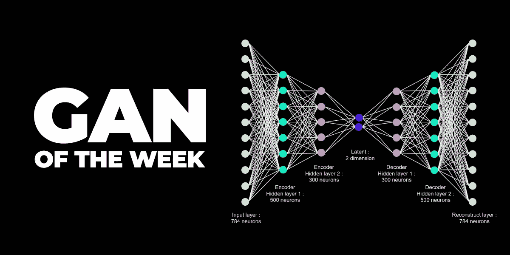
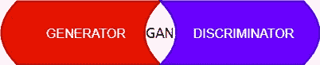
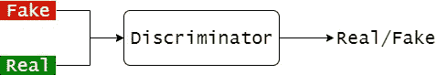
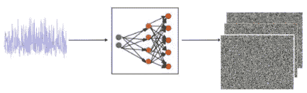
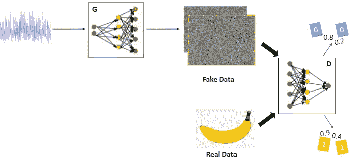
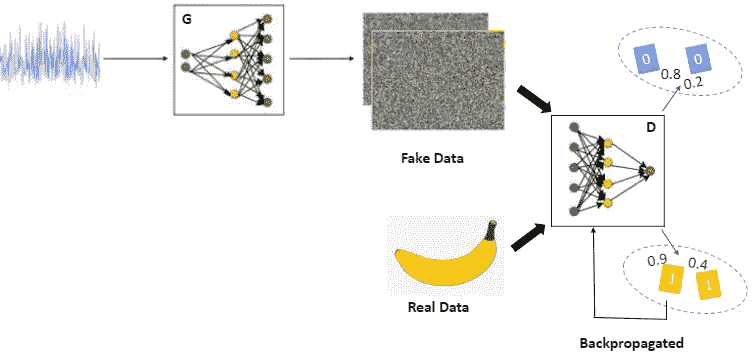
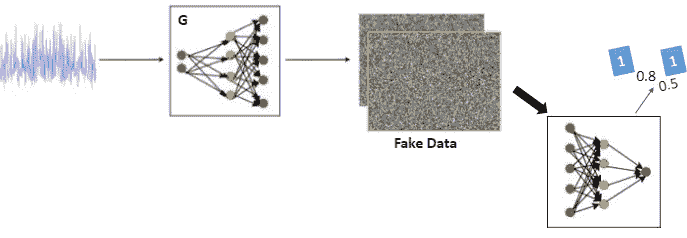
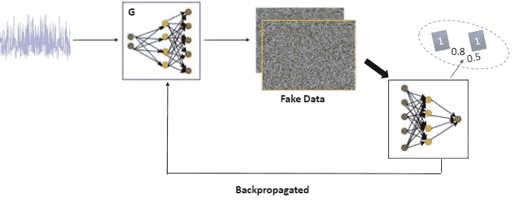

# 甘:将想象变为现实的工具

> 原文：<https://medium.com/analytics-vidhya/gan-an-imaginative-tool-into-reality-d8fa46aa6bff?source=collection_archive---------21----------------------->

嘿，敏锐的学习者！准备好翻过这个有趣的博客了吗？

[来源](https://twitter.com/Cindicator/status/1037367706960322560)

对一个令人兴奋的和先进的人工智能技术概念感到不满，这个概念被称为 GAN，缩写为 Generative Adversarial Networks。这个出色的算法是由年轻的研究人员 Ian J. Goodfellow 和他的同事在 2014 年发明的，他们刚刚开始了一个想象的机器学习时代。想象力？是的，你没听错！GAN 是一种非常热门的技术，可用于生成前所未见的合成图像。2014 年，甘的论文震惊了许多研究者。发明家确实给机器插上了想象的翅膀。例如，从已经存在的名人中产生新的名人形象或者创作一首新歌。是不是哇？

> 在继续之前，让我澄清一下博客的标题。甘被认为是一种想象工具，因为它能够生成从未存在过的图像(这是每个人的想象角色)并将它们带入现实。逼真的图像。

让我们投入学习时间吧！

GAN 是一种生成算法，可以扩展为:

*   **生成**:使用生成器模型生成新数据
*   **对抗性**:接受对抗性训练的有争议成分
*   **网络**:使用深度学习神经网络

# **甘是什么？**

GAN 是一种深度学习、无监督的机器学习对抗算法，建立在神经网络上，其中其组件互相假冒，同时互相间接生长。它被称为无监督的，因为没有标记的图像需要被传入鉴别器。毕竟，它可以说是一个分类器，只是将数据分类为真/假甚至多类数据(用于某种类型的 GANs)。鉴别器(D)是一个单输出神经网络，而生成器(G)将在此过程中不断学习并生成逼真的图像。因此，GAN 提出了一个更好的无监督深度神经架构版本，其中这种对抗网络的自学习是全新的！

> **注**:虽然标准 GAN 被归类为无监督的，但是还有其他类型的 GAN，扩展的 VanillaGAN 和作为半监督算法的功能(*例如 ConditionalGAN)。*

让我们举一个现实生活中的例子。

有一个小偷试图创造一个假的美元货币，而一个侦探正在值班检查货币的真假。小偷试图用假币来愚弄侦探。已经知道真币的侦探会把它分类为真/假，并告诉窃贼把它分类为假的特征。现在，小偷将从错误中吸取教训，并根据更新的结果创建新的侦探，再次尝试伪造侦探。但是侦探将会更加训练有素，G 会把图像传给 D，如此等等。

***甘主要成分:***

GAN 是一个发生器和鉴别器的胶囊

在上面的例子中，小偷是一个生成器，侦探是一个鉴别器。

> GAN 通常用于图像数据，因此 CNN 在鉴别器和发生器中出现。

生成器的工作是获取随机噪声并生成完全不存在的图像，而鉴别器的作用是从真实和虚假数据中获得训练，以将图像分类为真实/虚假，并通过帮助生成器间接欺骗自己。*聪明却又天真，不是吗？*于是，G 向 D 学习，创造出真实的图像来愚弄，让 D 信以为真。

> 注意:鉴别器和发生器都应该一起训练好。这意味着它不应该像训练 D，然后移动到 g。要知道为什么，在这个博客的后面部分得到答案。

# 甘的工作

生成性对抗网络被称为想象工具，因为它能够在 G 和鉴别器的帮助下生成全新的不存在的图像。让我们看看它是如何工作的。

# 第一步:

**发电机空闲时的列车鉴别器**

***步骤 1.1* 通过发生器(G)从随机噪声中产生数据**(如图像)

版权

> **正向传播**:分类(鉴别器)、生成(生成器)
> **反向传播:**对抗训练

***步骤 1.2*** 鉴别器(D)设置为**正向传播真实和虚假数据**并使用 sigmoid 或 softmax 函数计算其概率，具体取决于目标类别的数量。同样，将**假数据的理想概率设为 0，而真数据的理想概率设为 1** 。

版权

可以看到，最初，真实和虚假图像的概率不是很明显，因为这只是 D 的开始，它不知道这些。

版权

每个概率的**误差(损失)**被**计算**，并且聚集误差被**反向传播** **到 D** 以更新权重。
*例如，
(0–0.8)+(0–0.2)+(1–0.9)+(1–0.4)*

作为分类器的 d 现在将从它的错误中学习，并且现在将更好地完成它的工作。

# ***第二步:***

**鉴别器空闲时的列车发电机**

> 锻造的时刻到了！G 会试图欺骗 D，令人惊讶的是 D 自己也会帮助它。让我们看看怎么做。

***步骤 2.1***
**G****生成**图像并传递给 D，D 再次计算概率。这一次，由于 G 需要被训练来创建真实图像，因此我们的**理想概率变为 1** 。

版权

***步骤 2.2***
**计算累计误差(损失)**和**反向传播**到 G，然后相应地更新权重，使 G 更好地创建真实值。

版权

> D 就是这样间接帮助 G 和 yeah 让自己掉坑里的！

现在对 n 个时期和批次重复步骤 1 和 2。过程再次重新开始，用真的和假的来训练 D，并且误差被传播回来以便改进。然后，G 被训练以生成更真实的图像。如果图像看起来真实，你可以手动将它们可视化，或者可以使用 neuralNet 参数进行更多的历元或更多的调整。

> 为什么建议同时训练发生器和鉴别器？

两个网络都必须在各自的领域做到最好。如果 D 被单独非常精确地训练，那么 G 将没有机会学习。或者如果 D 没有训练好，那么 G 将不需要改进，因为 D 将总是返回非真实的假图像作为真实图像。因此，这些必须被训练并且一起变得更好。

# 氮化镓的种类

类型描述如下。

1.  **普通 GAN:** 最简单的初始 GAN，其中发生器和鉴别器是 **MLPs** 。此外，通过**随机梯度下降**进行优化。
2.  **条件 GAN(CGAN):** 它是一种**监督**技术，条件参数包含在生成器中。g 根据传递的标签(y)生成图像。标签也会传递给 D 来分类真/假。
3.  **深度卷积 GAN(DCGAN):** 最流行和最成功的算法，它涉及**卷积网络，而不是 MLPs** 。这里，一些技巧有助于生成高质量的图像。此外，不使用最大池，而是使用 Conv 步幅，避免完全连接的层。
4.  **拉普拉斯金字塔 GAN(LAPGAN):** 多个生成器和鉴别器的各种级别的金字塔。它在生成高质量图像时很受欢迎，首先对图像进行下采样，然后逐渐放大，直到达到顶部，直到它达到原始大小。
5.  **SinGAN:** 这种 GAN 几乎把以前 GAN 的所有缺点都整理出来了。独特的功能是**从一幅图像生成多幅图像**。此外，由于其他 GAN 的参与，如 PatchGAN，WGAN，Progressive GANs 等，它能够产生高质量的真实图像。

还有许多其他类型的 GAN，如 WGAN、PatchGAN、SRGAN 等。

# 参考

> [迄今为止最好的一篇展示甘诞生的文章](https://blog.floydhub.com/gans-story-so-far/)。
> 
> 对抗训练有点棘手。查看[这篇博客](/@jonathan_hui/gan-why-it-is-so-hard-to-train-generative-advisory-networks-819a86b3750b)了解更多细节。
> 
> 谷歌还推出了这个网站，不仅可以学习 GANs，还可以学习其他的 ML/AI。

如果你喜欢这个博客，你可以自由关注这个作者，因为这个作者保证会回来分享更多有趣的人工智能技术。此外，如果有任何理解或概念上的错误，请随时告诉我。

谢谢，

快乐阅读！:)

***可以通过***[***LinkedIn***](https://www.linkedin.com/in/kaul-shachi)***取得联系。***