# GAN——生成性对抗网络

> 原文：<https://medium.com/analytics-vidhya/gan-generative-adversarial-network-2b8f5ad6a50b?source=collection_archive---------11----------------------->

我们知道，即使将最低水平的噪声应用于真实数据，几个传统的神经网络也可以很容易地被操纵来错误地识别或错误地预测对象。这是因为大多数深度学习模型都是从少量数据中训练出来的，可能会导致模型过度拟合。

# ***甘是什么？***

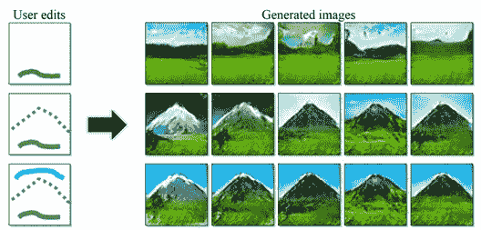

GAN 也称为生成对抗网络，它提供了一种在不需要大量标记数据的情况下学习深度描述的方法。他们使用一种竞争机制，通过提取反向传播信号将两个网络结合起来。这个概念可以用于无监督和半监督学习。它包括同时训练两个网络并使它们相互竞争。

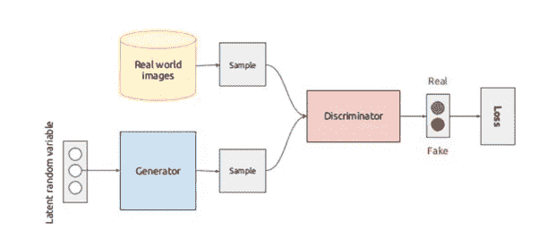

所以基本上，Gan 由生成器和鉴别器神经网络组成。生成器模型创建虚假的数据，如图片、声音、音乐，并试图欺骗鉴别器。它不是直接从真实数据集训练的；它从通过鉴别器接收的误差信号中学习。而鉴别器的作用是区分真实数据和虚假数据。它可以访问真实数据中的修改样本和图像样本。它根据图像或数据是来自原始数据还是来自生成器生成的伪数据来接收错误信号。它们由卷积和全连接多层网络执行。在每次迭代之后，模型在多个步骤中被训练以提高它们在各自任务中的性能。

生成器接受数据分布并被训练以增加鉴别器出错的可能性，并且鉴别器计算发送给它的图像是来自训练数据集的实际图像还是由生成器生成的图像的概率。

d 是将图像数据分配给样本概率的函数，该样本概率属于来自真实数据的分布。

> :D(x) → (0，1)

在生成器的情况下，D 被调节以区分图像，如果它来自训练数据集，那么它被分类为真实的并且接近 1，如果它来自生成器的数据，那么它被分类为假的并且接近 0。如果鉴别器的分类是完美的，则可以暂停它，同时可以再次恢复发生器，以得到训练来降低鉴别器的性能或准确度。

但实际上，鉴别者的训练直到达到最大准确度才开始。在这之后，发生器被训练来欺骗它，如果发生器的分布恰好等于真实的数据分布，那么鉴别器预测所有的样本输入为 0.5。

# ***训练流程:***

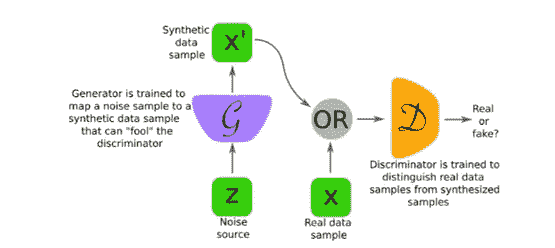

在训练期间，有两个主要任务来确定发生器和鉴别器模型的参数。在鉴别器的情况下，它应该最大限度地优化分类的准确性。在生成器中，它应该欺骗鉴别器来降低它的精度。

如下所示的价值函数 V(G，D)用于计算培训成本。

> max_(D ) min_(G) V(G，D)
> 其中
> V (G，D) = E_(p 数据(x)) log D(x) + E_(p g(x)) log(1 — D(x))

当一个模型的参数在训练期间被更新时，另一个模型的变量仍然是。当鉴别器模型效率低且不能区分真实和虚假数据时，生成器模型将更准确和最优。

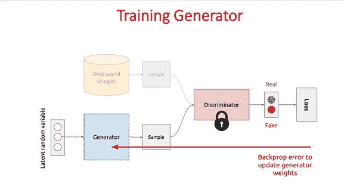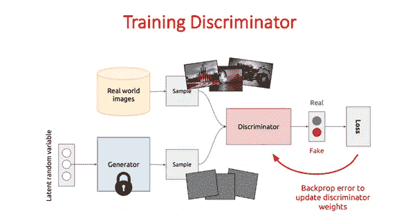

对于发电机，最佳条件下的鉴别器为

> D^* (x) = (p_ 数据(x) )/(p_ 数据(x)+p_(g(x)))

如果 p_(g(x)) = p_ data (x))，则生成器是最优的。这是鉴别器对所有图像样本估计为 0.5 的时间。

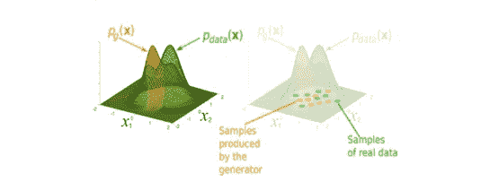

发生器模型是固定的，并且将仅在鉴别器模型被训练以使其达到关于该特定发生器的最佳状态之后被更新。但这只适用于理论部分。鉴别器模型无法实时达到最佳精度，因此发生器与鉴别器同时被修改或更新。

# ***甘在训练中遇到的挑战有:***

由于以下问题，训练 GAN 模型通常是困难的。

1.  融合的问题:

收敛生成器和鉴别器模型是一个麻烦。一般来说，深度学习模型试图减少损失和增加利润，并使用随机梯度下降或反向传播优化方法来获得理想的最准确的参数。SGD 在某些给定的情况下收敛。我们将收敛到局部最优，因为它使用非凸优化。

> 最小克数 L(克)

在 GAN 中，收敛到纳什均衡是不可能的，因为 SGD 不能得到它。

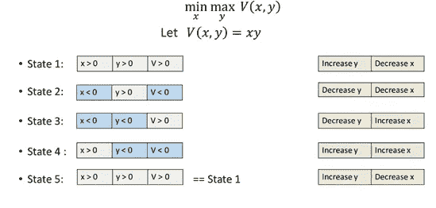

鉴别器和生成器都在玩最小化和最大化的游戏。

> 最小最大 V(G，D)

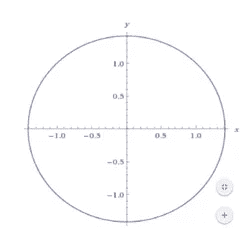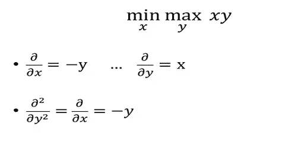

由于方程中的正弦函数，它不能收敛。【即使学习率适中】。

2)还存在模型崩溃的可能性，因为生成器有时不能给出样本中的目标/预期多样性。

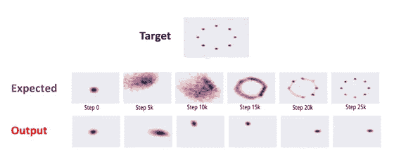

为了解决这个问题，我们可以使用小批量 GAN 来批量产生多样性。为了给出高质量的样本，我们还可以标记真实数据(监督方法)。

3)此外，当鉴别器的损耗快速收敛到零时，有时没有有效的方法用于发生器更新其梯度。

# ***甘的种类:***

> **全连接 GAN:**

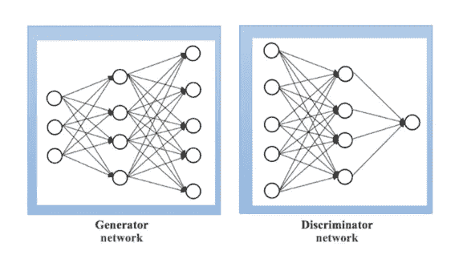

在这种类型中，生成器和鉴别器使用完全连接的神经网络层。

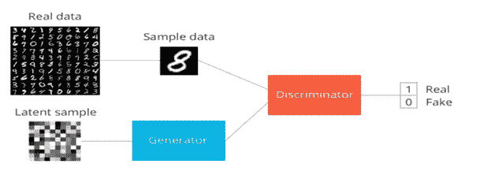

它用于基本数据集，如生成 MNIST 手写数字等。

> **条件 GAN (CGAN):**

它们在带标签的数据集上接受训练，我们还可以为生成器创建的每个实例定义标签。因此，利用这个附加的标签信息，我们可以控制生成器生成的图像质量。将生成仅属于特定条件类的图像。

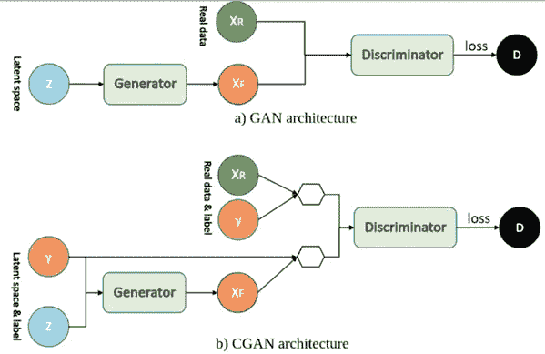

> **深度卷积 GAN (DCGAN):**

由于它们是 GAN 的扩展，所以它们更健壮并且产生更好质量的图像。这里，批规范化的特性被添加到鉴别器和生成器中。

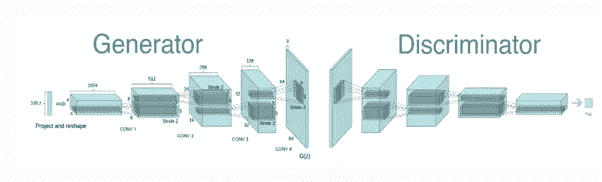

> **InfoGAN :-**

在无监督的形式下，它们对于学习最重要的图像特征非常有用。我们可以使用它们在高度复杂且未标记的数据集上训练条件 GAN。

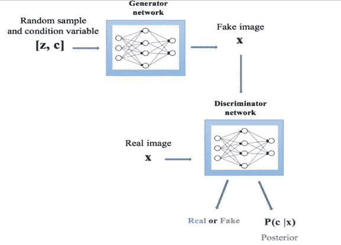

# **氮化镓的应用:**

***使用 StackGAN 进行文本到图像的合成。***

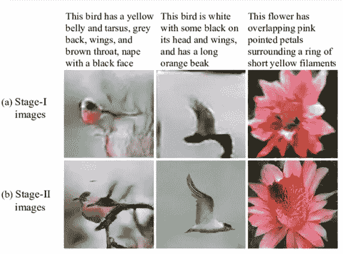

这可广泛用于工业目的。通过使用 StackGAN，我们可以从任何给定的文本生成逼真的照片。该模型在不同的阶段处理整个过程。最初，诸如形状、大小和颜色等属性。由 GAN 从给定的输入文本中分析，并输出低分辨率的图像。在第二阶段，前一阶段的结果连同输入文本被作为输入，并且通过纠正第一阶段的错误，它给出具有高分辨率的逼真图像。

***从草图中生成真实的图像。***

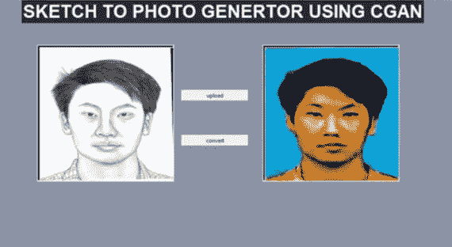

物体、人、动物的草图可以通过使用条件 GAN 模型转换成彩色图像。这里，生成器将草图和一些来自噪声的随机向量作为输入。鉴频器有两个输入，一个是真实样本，另一个是发生器产生的样本。发电机得到训练，以提供更准确的图像的帮助下，鉴别。

***使用 SRGAN(超分辨率 GAN)提高图像分辨率***

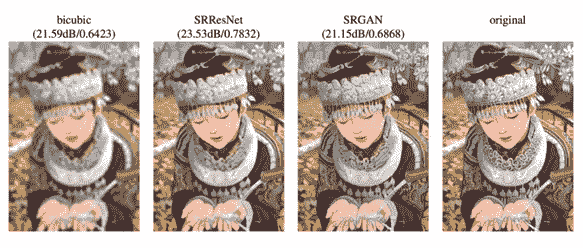

在这个过程中使用 SRGAN 从低分辨率图像的输入中给出高分辨率图像。生成器被给予低分辨率图像的输入，并且鉴别器被用于对低和高分辨率图像进行分类。这里使用的损失函数是感知损失，它包括对抗损失和重建损失。

***下一帧视频预测***

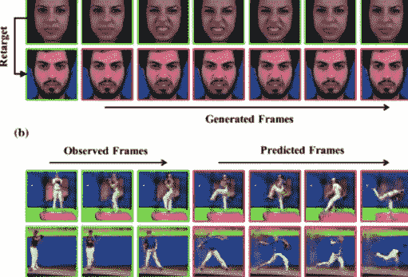

这是自动驾驶汽车和视频监控(检测视频中看到的动作威胁)中使用的一个重要概念。这里，可以使用回溯循环 GAN。以这样的方式训练发生器，使得它可以从任何输入帧预测过去的帧以及未来的帧。这里，可以容纳两个鉴别器，一个用于区分真实帧和虚假帧，另一个用于识别样本是否有任何虚假帧。

***侧脸检测***

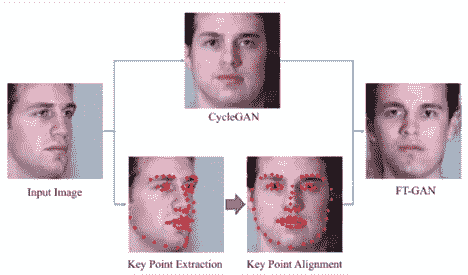

这是非常有用的应用，因为在 cctv 摄像机上或视频监控期间不可能识别侧面角度的人脸。没有合适的人脸识别机器学习算法可以准确地处理侧脸。因此，可以使用有条件的 GAN 将检测到的侧面转换成正面。