# 动画——面部动画

> 原文：<https://medium.com/analytics-vidhya/ganimation-facial-animation-109439fa93ec?source=collection_archive---------12----------------------->

Ganimation 是一篇有趣的论文，发表于 2018 年，作者通过控制定义人类表情的面部运动，成功地改变了面部表情。

查看报纸上的图片，它们展示了一些例子。

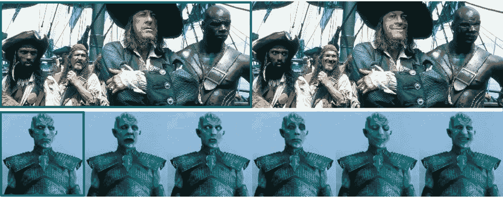

**什么是动作单元？**

埃克曼和弗里森开发了面部动作编码系统(FACS)来描述面部表情。它将面部表情分解为肌肉运动的各个部分，称为动作单元(AUs)。例如，恐惧是由以下因素引起的——内提眉(AU1)、外提眉(AU2)、降眉(AU4)、上提眼睑(AU5)、收紧眼睑(AU7)、伸展嘴唇(AU20)和下巴下垂(AU26)。

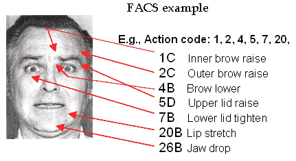

图片 Courtsey:[https://Inc . ucsd . edu/mplab/grants/project 1/research/face-detection . html](https://inc.ucsd.edu/mplab/grants/project1/research/face-detection.html)

**生成动作单元**

我们可以使用像 OpenFace Toolkit 这样的项目来生成面部动作单元。OpenFace 接收人脸图像并生成动作单元向量。它使用 MTCNN(多任务卷积神经网络)来裁剪人脸，这是人脸检测中的 SOTA 和线性核 SVM 来回归 AU 强度估计。

Tadas Baltrusaitis 非常慷慨地开源了 OpenFace Toolkit 实现，并提供了一个方便的 docker 来为每张脸生成动作单元。

为人脸生成的样本 AU 看起来像这样-

*【0.3，0.19，0。, 0.02, 0., 1.73, 0.56, 0.96, 0., 0., 0.03, 0., 0.63, 0., 0.75, 2.11, 0.]*

值为 0 表示不存在该 AU，而正数表示激活的程度。

**组织方法**

Ganimation 是一个合成面部动画的模型，它涉及到控制这些动作单元。它是一个 GAN 架构，其中模型以一维向量为条件，指示每个动作单元的存在/不存在和大小。重要的是，训练过程只需要输入图像及其动作单元向量。

给定具有动作单元 y(r)的输入图像 Iy(r)，想法是学习映射 M，将其转换为具有动作单元 y(g)的输出图像 Iy(g)。

发电机有两个部件。G1-将图像 Iy(r)变换为 Iy(g ), G2 将图像从 Iy(g)变换回 Iy(r )_ 预测。对于鉴别器，有 D_I 和 D_y，D _ I 评估图像的照片真实性，D _ y 评估从生成的图像 Iy(g)预测的动作单元 y(g)

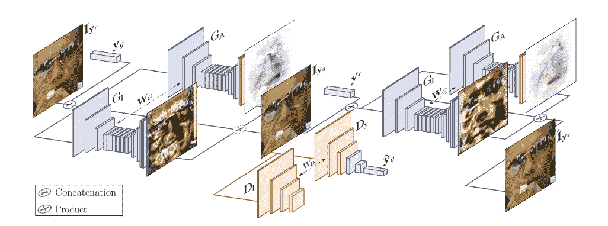

图片提供:组织信息纸

训练是在{ Iy(r)，y(r)，y(g) }的三元组上进行的，其中目标动作单元向量 y(g)是随机生成的。这使得数据的生成非常简单。给定一组人脸图像，所有需要做的就是得到一个紧密的人脸裁剪并生成它的动作单元。

**发电机**

I(o):尺寸为 H×W×3 的输入图像，具有动作单元 y(o)
y(o):输入/原始表达式的动作单元编码(大小为 N 的一维向量)
y(f):输出/期望表达式的动作单元编码(大小为 N 的一维向量)
I(f):以 y(f)为条件的输出图像

图像向量与动作单元 y(o)连接，得到 H x W x (3 + N)的输出。其中，大小为 N 的 y(o)被表示为类似于 H×W×N 向量的扩展版本。

生成器回归并生成两个输出。一个注意力遮罩 A (H x W)和一个 RGB 颜色变换(H x W x 3)。

注意屏蔽 A 决定了 C 中的每个像素对输出图像 I(f)的贡献。

I(f) = (1- A)。C +临时国际组织

如果 Aij 为 1，那么我们可以看到，当 Aij 为 0 时，I(0)的对应像素被直接复制到输出图像 vs，此时颜色变换被用于在输出图像中生成该像素。

生成器架构改编自论文“使用循环一致对抗网络的不成对图像到图像的翻译”，该论文使用两个生成器方法，并稍作修改。

该网络包含三个卷积、几个残差块、两个步长为 1/2 的分数步长卷积以及一个将特征映射到 RGB 的卷积。它对 128 × 128 图像使用 6 个块，对 256 × 256 和更高分辨率的训练图像使用 9 个
块。它还使用实例规范化，而不是批处理规范化。

**鉴别器**

鉴别器组件有两个组件— D_I 和 D_y

D_I 类似于贴片 GAN。这只会对图像碎片尺度的结构造成不利影响。它试图分类一个 N×N 的小块是真的还是假的。这是在图像上卷积运行的，对响应求平均值以获得最终输出。

D_y 是估计 AU 激活的回归头。

**损失函数**

让我们看看损失函数。这是 4 次失败的组合。

1.图像不利损失—这是基于 WGAN-GP 使用推土机距离的标准 GAN 损失。最初的 GAN 具有 Jenson-Shannon 发散损失函数，但是这不是连续的并且可以饱和。相反，WGAN-GP 使用 Wasserstein 损失，它并不真正输出介于 0 和 1 之间的数字。

批评家损失函数:D(x) — D(G(x))
发电机损失函数:D(G(x))

其中 D(x)是真实图像的评价分数，D(G(x))是虚假图像的鉴别分数。
鉴别器试图通过最大化差异来最大化临界损失函数。发电机试图最大化发电机损耗函数。实际损失是通过反转符号来实现的。

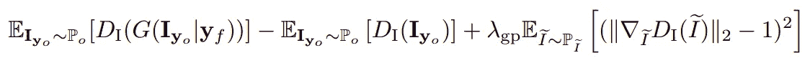

2.注意力丢失——这是两种正规化的混合。第一种是全变差正则化，它更多的是像素到像素的平滑。第二种是 L2 正则化，以防止注意力权重饱和。如果注意力权重在上面的注意力等式中饱和，我们可以看到输出图像将开始镜像输入，并且生成器将没有效果。

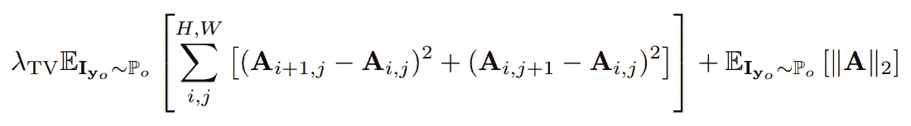

3.条件表达式丢失-这是操作单元丢失。对于一个给定的动作单元 y(f ),我们期望生成器产生一个改变了表达式的图像。因此，该损失的一个分量测量生成图像上的回归损失与实际 AU 向量 y(f)之间的损失。另一个分量是原始图像上的预测 AU 和 AU 向量 y(o)之间的回归损失

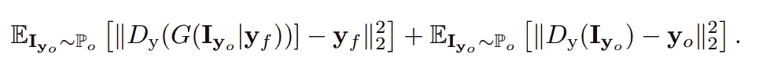

4.身份丢失——我们有两个生成器，一个将图像 I(o)转换为 I(f)。另一个将 I(f)变换为 I(o)predicted。这意味着可以将这种损失作为信息损失来测量，也称为周期一致性损失。所以这是我(o)和我(o)_ 预测之间的损失。

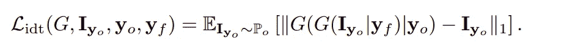

最终损失函数是所有 4 次损失的组合。

损失=图像对抗性损失+ λy *条件表达式损失+ λa *(生成器 1 的注意损失+生成器 2 的注意损失)+ λidt *同一性损失

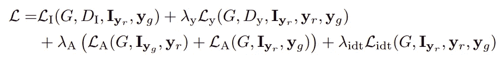

损耗最终被定义为一个典型的 GAN 极小极大问题。最小值和最大值是发电机损耗的最小化和鉴别器损耗的最大化。鉴别器寻求将正确标签分配给原始样本以及来自生成器的样本的概率最大化。

最大化 log D(x) + log(1-D(G(z)))
其中 x 为实际样本，G(z)为生成样本。

**评估定制图像上的组织**

为了在自定义图像集上对其进行评估，筛选一组目标人脸图像，测试图像并生成动作单元。需要对所有人脸图像进行近距离裁剪。我用的是 MTCNN。使用测试图像、测试图像的动作单元和从定制图像集中的样本中提取的动作单元，获得具有改变的表达式的最终输出。

我在我的一张粗暴的照片上试着生成改变的表情:)模型获取测试图像并改变它以复制目标图像的表情。这里，每行的第一个图像是提供的测试图像，该行的最后一个图像是目标图像。当目标动作单位的大小逐渐变化时，可以看到表达的变化。

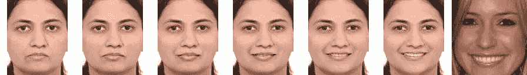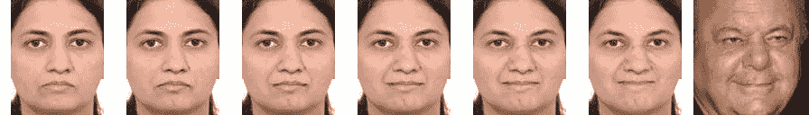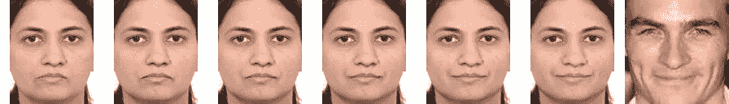

希望你喜欢这篇文章！请在评论中告诉我

**推荐人:**

1.组织动画:来自单一图像的解剖学意义上的面部动画——阿尔伯特·普马罗拉、安东尼奥·阿古多、阿莱克斯·m·马丁内斯、阿尔贝托·桑菲利乌、弗朗切斯克·莫雷诺-诺古尔
[https://arxiv.org/pdf/1807.09251.pdf](https://arxiv.org/pdf/1807.09251.pdf)

2.[https://www.paulekman.com/facial-action-coding-system/](https://www.paulekman.com/facial-action-coding-system/)

3.生成对抗网络——https://arxiv.org/pdf/1406.2661.pdf[T3](https://arxiv.org/pdf/1406.2661.pdf)

4.瓦瑟斯坦·甘—阿约夫斯基，m .，钦塔拉，s .，博图，l .
T5，

5.瓦瑟斯坦·甘斯的改进训练—[https://arxiv.org/pdf/1704.00028.pdf](https://arxiv.org/pdf/1704.00028.pdf)

6.OpenFace 2.0:面部行为分析工具包
[http://multicomp . cs . CMU . edu/WP-content/uploads/2018/11/open face . pdf](http://multicomp.cs.cmu.edu/wp-content/uploads/2018/11/OpenFace.pdf)
[https://github.com/TadasBaltrusaitis/OpenFace](https://github.com/TadasBaltrusaitis/OpenFace)

7.使用循环一致对抗网络的不成对图像到图像翻译
[https://arxiv.org/abs/1703.10593](https://arxiv.org/abs/1703.10593)

8.J .实时风格转换和超分辨率的感知损失——约翰逊、阿拉希和飞飞。
[https://arxiv.org/pdf/1603.08155.pdf](https://arxiv.org/pdf/1603.08155.pdf)

9.基于条件对抗网络的图像到图像翻译—伊索拉，p，朱，J.Y，周，t，埃夫罗斯，

10.[https://github.com/albertpumarola/GANimation](https://github.com/albertpumarola/GANimation)

11.[https://github.com/donydchen/ganimation_replicate](https://github.com/donydchen/ganimation_replicate)