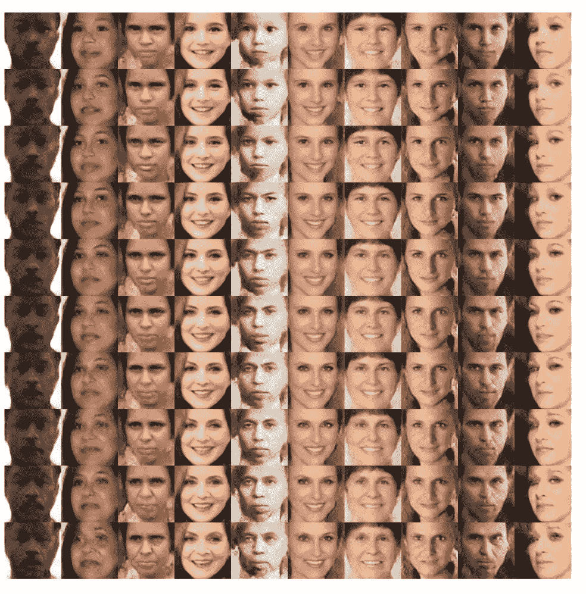
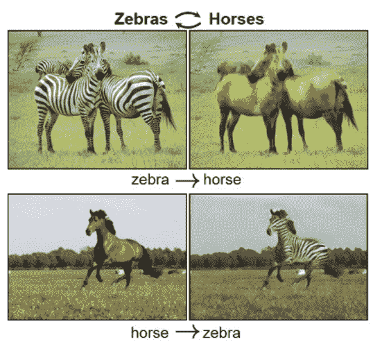
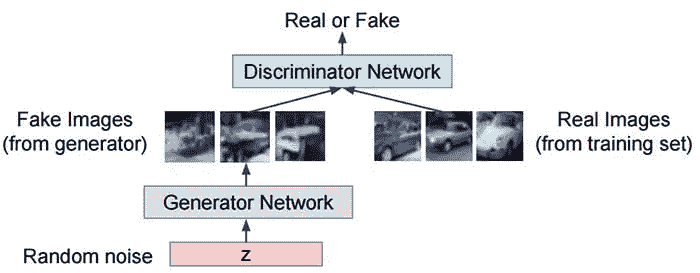
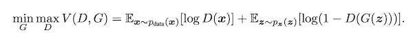
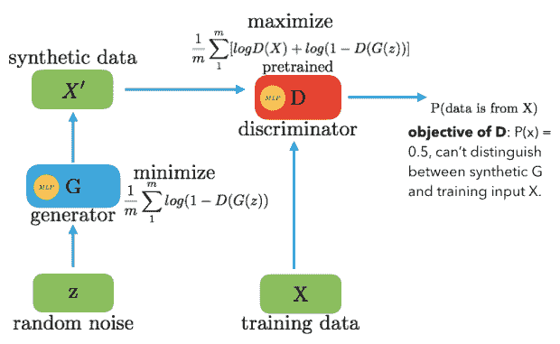
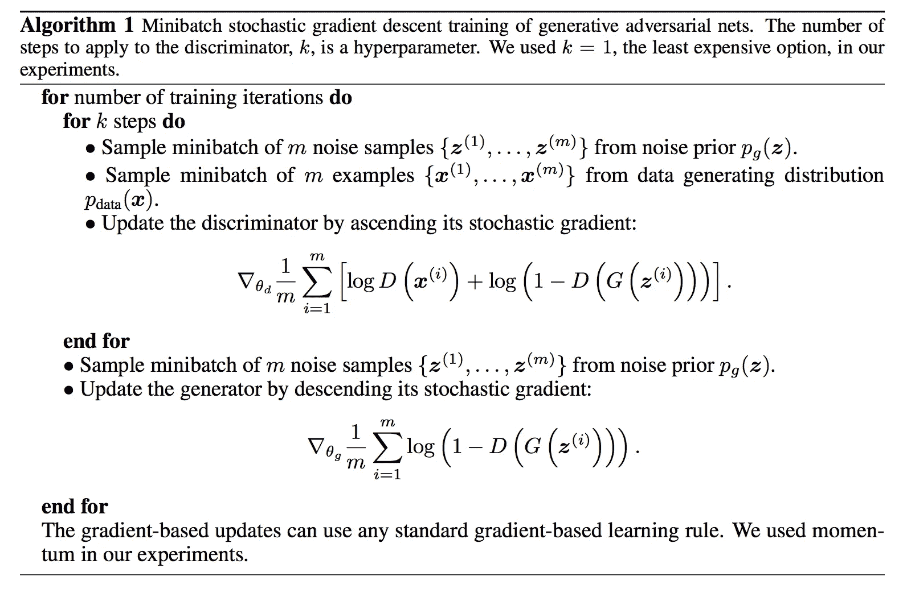

# GANs——生成对抗网络简介

> 原文：<https://medium.com/analytics-vidhya/gans-a-brief-introduction-to-generative-adversarial-networks-f06216c7200e?source=collection_archive---------0----------------------->

你有没有想过把你的斑马图像转换成马，或者反之亦然？有没有想过预测视频的下一帧？如果可以通过文本生成图像呢？要不要通过图片生成表情符号？你想创造一个不同姿势或不同角度的形象吗？如果你能创造一个白天到夜晚的图像，或者反之亦然，会怎么样？

是的，你可以做所有这些事情。这些是一些最酷的应用程序，它们让我着迷，并激发我写这篇文章。

生成对抗网络是深度学习中最热门的话题之一。生成对抗网络或 GANs 是用于无监督学习的神经网络类型。天然气水合物的应用大幅增加。让我们理解什么是生成性敌对网络，然后我们将看到它是如何工作的。

# 介绍

为了更好地理解生成敌对网络，让我们把它分解成单个的单词。因此，第一个词是生成性的，这意味着有一个不断生成新数据的网络，第二个词是对抗性的，这意味着它涉及两个相互对立的网络，而网络只是意味着一个数据顺序，它将继续前进并生成新数据。

# 它是如何工作的？

GANs 由两个网络组成，一个发生器 **G(x)** ，一个鉴别器 **D(x)** 。他们都玩一个对抗性游戏，生成器试图通过生成与训练集中的数据相似的数据来欺骗鉴别器。鉴别器通过从真实数据中识别假数据来试图不被愚弄。他们同时学习和训练复杂的数据，如音频、视频或图像文件。

**生成对抗网络**

生成器模型从随机噪声(z)生成图像，然后学习如何生成逼真的图像。使用均匀或正态分布对输入的随机噪声进行采样，然后将其馈入生成图像的发生器。来自训练集的伪图像和真实图像的生成器输出被馈送到学习如何区分伪图像和真实图像的鉴别器中。输出 D(x)是输入是真实的概率。如果输入是实数，D(x)将是 1，如果它是生成的，D(x)应该是 0。

# 甘斯背后的数学

让我们再深入一点，理解它在数学上是如何工作的。鉴别器和生成器用值函数 V(G，D)玩一个双人极大极小游戏。所以，极大极小目标函数是:

**目标函数**

**GANs 的架构**

D()给出了给定样本来自训练数据 X 的概率。对于生成器，我们希望最小化 log(1-D(G(z))，即当 D(G(z))的值很高时，D 将假设 G(z)除了 X 什么都不是，这使得 1-D(G(z))非常低，我们希望最小化它，使其更低。对于鉴别器，我们要最大化 D(X)和(1-D(G(z))。所以 D 的最优状态会是 P(x)=0.5。然而，我们想训练生成器 G，使它为鉴别器 D 产生结果，这样 D 就不能区分 z 和 x。

现在的问题是为什么这是一个极大极小函数。这里，鉴别器试图最大化目标 V，而生成器试图最小化它，由于这种最小化/最大化，我们得到极小极大项。它们都通过交替梯度下降来一起学习。

如何实现这一点？

我们将通过固定 G，使用真实图像和生成的图像对 D 执行梯度下降迭代。然后，我们固定 D 并训练 G 进行另一次迭代，以欺骗固定的 D。我们希望通过交替迭代 G 和 D 来优化我们的极大极小函数，直到我们从生成器获得高质量的图像，而鉴别器将无法区分真实图像和虚假图像。

下面是伪代码，显示了如何训练甘。

# 结论

gan 非常受欢迎，广泛应用于各种行业的各种问题中。训练它们似乎很容易，但实际上，这并不是因为它需要两个网络来训练，这使得它们不稳定。

这是一篇简单的文章，让你对 GANs 有一个基本的概念。如果你想了解更多，下面是你可以阅读的参考资料。

*   【https://arxiv.org/pdf/1406.2661.pdf 号
*   [http://cs 231n . Stanford . edu/slides/2017/cs 231n _ 2017 _ lecture 13 . pdf](http://cs231n.stanford.edu/slides/2017/cs231n_2017_lecture13.pdf)

希望这篇文章对你有用。我已经用 PyTorch 实现了 GANs。一定要看看这个回购协议。

[https://github.com/Shwetago/Generative-model-using-PyTorch](https://github.com/Shwetago/Generative-model-using-PyTorch)

谢谢你读到这里。敬请关注更多文章。