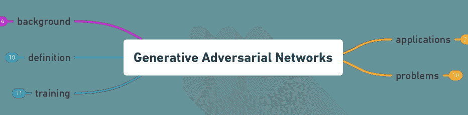
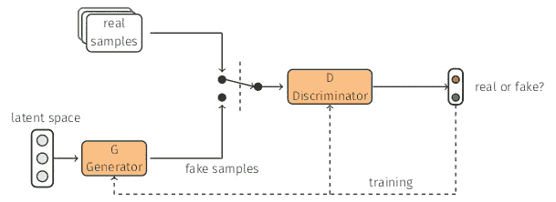
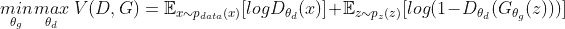
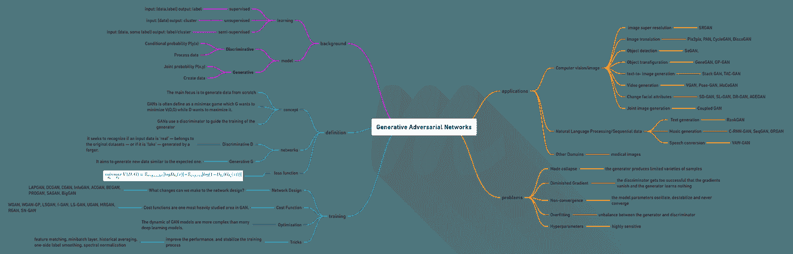

# GANs —简要概述(第 1 部分)

> 原文：<https://medium.com/analytics-vidhya/gans-a-brief-overview-part-1-adc3e2705751?source=collection_archive---------16----------------------->

这篇文章介绍了一些基本概念，包括**生成对抗网络的概念——GANs**。

由 [fernanda rodríguez](https://medium.com/u/d83c82313ee1?source=post_page-----adc3e2705751--------------------------------) 开发的生成性对抗网络。

在这篇文章中，你会发现:

*   一些先前概念的背景，
*   **生成敌对网络简介，**
*   **网络设计**和**成本函数**，
*   **训练，**和
*   思维导图配一个**甘的总结**。

# 背景

给出了一些概念的简要定义，如监督和非监督学习，以及判别和生成模型。

## 监督学习

学习映射一个函数 *ŷ=𝑓(𝑥)* 给定标签数据 *y* 。

*   例如:分类算法(SVM)，回归算法(线性回归)。
*   应用:对象检测，语义分割，图像字幕等。

## 无监督学习

学习给定数据的底层结构，无需指定目标值。

*   示例:聚类算法(k-means)、生成模型(GANs)
*   应用:降维、特征学习、密度估计等。

## 判别模型

大多数监督学习算法具有固有的判别能力。

判别模型允许我们评估**条件概率** *𝙿(𝑦|𝑥)* 。学习将输入 *x* 映射到输出 *y* 的功能。

*   例子:逻辑回归，支持向量机，神经网络。

## 生成模型

大多数无监督学习算法是天生的。

生成模型可以让我们评估**联合概率**𝙿(𝑥*𝑦).*尝试同时学习输入 *x* 和输出 *y* 的联合概率。

*   例子:潜在的狄利克雷分配，限制玻尔兹曼机，生成对抗网络。

# 生成性对抗网络

[生成对抗网络(Generative Adversarial Networks)或 GANs](https://arxiv.org/abs/1406.2661) 是由[**Ian good fellow**](http://www.iangoodfellow.com/)、Yoshua Bengio 等人在 2014 年提出的一个框架。

**GANs** 由两个模型组成，用一个[人工神经网络](/@mafda_/ml-dl-artificial-neural-networks-part-4-619350a93ef1)表示:

*   第一个模型叫做**生成器**，它的目标是生成与预期数据相似的新数据。
*   第二个模型被命名为**鉴别器，**，它试图识别输入数据是属于原始数据集的“真实”数据，还是由伪造者生成的“虚假”数据。

## 电力网设计

由 [fernanda rodríguez](https://medium.com/u/d83c82313ee1?source=post_page-----adc3e2705751--------------------------------) 设计的生成对抗网络架构。

*   生成器 *𝐺* 的输入是一系列随机生成的数字，称为**潜在空间**。它试图产生来自某种概率分布的数据。
*   *𝐺* 将随机噪声作为输入，然后通过一个可微分函数运行该噪声，以转换该噪声并将其整形为具有可识别的结构。
*   *𝐺* 的输出是逼真的图像。如果没有训练，生成器只会产生垃圾图像。
*   *𝐷* 是使用**监督学习**训练的**分类器**。它对图像是真实的(1)还是虚假的(0)进行分类。

## 价值函数

极大极小目标函数(生成器和鉴别器玩的极大极小游戏的价值函数或代价函数):

fernanda rodríguez 的成本函数 GANs。

*   *𝐷⒟* 想要最大化客观使得 *𝐷(𝑥)* 接近 1(真实)，而*)*接近 0(虚假)。
*   *𝐺⒢* 想最小化客观使得*𝐷(𝐺(𝑧)】*接近 1(鉴别者被忽悠以为生成了 *𝐺(𝑧)* 是真实的)。

## 双人游戏

生成器 *𝐺* (伪造者)需要学习如何创建数据，以使鉴别器 *𝐷* 不再能够鉴别出它是假的。这两个团队之间的竞争提高了他们的知识，直到 *𝐺* 成功创造出真实的数据。

*   𝐺试图通过生成看起来真实的图像来欺骗鉴别者。
*   *𝐷* 试着区分真假图像。

结果，鉴别器 *𝐷，*

*   *𝐷* 被训练以正确地将输入数据分类为真实或虚假。
*   *𝐷* 权重被**更新**以最大化任何**真实数据**输入 *x* 被分类为属于真实数据集的概率。
*   使用的损失/误差函数使函数 *𝐷(𝑥)* 最大化，同时**使***𝐷(𝐺(𝑧)*最小化。

还有发电机 *𝐺、*

*   𝐺接受训练，通过生成尽可能真实的数据来欺骗鉴别器。
*   *𝐺* 权重**被优化**以最大化任何**虚假数据**被分类为属于真实数据集的概率。
*   用于该网络的损失/误差函数**最大化***【𝐷(𝐺(𝑧】)*。

## 培养

我们在一个循环中依次训练鉴别器和生成器，如下所示:

1.  将鉴别器设置为可训练
2.  用真实数据和生成器生成的数据训练鉴别器，对真假数据进行分类。
3.  将鉴别器设置为不可训练
4.  将发电机作为 GAN 的一部分进行培训。我们将潜在样本送入 GAN，让发生器产生数据，并使用鉴别器对数据进行分类。

选择优秀的整体架构至关重要，

*   生成器和鉴别器都至少有一个隐藏层。
*   两个同时优化。
*   我们为 G 和 D 定义了一个损失。最小化 D 的损失，同时使用另一个优化器来最小化 G 的损失。

fernanda rodríguez 总结生成性对抗网络。

对于那些寻找我们 **GANs 系列**中所有文章的人。以下是链接。

 [## GANs——生成性对抗网络 101

### 生成对抗网络的 Keras 实现。带 MNIST 的 GANs、DCGAN、CGAN、CCGAN、WGAN 和 LSGAN 型号…

medium.com](/@mafda_/gans-generative-adversarial-networks-101-8bf8e304585c) 

# 参考

## 相关论文

*   [生成性对抗网络](https://arxiv.org/abs/1406.2661)
*   [深度卷积无监督表示学习](https://arxiv.org/pdf/1511.06434.pdf)
*   [条件生成对抗网](https://arxiv.org/pdf/1411.1784.pdf)
*   [具有上下文条件生成对抗网络的半监督学习](https://arxiv.org/pdf/1611.06430.pdf)
*   [瓦瑟斯坦甘](https://arxiv.org/pdf/1701.07875.pdf)
*   [最小二乘一般敌对网络](https://arxiv.org/pdf/1611.04076.pdf)
*   [生成对抗网络:综述和分类](https://arxiv.org/pdf/1906.01529.pdf)
*   [生成对抗网络的最新进展:综述](https://ieeexplore.ieee.org/document/8667290)

## 数据集

*   [MNIST 手写数字数据库](http://yann.lecun.com/exdb/mnist/)
*   [CIFAR-10 数据集](https://www.cs.toronto.edu/~kriz/cifar.html)

## 其他存储库

*   [喀拉斯-甘](https://github.com/eriklindernoren/Keras-GAN)
*   [对抗性网络论文](https://github.com/zhangqianhui/AdversarialNetsPapers)
*   [如何训练一个甘？让 GANs 发挥作用的技巧和诀窍](https://github.com/soumith/ganhacks)
*   [甘动物园](https://github.com/hindupuravinash/the-gan-zoo)
*   [GAN Lab:一个用于生成性对抗网络的交互式可视化实验工具](https://github.com/poloclub/ganlab)
*   [gans-awesome-应用](https://github.com/nashory/gans-awesome-applications)
*   [张量流生成模型集合](https://github.com/hwalsuklee/tensorflow-generative-model-collections)