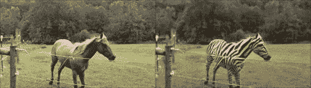
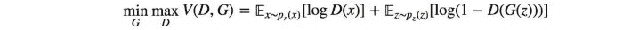
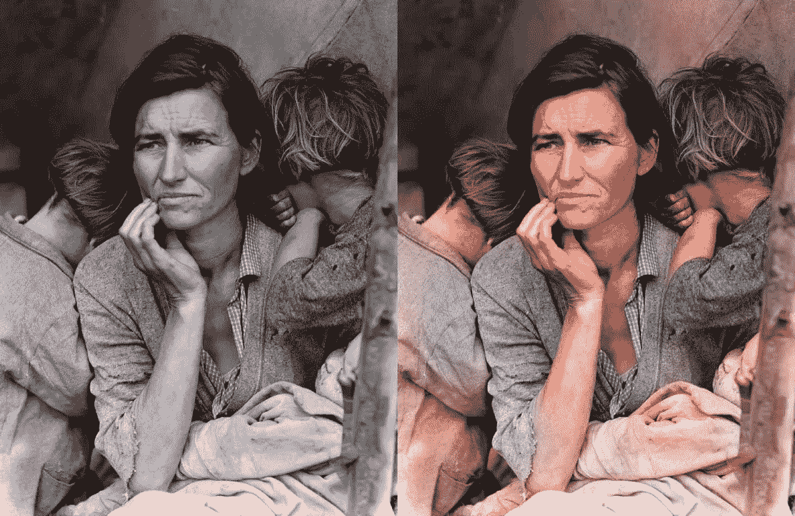
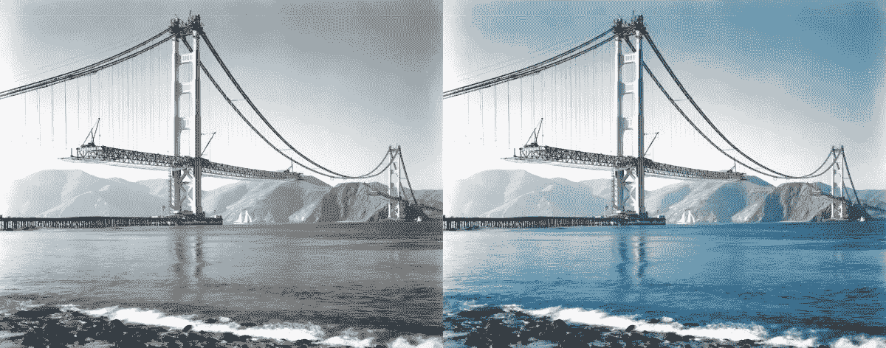
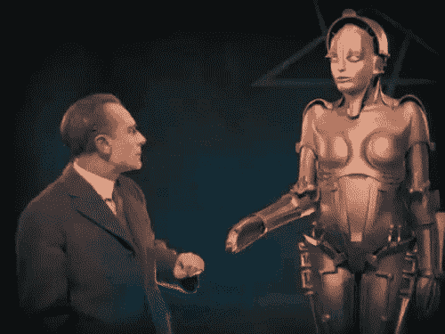

# 甘斯:花哨还是有用？

> 原文：<https://medium.com/analytics-vidhya/gans-fancy-or-useful-5b6318cdce2?source=collection_archive---------20----------------------->

> 我可以学着像梵高或毕加索那样画画…我也可以模仿奥巴马！

[生成对抗网络(GANs)](https://arxiv.org/abs/1406.2661) 是一类不同于所有其他模型家族的生成模型，因为我们没有使用最大似然来训练它们。为什么不呢？不太清楚的是，更好的可能性数字一定对应于更高的样本质量。我们知道*最优生成模型*会给我们最好的样本质量和最高的测试对数似然。然而，具有高测试对数可能性的模型仍然会产生差的样本，反之亦然。因此，我们转向*无可能性训练*，希望优化一个不同的目标可以让我们摆脱获得高可能性和高质量样本的渴望。

使用 [CycleGANs](https://arxiv.org/abs/1703.10593) 生成斑马纹

甘是基于零和的非合作博弈。简而言之，如果一方赢了，另一方就输了。零和游戏也叫极小极大。你的对手想要最大化它的行动，而你的行动是最小化它们。在博弈论中，当鉴别器和发生器达到纳什均衡时，GAN 模型收敛。这是下面的极小极大方程的最优点。

由于双方都想削弱对方，当一方不管对手做什么都不改变自己的行动时，纳什均衡就发生了。

[*在极小极大博弈中，尤其是非凸博弈中，使用梯度下降，成本函数可能不收敛。*](/@jonathan_hui/gan-why-it-is-so-hard-to-train-generative-advisory-networks-819a86b3750b) *因为在这里我们不是在寻找最小值或最大值，而是寻找一个鞍点，这本身就是一个挑战，特别是使用梯度下降来这样做。*

一个可行的方法是使用一个预先训练好的发生器和鉴别器来训练 GANs。这种做法是为了抵消盲人摸象的效果。但是当鉴别器和发生器被预先训练时，训练 GAN 的最初障碍被克服。我们将讨论甘的训练过程，在[的](https://github.com/jantic/DeOldify)(对旧图像和胶片进行着色和恢复)中，这一过程在监控下似乎产生了引人注目的结果。这种方法已经被 [fast.ai](http://fast.ai/) 和 Deoldify [Jason Antic](https://github.com/jantic) 的创造者采用，并被称为 NoGAN:

多萝西娅·兰格的《移民母亲》(1936)

DeOldify 最重要的设计选择之一是使用自我关注，正如“[自我关注生成对抗网络](https://arxiv.org/abs/1805.08318)”(SAGAN)论文中所实现的。本文总结了使用它们的动机:

“传统的卷积 gan 生成高分辨率细节，仅作为低分辨率特征图中的空间局部点的函数。在 SAGAN 中，可以使用来自所有特征位置的线索来生成细节。此外，鉴别器可以检查图像远处部分的高度细节特征是否相互一致。”

《建造金门大桥》(美国东部时间 1937)。**注意:**你可能想知道这个渲染看起来很酷，但是颜色准确吗？最初的照片让它看起来像是白色的桥塔。我们对此进行了研究，结果发现答案是否定的——在这个时候，塔楼已经被红色底漆覆盖了。所以这是需要记住的事情——历史准确性仍然是一个巨大的挑战！

注意:你可能想知道的是，虽然这个渲染看起来很酷，但是颜色准确吗？最初的照片让它看起来像是白色的桥塔。我们对此进行了研究，结果发现答案是否定的——在这个时候，塔楼已经被红色底漆覆盖了。所以这是需要记住的事情——历史准确性仍然是一个巨大的挑战！

培训过程描述如下:

1.  对发电机进行预训练。发生器首先以一种更传统、更容易控制的方式进行训练——带有[感知损失](https://arxiv.org/abs/1603.08155)自身。GAN 训练还不介绍。在这一点上，你正在用最简单的方法尽可能好地训练发电机。这占据了我们训练的大部分时间。请记住:这种预训练本身将会使生成器模型走得更远。着色将作为一项任务得到很好的训练，尽管颜色将倾向于暗淡的色调。自我关注在这个阶段也会得到很好的训练，这一点很重要。
2.  **保存预训练生成器生成的图像。**
3.  **将鉴别器预训练为二元分类器。**与发电机的预训练非常相似，我们在这一步的目标是以更容易控制的“常规”方式为鉴频器提供尽可能多的训练。没有比二进制分类器更简单的了！在这里，我们将鉴别器训练为真实和虚假图像的二元分类器，虚假图像是上一步中保存的图像。
4.  **(几乎)在正常 GAN 设置下训练发电机和鉴别器。快点！这是令人惊讶的部分。事实证明，在这种预训练场景中，鉴频器将在 GAN 训练期间快速驱动发生器的调整。这发生在某种“拐点”到来之前的一个狭窄的时间窗口内。在这之后，以这种方式继续训练似乎没有什么好处。事实上，如果在这之后继续训练，你会开始看到渲染中引入的伪像和故障。**

事实证明，在这种 GAN 训练中，发生在“拐点”之前的学习以非常有效的方式训练发生器。这不仅是为了快速实现良好的着色，而且不会在生成器渲染中引入伪像、变色和不一致。

以上方法完全取自 *fast.ai* 和 *Jason Antic。*

无预训练发生器和鉴别器的原始去失真模型

基于 NoGAN 的去模糊模型

考虑到 GAN 训练中的调整，可以接受这样的说法，尽管 GAN 训练非常困难，但一些变化和新型损失函数的引入可能对 GAN 的实际应用有很大的帮助。