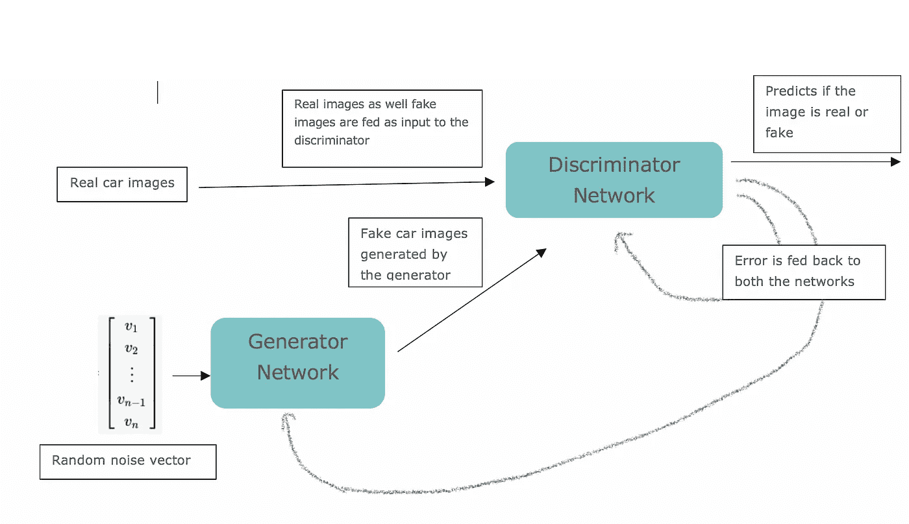

# GANs——G、A 和 N 在 GANs 中是什么意思？

> 原文：<https://medium.com/analytics-vidhya/gans-what-do-g-a-and-n-mean-in-gans-b0b9275520b5?source=collection_archive---------17----------------------->

几天前，一个类似于这里的视频激起了我对 GANs 的兴趣，在那里我发现“爱因斯坦先生”在做鬼脸。

我将在这里写的关于 GANs 的系列博客更多的是试图通过研究和广泛使用以下两个资源来记录我对这个主题的理解:

1)[https://live book . manning . com/book/gans-in-action/gans-in-action-deep-learning-with-generative-adversarial-networks/](https://livebook.manning.com/book/gans-in-action/gans-in-action-deep-learning-with-generative-adversarial-networks/)

2)[https://www . coursera . org/specializations/generative-adversarial-networks-gans](https://www.coursera.org/specializations/generative-adversarial-networks-gans)

我想把条件概率和贝叶斯定理作为这篇文章的先决条件。你可以在这里阅读这些。

GANs(生成对抗网络)是一种所谓的“生成”模型。第一篇文章旨在解释这些问题:

*“什么叫生财？为什么是对抗性的？什么网络？*

当我们将生成模型与判别模型进行比较时，更容易理解生成模型。假设，我们手头有一个分类问题。通常，当我们想到分类器时，脑海中浮现的是将两个组或类分开的某种超平面(一条线)。给定一个新的数据点，我们试图找出它会落在直线的哪一边，就像这样:

图一。区别分类器

这种模型被称为区别模型——它们区别或“识别”两个类别之间的区别。两种类型的模型属于判别模型:

1.使用概率模型的算法，其中我们找到条件概率 P(y | X；θ)**直接**，例如逻辑回归。

2.像 SVM 这样不使用概率模型并学习在输入特征和目标之间进行映射的分类器也被称为鉴别分类器。

现在，*对于同一个问题*，生成学习算法有什么不同？

生成模型不仅仅是分类。在对数据点进行分类的过程中，算法的第一步是对每个类别进行“建模”。

假设我们试图对汽车和飞机进行分类，生成算法对飞机的分布和汽车的分布进行建模，然后找出看不见的数据点更可能是从哪种分布中生成的。

用外行人的话说:

*   你有一组数据点(比如所有飞机的集合)
*   假设这些点遵循某种未知分布 D *飞机*
*   生成模型试图学习分布 D *模型 _ 飞机*类似于 D *飞机*

图二。简单的生成模型

类似地，学习算法模仿 D *汽车*分布来找到 D *型号 _ 汽车。如果模型的目标是对一个看不见的数据点进行分类，它就利用这些信息来找出它是一辆汽车还是一架飞机的概率。*

图 2 的底部。指示如何使用学习的分布来生成不一定在原始数据集中的新数据点。这解释了什么是生成性。

就概率而言:

在生成分类算法的情况下，我们仍然需要找到称为后验概率的概率 P(y|X)。在这种情况下使用贝叶斯定理，这意味着我们首先找到先验概率 P(X|y)和 P(y)。

图三。确定后验分布的贝叶斯规则

*就是这一步求 P(X|y)造成了差别。*

如果你考虑术语 P(X|y= '飞机')-这实际上近似于飞机的特征分布，类似地，P(X|y= '汽车')近似于或模拟汽车的特征分布。

如果不是为了分类，我们实际上感兴趣的只是找到 P(X)，即这些特征一起出现的概率，比如说，在一架飞机上。

一个词“生财”就这么多了！

字典上是这么说的:“以冲突或对立为特点”。这个术语是从博弈论中借用的，其中一个玩家的得失被另一个玩家的得失所平衡，正如这里的[所解释的](https://en.wikipedia.org/wiki/Zero-sum_game)。

GAN 的目的是生成:生成新的图像，生成语言，以便很难区分生成的项目和真实的项目。

GAN 由两个并行训练的网络组成:一个发生器和一个鉴别器。这些是在竞争，一个试图智取对方。

让我们看看怎么做。假设目标是生成真实的汽车图像。生成器网络需要生成尽可能接近真实汽车图像的汽车图像，并试图欺骗其对手鉴别器，鉴别器必须足够聪明，以识别馈送给它的图像是真实汽车还是假汽车；这是一个二元分类器。错误分类误差被反馈给两个网络。

图 4。阿甘

生成器随着生成类似真实的图像而变得越来越好，鉴别器通过将改进的生成图像识别为假的来进行识别。当鉴别器不再能够区分两者时，就是训练停止的时候——纳什均衡就达到了。在这个阶段，鉴别器的工作完成了，tada，生成器开始生成汽车图像，就好像它们是真实的一样。

我相信这就解释了“生成性”和“对抗性”，而不用说《甘》中的网络指的是生成者网络和鉴别者网络。

如果你仍然对这个想法不感兴趣——请一定要去参观 https://www.thispersondoesnotexist.com/——他们不是真人！

感谢您的阅读，如果您愿意和我一起踏上了解和建立 GANs 的旅程，请联系我们。

文献学

1.  [https://papers . nips . cc/paper/5423-generative-adversarial-nets . pdf](https://papers.nips.cc/paper/5423-generative-adversarial-nets.pdf)
2.  [https://ai . Stanford . edu/~ ang/papers/nips 01-discriminative generative . pdf](https://ai.stanford.edu/~ang/papers/nips01-discriminativegenerative.pdf)
3.  [http://cs229.stanford.edu/notes/cs229-notes2.pdf](http://cs229.stanford.edu/notes/cs229-notes2.pdf)