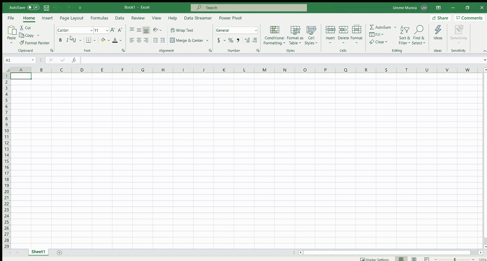

# 使用 Microsoft Excel、PowerBI 和 Tableau 的甘特图

> 原文：<https://medium.com/analytics-vidhya/gantt-chart-using-microsoft-excel-powerbi-and-tableau-e3d5aa8a887b?source=collection_archive---------16----------------------->

甘特图是跟踪任何项目进度的一种非常流行的可视化工具。这是一种条形图，说明项目时间表，将任务/活动列表放在垂直栏中，将每个任务/活动的持续时间放在水平栏中。这个图表有不同的类型；在这篇文章中，我不会详细介绍甘特图(查看 [wiki](https://en.wikipedia.org/wiki/Gantt_chart) 了解更多细节)。

# 擅长

excel 中的甘特图非常直观。我们只要去**文件>新建>在搜索栏**写‘甘特图’，我们就会看到一堆甘特图模板。我们可以选择任何最符合我们需要的模板，它将在一个单独的表中创建。

这是我经常使用的一个(下图)。现在，我们可以根据我们的项目编辑活动、开始日期、结束日期和持续时间。

# 功率 BI

Power BI 是微软的另一个商业分析服务产品。它主要用于通过报告和仪表板实现可视化和商业智能。让我们看看如何在 Power BI 中创建甘特图。

Power BI 在右上角有一些内置的可视化模板(下图中红色圆圈区域)，但我们在这里找不到甘特图。在可视化模块的 powerapps 按钮旁边有一个“获得更多视觉效果”按钮(下图中黄色突出显示)；我们将从那里导入甘特图模板。

因此，让我们单击“获取更多视觉效果”按钮>获取更多视觉效果(下图中黄色突出显示)，然后将弹出 Power BI 视觉效果窗口。

**“获得更多视觉效果”的 Power BI**

**Power BI 视觉窗口**

现在我们必须像 Microsoft excel 一样在搜索栏中搜索甘特图模板。搜索结果将显示不同的甘特图模板。其中大多数是免费的，但其中一些可能需要额外购买才能使用这些模板(如下图中绿色突出显示的模板)。同样，我们可以点击所选应用程序旁边的**黄色“添加”按钮**，根据我们的需求和项目选择一个。

这个选定的模板将显示在可视化窗格的正下方。我添加了两个(MAQ 软件的甘特图和甘特图)，在下图中标记为两个红圈。

现在我们必须加载数据来查看实际的图表。我已经创建了一个演示表(如下图)只是为了演示的目的，并从可视化窗格中使用“甘特图”应用程序。

**Power BI 中甘特图演示表**

Power BI 的拖放功能非常方便。您只需选择视觉效果，然后拖放您的活动、开始日期和可视化窗格中的其他字段，如下图所示。

我最终的甘特图如下所示(下图)。同样，我们可以根据我们的项目和需要修改它。

# （舞台上由人扮的）静态画面

Tableau 是另一个很好的数据可视化工具。与 Power BI 类似，Tableau 也因其拖放功能而广受欢迎。我们将使用其内置的甘特图类型来获取甘特图。让我们从那个开始。

在 tableau 中，首先我们需要导入数据。在这里，我在 excel 中创建了一个演示项目时间表，如下所示。为了导入数据，我只需从 excel 中复制数据并粘贴到 Tableau 中。

**演示项目时间表**

默认情况下，Tableau 在下面创建了这个表。

为了获得最初的可视化，我们需要每个活动的持续时间。这里，我们需要创建一个计算字段 Duration。要创建计算字段，我们必须执行以下操作。

*   转到分析>创建计算字段
*   将打开一个新的对话框；在计算 1 中写入持续时间，并在公式框中写入**【到期日】【开始日期】**
*   单击确定

创建计算字段:持续时间

现在我们有了每项活动的持续时间。让我们对甘特图做如下操作。

*   在列中输入开始日期，在行中输入活动和/或主管
*   右键单击开始日期，选择确切的日期
*   将持续时间拖到合适的大小；Tableau 将从右侧的“演示”窗格中自动选择甘特图视图。

我们现在也有了表格形式的基本甘特图。同样，我们可以根据我们的需要和项目修改可视化。

感谢您的阅读。希望这篇文章能帮助你安排下一个项目。甘特图快乐！！！