# 高斯马尔可夫网络&连续变量的线性回归

> 原文：<https://medium.com/analytics-vidhya/gaussian-markov-networks-linear-regression-on-continuous-variables-affddb0643be?source=collection_archive---------17----------------------->

在 [Unsplash](https://unsplash.com?utm_source=medium&utm_medium=referral) 上由 [Carlos Muza](https://unsplash.com/@kmuza?utm_source=medium&utm_medium=referral) 拍摄的照片

通常使用线性回归模型来计算连续变量之间的相关性并进行推断。在变量组之间存在大量相关性和独立性的情况下，将变量表示为贝叶斯网络可能更方便。将这种关系表示为网络允许计算网络中变量的组和组合之间的联合分布、条件分布和边际分布。在较小网络的情况下，推理和联合/边缘分布可以使用标准形式的正态分布来计算。然而，对于较大的网络，使用信息形式来表示联合分布更方便，因为观察变量和潜在变量之间的关系通常在本质上是有条件的。使用信息形式可以更容易地对一个变量或一组变量进行推断。

贝叶斯网络是表示具有概率分布的变量之间的条件关系和独立性的图形结构。高斯贝叶斯网络表示一组正态分布变量之间的关系。高斯变量之间的关系总是线性的。

多元正态分布基于下面给出的连续向量变量 x

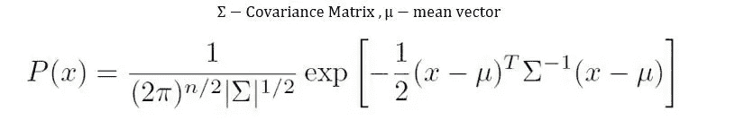

考虑以下连续变量的贝叶斯网络。这是线性回归方程的简单图示。下面给出的网络非常简单，但是如果使用更复杂的网络，就有可能理解变量之间的依赖性和独立性(例如，X1 独立于 X2)。

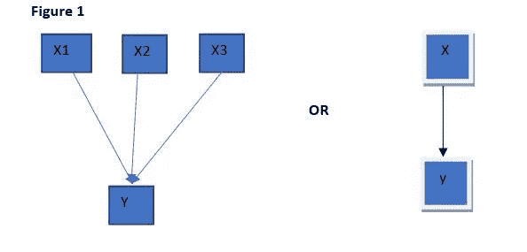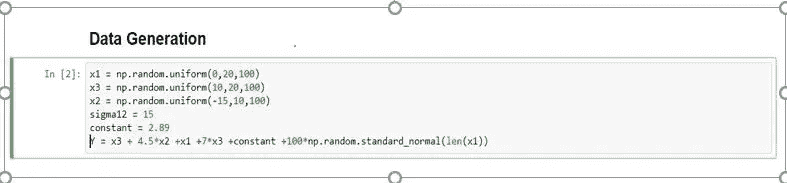

> **共同配送:标准形式**

该网络的联合分布如下所示-

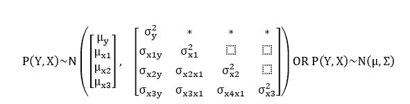

这可以用更合理的形式表示为→

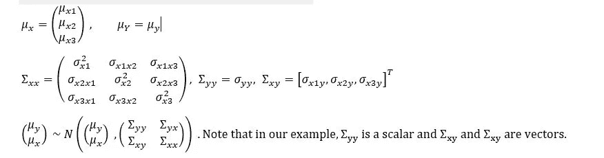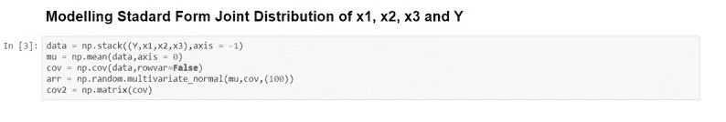

**条件分布:标准形式**

线性回归的标准方程以向量形式给出如下

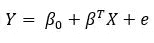

条件分布 P(Y|X)模拟线性回归方程，如下所示

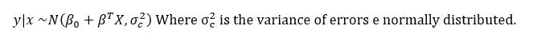

这可以等效地表示为-

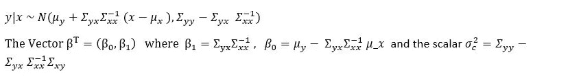

上面提到的方程用来预测给定点 X= Xo 的矢量点 y，在这种情况下-

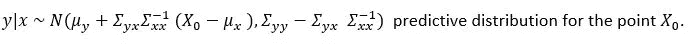

下面给出了条件分布在代码中的实现。给定一个矢量，计算 y|x 的分布。

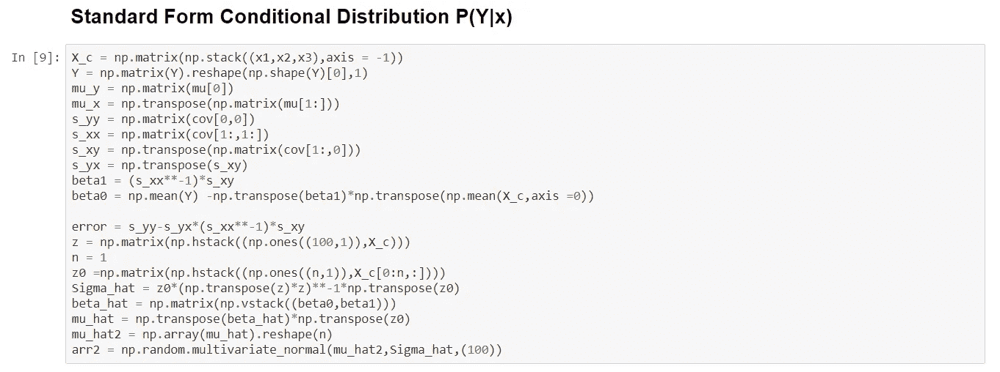

对于较大的网络，使用高斯分布的信息形式来计算联合分布、条件和余量更方便。

**联合分布:信息/范式**

在图形运算中，联合分布的信息形式对于计算条件分布非常有用。信息矩阵本身能够表示整个图形结构。

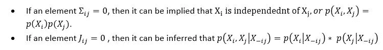

对于上述问题，的信息矩阵可以推断如下

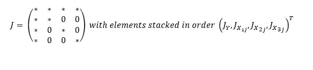

的非零元素表示图上的边。对角线元素代表图上的节点。

边(X1->Y)、(X2->Y)、(X3->Y)和(X4->Y)在精度矩阵中表示为非零元素。零值意味着由该值的占位符指示的节点之间不存在边。例如，如果 J23=0，X2 和 X3 之间不存在边。

高斯的信息形式如下所示。设堆叠矩阵(Y，X)用 S 表示其中 S =(Y，X1，X2，X3)其中 P(S)是 S 的 pdf

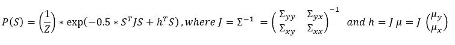

联合分布在如下代码中实现。下面没有计算配分函数 Z。

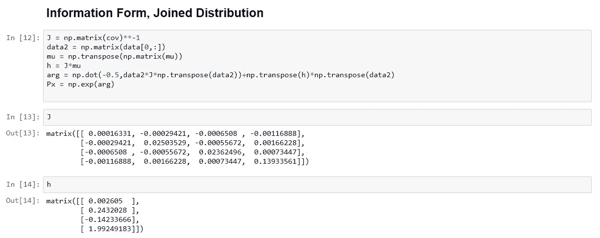

条件分布 P(Y|X)可以通过修改归一化常数以信息形式计算。使用如下所示的信息表很容易计算成对联合分布

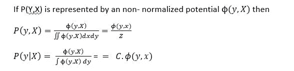

在上面的表示中，势是概率的非归一化形式。它必须除以联合分布中所有变量的势的积分，才能给出一个概率值。这些公式中的分母称为配分函数(表示为 Z ),计算量非常大。

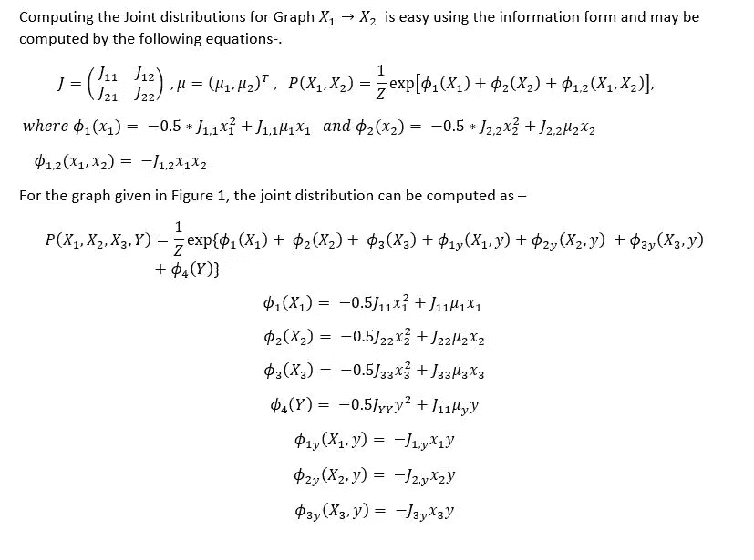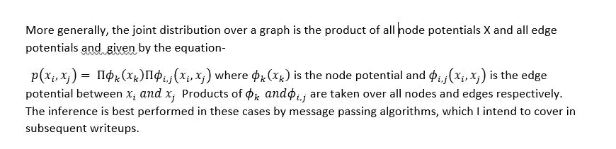