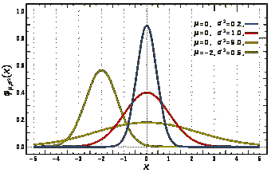

# 具有张量流概率的高斯混合模型

> 原文：<https://medium.com/analytics-vidhya/gaussian-mixture-models-with-tensorflow-probability-125315891c22?source=collection_archive---------1----------------------->

## 关于张量流概率高斯混合模型的注记。

> 在[概率论](https://en.wikipedia.org/wiki/Probability_theory)中，一个**正态**(或**高斯**或**高斯**或**拉普拉斯–高斯** ) **分布**是一个[实值](https://en.wikipedia.org/wiki/Real_number) [随机变量](https://en.wikipedia.org/wiki/Random_variable)的一种[连续概率分布](https://en.wikipedia.org/wiki/Continuous_probability_distribution)。—维基百科

# 内容

1.  统计数字
2.  高斯的
3.  多元高斯
4.  高斯混合模型
5.  多元高斯混合模型
6.  条件高斯混合模型

# 属国

所需的依赖项是 Python 3.8、Numpy、Pandas、Matplotlib、TensorFlow 和 Tensorflow-Probability。

```
import numpy as np
import pandas as pd
import matplotlib.pyplot as plt
from mpl_toolkits import mplot3d
import scipy
import tensorflow as tf
import tensorflow_probability as tfp
tfd = tfp.distributions
```

# 统计数字

所需的统计数据有:平均值、协方差、对角线和标准偏差。我们首先生成 X，一个 2D 数组，然后使用 Numpy 方法将统计数据与所使用的参数进行比较。

```
np.random.seed(0)  # random seedmu = [0,1]
cov = [[2,0],
       [0,2]]
X = np.random.multivariate_normal(mu, cov, size=100)X_mean = np.mean(X, axis=0)
X_cov = np.cov(X, rowvar=0)
X_diag = np.diag(X_cov)
X_stddev = np.sqrt(X_diag)# X_mean
[-9.57681805e-04  1.14277867e+00]# X_cov
[[ 1.05494742 -0.02517201]
 [-0.02517201  1.04230397]]# X_diag
[1.05494742 1.04230397]# X_stddev
[1.02710633 1.02093289]
```

请注意，从 X 计算出的平均值和协方差的值与指定用于生成 X 的参数相当。`np.cov`使用参数`rowvar=0`将样本行转换为变量行，以计算协方差矩阵。`np.diag`获得对角线，即协方差矩阵的方差。`np.sqrt`将获得对角线的标准差。

# 高斯的

高斯分布由其概率密度函数定义:

```
p(x) = 1/(sigma*sqrt(2*pi))*e^(-1/2*((x-mu)/sigma)²)
```



高斯分布:概率密度函数(左)和累积分布函数(右)

# 多元高斯

多变量高斯可以使用`tfd.MultivariateNormalFullCovariance`建模，通过`loc`和`covariance_matrix`参数化。

```
mvn = tfd.MultivariateNormalFullCovariance(
 loc=X_mean,
 covariance_matrix=X_cov)mvn_mean = mvn.mean().numpy()
mvn_cov = mvn.covariance().numpy()
mvn_stddev = mvn.stddev().numpy()# mvn_mean
[-0.00135437  1.20191953]# mvn_cov
[[ 2.10989483 -0.05034403]
 [-0.05034403  2.08460795]]# mvn_stddev
[1.4525477  1.44381714]
```

但是，`tfd.MultivariateNormalFullCovariance`将被弃用，应使用`MultivariateNormalTril(loc=loc, scale_tril=tf.linalg.cholesky(covariance_matrix))`来代替。正定矩阵(如协方差矩阵)的乔莱斯基分解可以解释为正定矩阵[ [1](http://www.seas.ucla.edu/~vandenbe/133A/lectures/chol.pdf) ][ [2](http://ais.informatik.uni-freiburg.de/teaching/ws12/mapping/pdf/slam05-ukf.pdf) ]的“平方根”。

```
# Due to deprecated MultivariateNormalFullCovariance
mvn = tfd.MultivariateNormalTriL(
 loc=X_mean,
 scale_tril=tf.linalg.cholesky(X_cov))mvn_mean = mvn.mean().numpy()
mvn_cov = mvn.covariance().numpy()
mvn_stddev = mvn.stddev().numpy()# mvn_mean
[-0.00135437  1.20191953]# mvn_cov
[[ 2.10989483 -0.05034403]
 [-0.05034403  2.08460795]]# mvn_stddev
[1.4525477  1.44381714]
```

可以为`tfd.MultivariateNormalDiag`指定标准偏差，而不是指定协方差矩阵。

```
mvn = tfd.MultivariateNormalDiag(
 loc=X_mean,
 scale_diag=X_stddev)mvn_mean = mvn.mean().numpy()
mvn_cov = mvn.covariance().numpy()
mvn_stddev = mvn.stddev().numpy()# mvn_mean
[-0.00135437  1.20191953]# mvn_cov
[[2.10989483 0\.        ]
 [0\.         2.08460795]]# mvn_stddev
[1.4525477  1.44381714]
```

为了显示多元高斯的概率密度函数，可以使用`plt.contour`。

```
x1, x2 = np.meshgrid(X[:,0], X[:,1])data = np.stack((x1.flatten(), x2.flatten()), axis=1)
prob = mvn.prob(data).numpy()ax = plt.axes(projection='3d')
ax.plot_surface(x1, x2, prob.reshape(x1.shape), cmap='viridis')
plt.show()
```


多元高斯的概率密度函数

# 高斯混合模型

高斯混合模型(GMM)是高斯混合模型，每个高斯模型由μ_ k 和σ_ k 参数化，并与每个分量权重θ_ k 线性组合，总和为 1。GMM 可以通过其概率密度函数来定义:

```
p(x)=sum(theta*N(x|mu,sigma))
```

取由`pi=[0.2,0.3,0.5]`、`mu=[10,20,30]`和`sigma=[1,2,3]`参数化的高斯混合。分类分布`tfd.Categorical(probs=pi)`是一种离散概率分布，它模拟一个随机变量，该变量取 K 个可能类别中的一个。

```
pi = np.array([0.2, 0.3, 0.5], dtype=np.float32)
mu = np.array([10, 20, 30], dtype=np.float32)
sigma = np.array([1, 2, 3], dtype=np.float32)gmm = tfd.Mixture(
    cat=tfd.Categorical(probs=pi),
    components=[tfd.Normal(loc=m, scale=s) for m, s in zip(mu, sigma)]
)x = np.linspace(0, 40, 100)
plt.plot(x, gmm.prob(x).numpy());print(gmm.mean().numpy())  # 23.0
```


混合高斯分布的概率密度函数

`tfd.MixtureSameFamily`允许定义相同系列分布的混合模型，无需 for 循环。

```
gmm = tfd.MixtureSameFamily(
    mixture_distribution=tfd.Categorical(probs=pi),
    components_distribution=tfd.Normal(loc=mu, scale=sigma)
)gmm.mean().numpy()  # 23.0
```

# 多元高斯混合模型

通过将`tfd.MixtureSameFamily`与`tfd.MultivariateNormalDiag`结合使用张量流概率，可以实现多元高斯混合模型。

```
pi = np.array([0.2, 0.3, 0.5], dtype=np.float32)
mu = np.array([[10, 10],
               [20, 20],
               [30, 30]], dtype=np.float32)
sigma = np.array([[1, 1],
                  [2, 2],
                  [3, 3]], dtype=np.float32)mvgmm = tfd.MixtureSameFamily(
    mixture_distribution=tfd.Categorical(probs=pi),
    components_distribution=tfd.MultivariateNormalDiag(
        loc=mu,
        scale_diag=sigma)
)x = np.linspace(5, 35, 100)
y = np.linspace(5, 35, 100)
x, y = np.meshgrid(x, y)data = np.stack((x.flatten(), y.flatten()), axis=1)
prob = mvgmm.prob(data).numpy()ax = plt.axes(projection='3d')
plt.contour(x, y, prob.reshape((100, 100)));
ax.plot_surface(x, y, prob.reshape((100,100)), cmap='viridis');
```


多元高斯混合的概率密度函数

# 条件多元高斯

不幸的是，TensorFlow-Probability 不支持在给定 x 的选定特征的情况下获得条件分布和边际分布。我们可以通过扩展`tfd.MultivariateNormalTriL`自己实现这一点。

```
def invert_indices(n_features, indices):
    inv = np.ones(n_features, dtype=np.bool)
    inv[indices] = False
    inv, = np.where(inv)
    return invclass ConditionalMultivariateNormal(tfd.MultivariateNormalTriL):
    def parameters(self):
        covariances = self.covariance()
        means = self.loc
        return means, covariances

    def condition(self, i2, x):
        mu, cov = self.loc, self.covariance()
        i1 = invert_indices(mu.shape[0], indices)

        cov_12 = tf.gather(tf.gather(cov, i1, axis=0), i2, axis=1)
        cov_11 = tf.gather(tf.gather(cov, i1, axis=0), i1, axis=1)
        cov_22 = tf.gather(tf.gather(cov, i2, axis=0), i2, axis=1)

        prec_22 = tf.linalg.pinv(cov_22)
        regression_coeffs = tf.tensordot(cov_12, prec_22, axes=1)

        mean = tf.gather(mu, i1, axis=0)
        diff = tf.transpose(x - tf.gather(mu, i2, axis=0))
        mean += tf.transpose(tf.tensordot(regression_coeffs, diff, axes=1))

        covariance = cov_11 - tf.tensordot(regression_coeffs, tf.transpose(cov_12), axes=0)
        return ConditionalMultivariateNormal(loc=mean, scale_tril=tf.linalg.cholesky(covariance)) def marginalize(self, indices):
        mu, cov = self.loc, self.covariance()
        return ConditionalMultivariateNormal(loc=mu.numpy()[indices], scale_tril=tf.linalg.cholesky(cov.numpy()[np.ix_(indices, indices)])) # Conditional Distribution P(X1|X0)
mvn = ConditionalMultivariateNormal(
    loc=X_mean,
    scale_tril=tf.linalg.cholesky(X_cov))x = np.array([2])
indices = np.array([1])conditional_mvn = mvn.condition(indices, x)
marginal_mvn = mvn.marginalize(indices)print(conditional_mvn.sample().numpy())
print(marginal_mvn.sample().numpy())# Conditional MVN sample
[[[[1.60346902]]]
 [[[0.70901248]]]
 [[[0.68173244]]]]# Marginal MVN sample
[[-0.22300554]
 [ 2.69431439]
 [-0.52467359]]
```