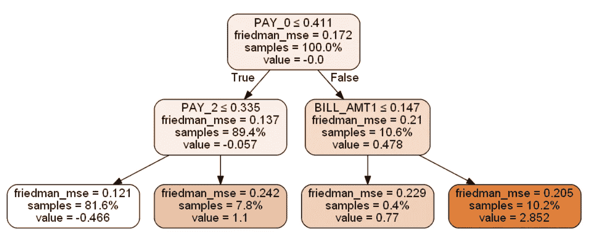
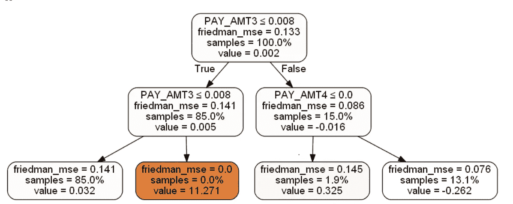
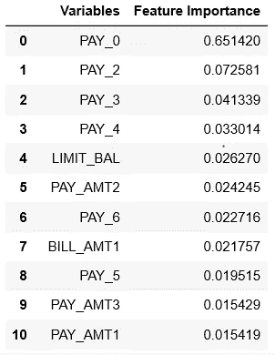
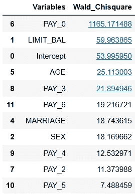
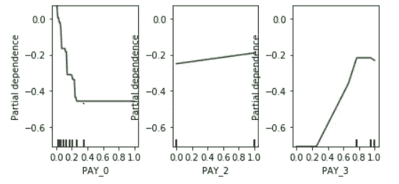
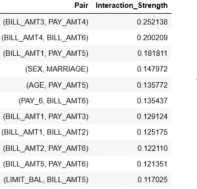
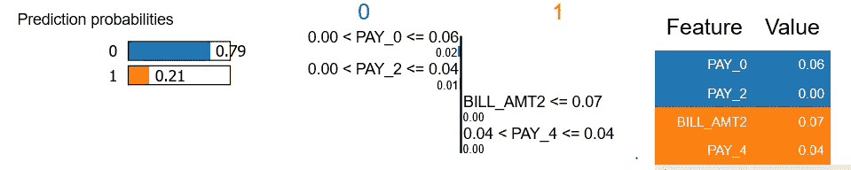
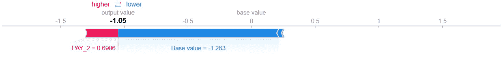
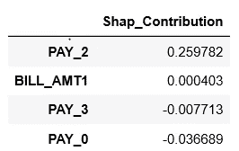

# GBM V/S 物流(银行案例研究)

> 原文：<https://medium.com/analytics-vidhya/gbm-v-s-logistic-banking-case-study-8d0d15ee5611?source=collection_archive---------6----------------------->

机器学习是这个城市的新流行语。每个行业都希望使用机器学习技术，因为它们能够提高准确性，从而增加收入。然而，在金融和医疗保健等行业，除了准确性，推理也起着至关重要的作用，这些技术的使用是一个大问题。下面是一个案例研究，展示了如果在这些行业中使用机器学习技术会发生什么。我希望通过这个博客，我能够帮助在这些行业工作的人回答高级管理层提出的一些问题。

Rocket Singh 先生在 ABC 银行工作。他的经理要求他建立一个模型来预测拥有信用卡的 ABC 银行的客户是否会拖欠他们的下一次付款

Rocket Singh 先生建立了一个传统的逻辑回归模型和一个挑战者机器学习模型(梯度推进机器)。他带着两个结果去见了他的经理。

Rocket Singh 先生:- 我已经建立了一个逻辑回归模型以及梯度推进机器模型。Logistic 的 AUC(曲线下面积)为 76%,而 GBM 为 80%。

**经理:-** 听起来很有趣！！你能告诉我什么是 GBM，它是如何工作的吗？？

**Rocket Singh 先生:-** GBM 是一种集成技术，其中按顺序构建多棵树，并且每棵树都试图纠正前一棵树所犯的错误

经理:- 那么你在模型中造了多少棵树？？

Rocket Singh 先生:- 100 棵树，每棵树的最大深度为 2。这些树中的每一个都建立在 70%的数据上，其中每次数据是随机选择的，并且对于每一个树，80%的特征是随机选择的

经理:- 你能给我看一下这些树吗，我想了解每棵树中的变量以及它们是如何相互作用的

**树 1**

**树 100**

Rocket Singh 先生:- 树 1 &树 100 如上图所示。像这样我们可以想象 100 棵树中的每一棵树。所有这些树都可以写成基本的 if-else 语句，更像是一种基于规则的方法，而不是一个黑盒

经理:- 好的。GBM 模型和 Logistic 回归模型中的前几个变量是什么？？我想了解这两个模型中的顶级变量是如何变化的

Rocket Singh 先生:- 这是 GBM 模型&逻辑回归模型的前 10 个变量的列表。对于逻辑回归来说，变量是基于 Wald 卡方选择的，而对于 GBM 模型来说，变量是基于信息增益选择的。

**十大变量-GBM 模型**

**十大变量-逻辑回归**

经理:- 在这两个模型中，前 10 个变量的列表或多或少看起来是相同的，PAY_0 将成为最重要的变量。那你怎么会得到 4%的额外增量呢

**Rocket Singh 先生:-** 这是 AUC 之间没有太大差异的主要原因。话虽如此，4%的增量提升是因为 GBM 模型能够捕捉变量之间的轻微非线性和相互作用

**经理:-**GBM 模型对顶级变量有什么反应，有可能了解哪些变量是相互影响的吗

**Rocket Singh 先生:-** 我们可以使用部分相关图来了解模型对于顶部变量的表现

**GBM 中前 3 个变量的部分相关图**

这里，X 轴上的值表示在 0 和 1 之间归一化的变量的实际值，Y 轴上的值显示变量对类别概率的相对 logit 贡献。

因此，Y 轴上的负值表示变量导致概率趋向于 0，而正值则使概率趋向于 1。

从上面的图中可以看出，PAY_0 显示出下降趋势，但在 0.2 之后变平，而 PAY_3 以变平的趋势开始，然后在 0.2 之后显示出上升趋势，在 0.6 之后再次变平

逻辑回归不能捕捉这种趋势，因为它强加了一个线性趋势。**顶部变量也或多或少显示出线性趋势，因此 AUC** 之间没有太大差异。另一方面，如果顶部变量具有高度非线性的趋势，则 AUC 值之间的差异将非常大

经理:- 这些变量的趋势与业务非常一致，但我惊讶地看到这些极端的扁平化性质。我们能理解哪些是相互作用的变量对吗

Rocket Singh 先生:- 是的，我们可以。弗里德曼和波佩斯库的 H 统计帮助我们理解变量之间相互作用的强度。下表显示了最重要的一对变量(每对 2 个)及其相互作用强度。相互作用强度的值范围从 0 到 1，其中 0 表示没有相互作用，而 1 表示最大相互作用

**弗里德曼和波佩斯库的 H 统计**

**经理:-**BILL _ AMT 和 PAY_AMT 的交互有道理但是性别的交互&婚姻很奇怪。你能深入研究一下这些数字，让我知道为什么会这样吗

火箭辛格先生:- 好的，我会在明天之前做好，然后告诉你。

经理:-Rocket Singh 先生，这种模式在客户层面上表现如何？我的意思是，看看你给我看的所有东西，我想如果顾客 A 的年龄是 25 岁，顾客 B 的年龄也是 25 岁，那么他们两个的结果可能会不同，如果我错了，请纠正我

**Rocket Singh 先生:-** 是的先生你是对的。为了在客户层面理解这个模型，我们可以利用本地的可解释技术，比如莱姆& SHAP。

LIME 代表**本地可解释的模型不可知解释**

它在本地工作，它会告诉你如何计算每个客户的概率得分。

它是这样工作的

1.)选择你希望解释其输出的某个点 x，并获得模型的预测ŷ.

2.)通过置换点 X 来采样新点。让我们称这些点为 X’。计算排列和原始观察值之间的距离。

3.)用你的黑箱模型评估这些点。称这些预测为 Y’。

4.2)从置换数据中挑选出最能描述复杂模型结果的 m 个特征。

5.)用 m 个特征和相似性得分作为权重，将简单的可解释模型拟合到置换数据。

6.)简单模型的特征权重解释了复杂模型的局部行为。

石灰的输出看起来像这样

**石灰输出**

这里，我从数据中抽取了 1 个客户。对他来说，PAY_0 & PAY_2 倾向于 0 类，而 BILL_AMT2 & PAY_AMT5 倾向于 1 类，这是导致他获得概率值 0.21(这是他在 GBM 模型中拖欠下一次付款的概率)的前 4 个特征。对于该客户，这 4 项功能的实际价值在上面的行中有所表示，同时也以表格形式给出，并对 0 级和 1 级进行了颜色编码

类似地，我们可以使用 LIME 了解数据集中的任何客户，为了衡量这些解释的可靠性，我们可以使用拟合本地可解释模型后得到的 R-sqaure。该实例的 R 平方值为 71%，因此这些结果是可靠的。

然而，石灰也有一些缺点

石灰的缺点

1.)依赖于新点的随机采样，所以可能不稳定

2.)线性模型的拟合可能不准确，但是我们可以检查 R 的平方值，以知道是否是这种情况

为了更加确定对模型的理解，我们可以把 SHAP 和石灰结合起来使用。

SHAP 代表**沙普利加法解释**

这是一种来自联盟博弈论的方法，它告诉我们如何在玩家之间公平地分配“支出”。

关于机器学习，我们可以将模型的特征视为“*玩家*”，将模型的预测视为“*支出*”。

它基于以下 3 个公理:-

1.  **缺失:-** 如果一个特征从不增加任何边际价值，它们的权重应该是 0
2.  **局部精度:-** 当对特定输入 x 近似原始模型 f 时，局部精度要求解释模型至少与简化输入 x’(对应于原始输入 x)的 f 的输出相匹配。
3.  **一致性:-** 它指出，如果一个模型发生变化，使得某个简化输入的贡献增加或保持不变，而不考虑其他输入，则该输入的贡献不应减少。

它有助于您了解每个特征在获得概率分数中的作用

SHAP 的输出看起来像这样

**SHAP 值(表格形式)**

在上面的图中:-

1.)基值是对训练数据集进行预测的平均值

2.)输出值是该实例的所有变量的 SHAP 值与基本值的总和。这与 GBM 模型为该实例做出的预测(对数优势)相同。 **SHAP 确保输出值与模型预测相同，而 LIME 无法确保这一点，因此更加可靠**

3.)上图中变量的值是该实例的实际值

对于上述客户，BILL_AMT1 和 PAY_2 倾向于等级 1，而 PAY_0 和 PAY_3 倾向于等级 0

**经理:-** 有意思！！请与我分享这些结果，我会彻底调查并与利益相关者讨论。一旦模型最终确定，我们可以讨论该模型的部署，以及验证团队应该如何监控它的进展

Rocket Singh 先生:- 当然，先生，我会把结果寄给你，如果有任何疑问，你可以给我回复。你也可以使用下面的链接找到代码和工作细节

 [## statsguysam/模型-可解释性

### 此时您不能执行该操作。您已使用另一个标签页或窗口登录。您已在另一个选项卡中注销，或者…

github.com](https://github.com/statsguysam/Model-Interpretability/blob/master/Compare%20Linear%20%26%20GBM%20model/Linear_GBM.ipynb)