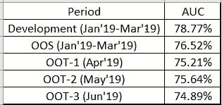
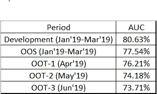
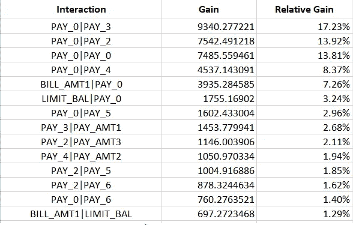
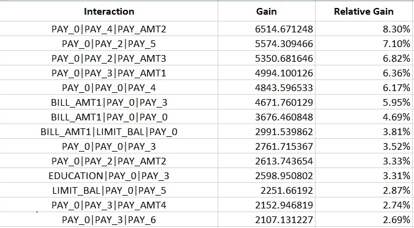
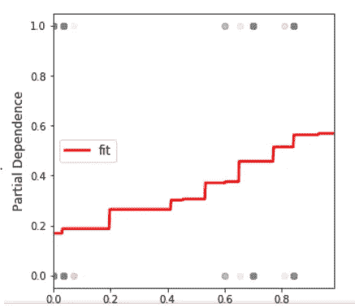

# GBM V/S 物流(银行案例研究)-第 2 部分

> 原文：<https://medium.com/analytics-vidhya/gbm-v-s-logistic-banking-case-study-part-2-f5bcd69aabd6?source=collection_archive---------9----------------------->

正如我们在 [**Part-1**](/@statsguysalim/gbm-v-s-logistic-banking-case-study-8d0d15ee5611) 中看到的，Rocket Singh 先生被要求找出性&婚姻互动背后的原因，他查看了数据，发现这种互动只在发展数据中有意义(纯属巧合)，而在任何其他时间段的数据中都没有意义。(**经验总是很重要，因为他的经理正确地指出了模型从数据中学习的偏差**)。当他被要求找出原因时，他去找他的经理并向他解释。

经理:- 因此，理想情况下，我们不应该让模型学习这种交互，因为它在未来的数据中不成立。剩下的交互对完全有意义。那么你有没有可能只保留那些交互，去掉这个呢？？

**Rocket Singh 先生:-** 是的，我们可以这样做，但不是在 GBM 模式下。我们可以在 XG Boost(e**X**treme**G**radient**Boost**ing)模型中做到这一点。XGBoost 允许我们使用**interaction _ constraints**参数指定我们想要交互的特性。(要了解更多关于交互约束的信息，请参考此链接:- [交互约束](https://xgboost.readthedocs.io/en/latest/tutorials/feature_interaction_constraint.html))

经理:-XG boost 模型是什么&它是如何工作的？？

**Rocket Singh 先生:-** XGBoost 也是一种集成技术，其中按顺序构建多个树，每个树都试图纠正前一个树所犯的错误。它类似于 GBM，具有一些额外的特性，如正则化、并行处理、处理缺失值等

**经理:-** 好的，你能使用 XGBoost 重新构建模型，注意交互并分享绩效结果吗

**Rocket Singh 先生:-** 理想情况下，与 GBM 相比，性能不会下降，但会在明天之前分享结果

经理:- 还有一件事，上次我们看到 PAY_3 有一些非线性趋势，但理想情况下，它应该呈现增长趋势。你有没有可能让模型学习到这个变量的线性递增趋势？？

Rocket Singh 先生:- 是的，XGBoost 也给了我们对变量施加线性约束的灵活性。这可以通过使用 XGBoost 模型的**单调约束**参数来实现。(要了解更多关于单调约束的信息，请参考此链接:- [单调约束](https://xgboost.readthedocs.io/en/latest/tutorials/monotonic.html))

经理:- 很好，这给了我们很大的灵活性。只需施加这两个约束，并与我分享结果

火箭辛格先生:- 当然！！我将在明天之前分享结果。

Rocket Singh 先生进行了必要的更改，并带着结果去见他的经理

Rocket Singh 先生:- 你好，先生，我已经做了更改，这是结果

**施加 2 个条件后不同时间段的 AUC**

为了确保我们的模型成立并且不会过度拟合，我们在另外 3 个时间段测试了我们的模型，结果表明我们的模型能够很好地概括看不见的数据。

**施加 2 个条件前不同时间段的 AUC**

这些是在施加 2 个条件之前不同时间的结果。如您所见，在施加条件后，AUC 值的变化较小，这表明**模型较早地学习了噪声，这两个条件充当了正则项，使模型的性能稳定**。

**顶对的互动不包括性别的互动&婚姻**

**顶级互动三胞胎排除性别互动&结婚**

**薪酬的单调递增趋势 _3**

经理:太好了！！这就是为什么我总是说人工智能不能取代人类智能，但当在合作中使用时，它可以用来取得巨大的成功。

火箭辛格先生:- 真的！！我完全同意。

经理:- 告诉我一件事，验证团队将如何验证这个模型？？他们将如何跟踪模型的性能？？如果模型失败了，我们如何理解背后的原因？？你考虑过了吗？？

是的，先生，我已经准备好了框架，就等您的批准了。

经理:这个模特看起来很适合我。让我们安排一次与整个验证团队的会议，在会上您可以向他们解释您的框架，如果他们没问题，那么接下来我们可以将此框架用于任何基于树的模型。

Rocket Singh 先生:- 好的，先生，我会与他们协调并相应地安排会议。

**经理:-** 好的，我有一个问题，你说 XGBoost 能够自动处理缺失值，幸运的是在这个记分卡中变量没有缺失值，但是我计划在其他会有缺失值的记分卡上应用 XGBoost，所以我很想知道它是如何处理的。

**Rocket Singh 先生:-**XGBoost 中处理缺失特征的策略是将分裂特征的值未知的所有样本放入两个孩子中的一个。它可以是左子或右子，其方向在树构造过程中被学习以选择优化训练损失的一个。

经理:- 哦，我明白了，这太神奇了，算法会自动决定应该将丢失的值归入哪个箱，这样损失就最小了。一旦这个模型被部署，我需要你为另一个有很多缺失值的记分卡建立一个挑战者模型。

火箭辛格先生:当然可以，先生！！我也考虑了该型号的部署策略，在与部署团队协调后会让您知道。

**经理:-** 好的，首先让我们结束该模型的验证。

**Rocket Singh 先生:-** 好的，先生，您也可以使用下面的链接找到代码和工作细节，如果您有任何疑问，请告诉我。

 [## statsguysam/模型-可解释性

### 此时您不能执行该操作。您已使用另一个标签页或窗口登录。您已在另一个选项卡中注销，或者…

github.com](https://github.com/statsguysam/Model-Interpretability/blob/master/Compare%20Linear%20%26%20GBM%20model/XGBoost.ipynb)