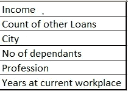
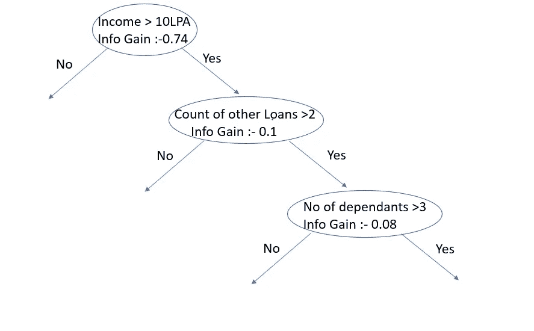
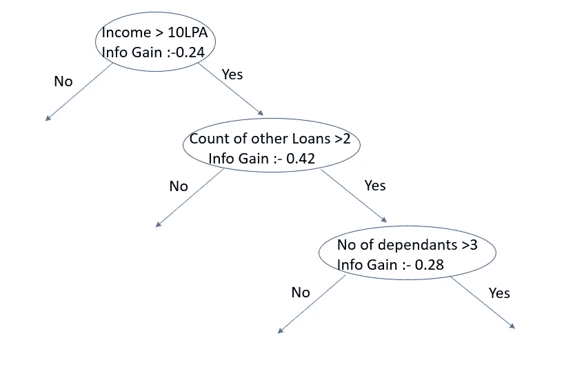
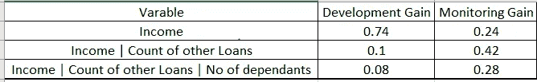

# GBM V/S 物流(银行案例研究)-第 3 部分

> 原文：<https://medium.com/analytics-vidhya/gbm-v-s-logistic-banking-case-study-part-3-5d5e4b7ae59c?source=collection_archive---------10----------------------->

正如我们在 [**Part-2**](/@statsguysalim/gbm-v-s-logistic-banking-case-study-part-2-f5bcd69aabd6) 中看到的，Rocket Singh 先生被要求与验证团队召开会议，讨论如何验证和监控模型的发展。Bakshi 先生是验证经理，Rocket Singh 先生在会议上开始向他解释他的模型。

巴克西先生:-Rocket Singh 先生，我已经阅读了您的报告以及您与经理分享的工作内容，我了解了 XGBoost 模型的工作方式，以及石灰、SHAP、部分相关图等技术，我们可以使用这些技术来更好地了解您的模型，但是我们将如何跟踪您的模型未来的表现。您分享的结果在各个时间段都是一致的，但是假设在监测期间，如果 AUC 值下降/上升，我们如何理解为什么会发生这种情况？

Rocket Singh 先生:好的，我正要去那。你能告诉我你如何监测逻辑回归模型吗？

**bak Shi 先生:-** 在逻辑回归中，由于我们使用分箱变量，因此我们计算了监测期模型中使用的最终变量的[**【IV】**](https://www.listendata.com/2015/03/weight-of-evidence-woe-and-information.html)(根据开发期使用相同的分箱)，并将其与开发期的 IV 值进行比较。这有助于我们理解哪些变量实际上导致了模型性能的提高/降低。

**Rocket Singh 先生:-** 好的，我们可以在逻辑回归中这样做，因为没有交互影响，但是 XGBoost 是一个基于树的模型，并且是一个独立的变量，我们无法对模型的表现进行评论。因此，我们不能只看单个变量，还必须比较它们的相互作用强度。

巴克西先生:- 我没明白你的意思。你能举个例子给我解释一下吗？

**Rocket Singh 先生:-** 当然，假设我们想要建立一个房屋贷款的申请记分卡(假设的例子)。模型中使用的最终变量如下

**最终变量**

现在就像我们在逻辑回归中得到信息值一样，对于 XGBoost 我们得到信息增益。因此，可能存在这样一种情况，即收益在发展阶段具有很高的信息增益价值，但在监测阶段价值下降。

Bakshi 先生:- 那么 AUC 值也会下降，我们应该重建模型。

Rocket Singh 先生:- 如果这是一个逻辑回归模型，AUC 值会下降，但在 XGBoost 模型中不是必需的。如果我们单独来看这些变量，我们觉得收入较高的人更有可能获得住房贷款。但是 XGBoost 不处理独立的变量，它处理变量之间的规则和交互。即使一个人有较高的收入，但他已经采取了多项其他贷款，并有许多家属，那么他更有可能拖欠比一个人谁相对较少的收入，没有其他贷款和较少的家属。因此，可能有这样一种情况，在开发阶段，对收入变量进行分割会产生良好的收益，而在监控阶段则不会。但是总的来说，收入、其他贷款的数量和受抚养人的数量之间的相互作用仍然会给你带来不错的收益。唯一的区别是，与监测期相比，开发期收入变量分割的收益贡献非常高。

**信息获取-发展路径**

**信息增益-监控路径**

在上面的例子中，如果你只看可变收入，你会说可变强度已经减少，但实际上它通过与其他功能的相互作用增加了它的强度，这在开发中不是这样。

Bakshi 先生:- 有道理，但是我们如何获得每条路径的信息增益的值呢？

**Rocket Singh 先生:-** 您可以通过解析所有树(XGBoost 模型中使用的树的数量)来获得您在开发期间构建的模型的这些增益值。对于监控期间，您需要在监控期间重新调整模型(使用与开发期间相同的超参数和变量)并获得这些值。

**bak Shi 先生:-** 好的，但如果我们重新调整模型，可能会出现新模型会根据监控期间的数据学习新的交互集合的情况。

Rocket Singh 先生:- 没错！！假设在开发阶段你有 20 对(2 个特性之间的交互)，在监控阶段你有另外 20 对。如果有许多重叠对，那么这是一个很好的迹象，表明该模式仍然存在，但如果重叠对的数量较少，那么这是一个值得关注的问题。

**bak Shi 先生:-** 但是使用与您上面解释的相同的基本原理，假设只有 10 个重叠对(50%)，但是模型的性能仍然很好，那么在这种情况下应该做什么。

**Rocket Singh 先生:-** 如果性能指标没有下降，则意味着与开发阶段相比，这 10 个重叠对之间的相互作用强度增加了，并且变量仍在起作用。**只有当模型性能下降时，才应进行这些检查，以便了解其背后的原因**。

**bak Shi 先生:-** 好的，那么如果模型的性能下降，我们应该了解其背后的原因，并要求“重建”，对吗？？

**Rocket Singh 先生:-** 不完全是，模型的性能已经根据开发期间学习到的权重/交互而下降。如果您更改权重/交互，最终变量可能仍会给您带来良好的性能。这就像重新校准你的模型，而不是从头开始重建。

Bakshi 先生:- 好的，那么我们如何能够了解我们是应该重新校准模型还是重建它呢？？如果我们决定重新校准，我们应该怎么做？？

**Rocket Singh 先生:-** 因此，当您在监控期间重新调整模型(使用与开发相同的变量和超参数)时，请计算性能指标(在我们的案例中为 AUC)并查看它是否给出了良好的结果。如果是这样，那就意味着最终变量仍然有效，但只是权重/交互作用发生了变化。因此，与其从零开始重建模型(这将花费大量时间),不如使用这些修改后的权重/交互作用，如果需要，您还可以调整超参数以获得更好的性能。

**bak Shi 先生:-** 好的，我明白了，告诉我一件事，规则集的大小取决于你在 XGBoost 模型中构建的树的深度，对吗？

Rocket Singh 先生:- 正确

Bakshi 先生:- 然后假设如果深度很高，那么我们将不得不跟踪每个级别的增益值，这将是非常麻烦的。

Rocket Singh 先生:我完全同意你的观点。如你所知，XGBoost 是一种集成技术，其中多个树被顺序构建，每个树试图纠正前一个树所犯的错误。因此，如果我构建深度更高的树，那么模型就不会那么有效，因为所有的树都会学习相同的规则。在这种情况下，理想的做法是使用单个决策树，而不是多个树的集合。理想情况下，在 XGBoost 中，我们的目标是生成浅树(深度为 2 或 3 ),并让它们从数据集学习不同的规则，这样它们就不会过度拟合，也不会对看不见的数据进行很好的概括

巴克西:- 好的，有道理，你的模型中树木的最大深度是多少？

Rocket Singh 先生:- 2、我将分享所有时间段内每次拆分的信息增益。

**巴克西先生:-** 好的，我会看一遍，如果我有任何问题，我会告诉你。

**Rocket Singh 先生:-** 当然，你也可以使用下面的链接找到代码和工作细节

 [## statsguysam/模型-可解释性

### 此时您不能执行该操作。您已使用另一个标签页或窗口登录。您已在另一个选项卡中注销，或者…

github.com](https://github.com/statsguysam/Model-Interpretability/blob/master/Compare%20Linear%20%26%20GBM%20model/XGBoost.ipynb?source=post_page-----f5bcd69aabd6----------------------)