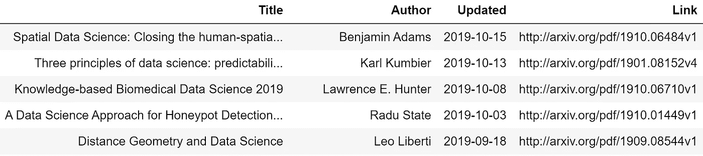

# 使用这个 Python arXiv API 包装器更难

> 原文：<https://medium.com/analytics-vidhya/geek-harder-using-this-python-arxiv-api-wrapper-ca9003b85b24?source=collection_archive---------12----------------------->


被 Pixabay ( [链接](https://pixabay.com/illustrations/artificial-intelligence-brain-think-3382507/))标记为重复使用的图像。

我一直在寻找更有效的方法把知识塞进我的脑袋里。正是考虑到这一点，我搜索了一个现有的 arXiv API 包装器，使用它我可以更快地检索感兴趣的论文，以便在闲暇时摄取。一个这样的 API 包装器，叫做 [pyarxiv](https://github.com/thechrisu/pyarxiv) ，被作者描述为“你值得拥有的 arxiv 客户端”，我倾向于同意。

> 对于外行人来说， [arXiv](http://arxiv.org) 是由康奈尔大学维护的一个项目，它提供近 200 万份学术论文的电子版，这些论文“涉及物理、数学、计算机科学、定量生物学、定量金融学、统计学、电子工程和系统科学以及经济学等领域。”

在这篇文章中，我将带你浏览我写的一个简短的脚本[，快速地从 arXiv.org 抽取 100 篇关于我选择的主题的论文。下面是结果的一瞥:](https://nbviewer.jupyter.org/github/nickmccarty/Tutorials/blob/master/arXiv%20API%20Test.ipynb)



通过取消所提供脚本中相关行的注释，可以很容易地将结果导出为 CSV 文件。

首先，我使用`pip install pyarxiv`来安装 API 包装器。安装完成后，可以导入所需的库，如下所示。在我的例子中，我将它们输入到我的 Jupyter 笔记本中。

```
**from** **pyarxiv** **import** query, download_entries
**from** **pyarxiv.arxiv_categories** **import** ArxivCategory, arxiv_category_map

**import** **pandas** **as** **pd**
```

然后，我希望脚本询问我希望在 arXiv 上找到的论文的主题，并为我检索关于该主题的论文，这是通过以下两行代码完成的:

```
topic = input("Enter the topic for which you want to search papers on arXiv: ")

entries = query(title = topic)
```

最后，我使用 Pandas 创建了一个数据框架，我可以将所有相关的论文细节填充到其中，并导出为 CSV 文件。下面提供了稍微详细一些的代码块。

```
*# Pull title, author, date, and link to PDF of paper from "entries"*
*# and put each in its own list*

titles = map(**lambda** x: x['title'], entries)
authors = map(**lambda** x: x['author'], entries)
updated = map(**lambda** x: x['updated'], entries)
links = map(**lambda** x: x['link'], entries)

*# Create empty dataframe called "papers"*

papers = pd.DataFrame()

*# Insert columns into "papers" from the previously created lists*

papers['Title'] = pd.Series(titles)
papers['Author'] = pd.Series(authors)
papers['Updated'] = pd.Series(updated)
papers['Link'] = pd.Series(links)

*# Slice HH:MM:SS off of each row in date column*

papers['Updated'] = papers['Updated'].str.slice(stop = 10)

*# Reformat URL string to take user to the PDF of the paper*

papers['Link'] = papers['Link'].str.replace("abs", "pdf", case = **True**)

*# Uncomment line of code below to export result as a CSV file*

*# papers.to_csv(topic + ' arXiv papers.csv')*

*# Sort dataframe in descending order by date*

papers.sort_values(by = 'Updated', ascending = **False**).reset_index(drop = **True**).head(20)
```

好了，伙计们！一种更有效的方法来检索你所选择主题的开放存取学术论文。同样，这里的[是我的 Jupyter 笔记本的链接。](https://nbviewer.jupyter.org/github/nickmccarty/Tutorials/blob/master/arXiv%20API%20Test.ipynb)

极客快乐！

编辑:我对提供的笔记本做了一些修改，并添加了一个部分，演示如何将论文自动下载到指定的文件夹中。请务必使用上面的链接来查看！