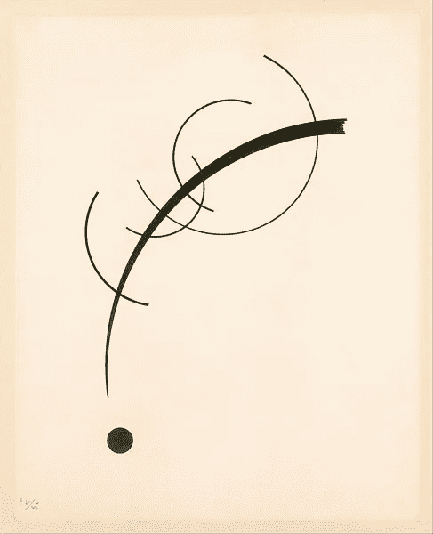

# 广义线性模型第二部分

> 原文：<https://medium.com/analytics-vidhya/generalised-linear-model-part-2-710c1d96a059?source=collection_archive---------27----------------------->

在第二篇文章中，我将扩展前面介绍的关于结果 **Y** 的一般指数族分布的[形式，我将推导出引入和求解最大似然估计的基本方程。这篇文章非常数学化，但是继续写下去，因为在第三部分，我们将会用不同的语言实现线性回归。](/analytics-vidhya/generalized-linear-model-part-1-107ec2fa2ec6)