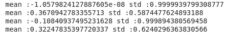
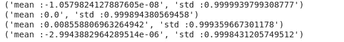

# CNN 中初始化权重的一般化方法

> 原文：<https://medium.com/analytics-vidhya/generalised-method-for-initializing-weights-in-cnn-24b183db51e3?source=collection_archive---------23----------------------->

用正确的值初始化参数是从神经网络获得精确结果的最重要的条件之一。

## **所有值为零的权重初始化**

如果所有的权重都用**零**初始化，那么对于 **W[l]中的每个 W，关于损失函数的导数是相同的，其中 W[l]是神经网络层 l**中的权重，因此所有的权重在后续迭代中具有相同的值。这使得隐藏单元对称并持续所有 n 次迭代，即设置权重为**零**并不会使其比线性模型更好，因此我们不应该用零初始化它。

## **用过大或过小的值初始化权重(随机权重)**

如果权重太大，那么我们有一个问题叫做**爆炸梯度**问题，它导致偏离最小损失。

如果权重太小，那么我们有一个问题叫做**消失梯度**问题，它导致在达到最小值之前收敛。

如需深入了解，请参考以下内容:

[](/hackernoon/exploding-and-vanishing-gradient-problem-math-behind-the-truth-6bd008df6e25) [## 爆炸和消失的梯度问题:真相背后的数学

### 你好星尘！今天我们将看到爆炸和消失梯度问题背后的数学原因，但首先让我们…

medium.com](/hackernoon/exploding-and-vanishing-gradient-problem-math-behind-the-truth-6bd008df6e25) 

## **如何初始化重量**

必须对重量进行初始化，以便:

*   每层激活的**平均值**接近于**零**。
*   每层激活的**方差**接近**1**。

一种方法是我们在神经网络的每一层附加一个 **Pytorch 钩子**。 **Pytorch hook** 基本上就是一个函数，有非常具体的签名。当我们说一个钩子被执行时，实际上，我们说的是这个函数被执行。挂钩将层的输入和层的输出作为参数，我们可以获取这些激活的平均值和标准偏差，用于调试模型，并查看为什么模型不能正确工作。

```
**class Hook():**
**def __init__(self, m, f):** 
self.hook =m.register_forward_hook(partial(f, self))**def remove(self):** 
self.hook.remove()**def __del__(self):** 
self.remove()**def append_stat(hook, mod, inp, outp):** d = outp.data
hook.mean,hook.std = d.mean().item(),d.std().item()
```

上面的代码片段创建了一个钩子，它是一个将被附加到层 **m** 的函数，该函数作为初始化参数被传递。此处的函数计算该层激活的平均值和标准差。

```
 **def** children(m):
    **return** list(m.children())hooks = [Hook(l, append_stat) for l in children(learn.model)] 
```

上面的代码片段将钩子连接到神经网络的每一层。

因此，当我们在神经网络上进行正向传递时，计算每层激活的所有平均值和标准偏差。

```
**def** lsuv_module(m, xb):
    h = Hook(m, append_stat) **while** learn.model(xb) is not None and abs(h.mean)  > 1e-3: 
        m.bias = nn.Parameter(m.bias-h.mean) **while** learn.model(xb) is not None and abs(h.std-1) > 1e-3:                m.weight.data = nn.Parameter(m.weight.data/h.std) **learn.model(xb)**
    h.remove()
    **return** "mean :"+str(h.mean),"std :"+str(h.std)**for m in models:** 
    print(lsuv_module(m, torch.tensor(xb)))**#xb is batch of input data**
```

上面的代码片段一个接一个地遍历模型的所有层。

对于模型中的每一层 l:

*   计算所有激活的平均值和标准偏差。
*   如果该层的所有激活的平均值大于 abs(1e-3 ),那么我们从该层中所有神经元的偏差中减去该平均值，使得在该步骤之后，新的平均值下降到接近于**零**。
*   类似地，如果我们将该层的所有权重除以该层激活的标准偏差，新的标准偏差将接近于**1**。

## 结果



使用明凯统一初始化的第 4 层网络的均值和标准差

这些是在使用**明凯统一初始化**后得到的结果，随着网络的深入，这些结果往往会表现得更差。这里的均值和标准差分别远离**零点**和**一个**。因此，它会导致不太准确的结果。

使用一般化方法后获得的结果如下:



使用通用初始化的第 4 层网络的均值和标准差

我们可以看到，每一层的均值和标准差分别接近于**零**和**一**，因此我们可以防止消失和爆炸梯度问题。因此，这种初始化对神经网络更有效。