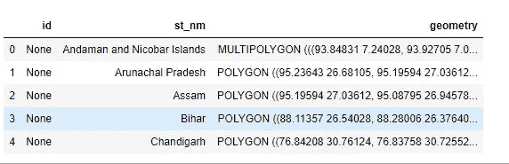
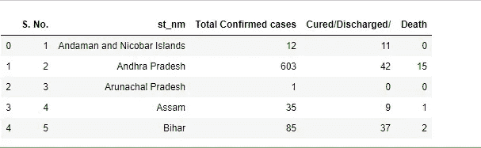
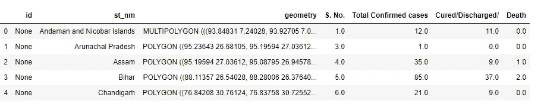
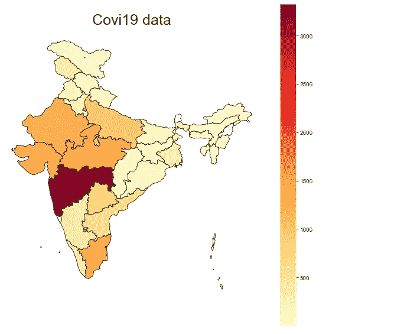
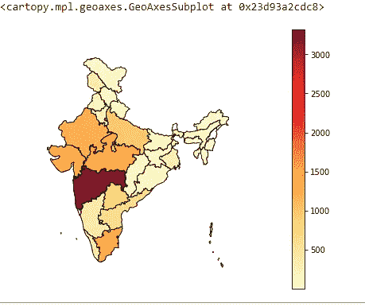
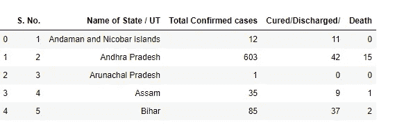
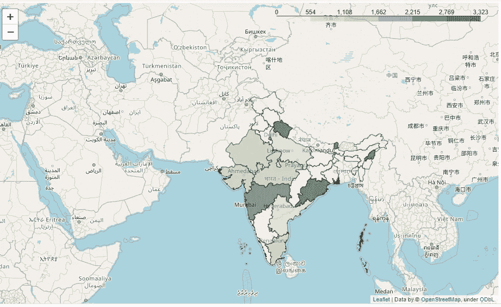

# 使用冠状病毒疫情数据生成静态 choropleth 印度地图

> 原文：<https://medium.com/analytics-vidhya/generate-a-static-choropleth-india-map-using-corona-virus-pandemic-data-19e9cbf5a07d?source=collection_archive---------6----------------------->

在下一篇文章中，我将演示如何使用冠状病毒疫情数据和不同的 python 库创建 choropleth 地图。我们将使用 Matplolib、Geopandas、Geoplot 库来生成静态地图。

在开始编写代码之前，让我们先来看看**什么是 choropleth map** ？

**根据谷歌-**
*一种在预先定义的区域内利用阴影、颜色或符号放置的差异来表示这些区域内特定量的平均值的地图。*

为了生成 choropleth 地图，我们需要地图和数据。我们使用形状文件来生成地图。我们使用 excel 文件作为数据

Matplolib
Matplotlib 是一个 Python 2D 绘图库，它以多种硬拷贝格式和跨平台的交互环境生成出版物质量数字。Matplotlib 可用于 Python 脚本、Python 和 IPython shells、Jupyter 笔记本、web 应用服务器和四个图形用户界面工具包。

**shape file** **shape file**是一种简单的非拓扑格式，用于存储地理要素的几何位置和属性信息。 **shapefile** 中的地理特征可以用点、线或多边形(区域)来表示。

我们可以通过 5 个步骤实现 choropleth 映射

## 步骤 1:读取 excel 文件

> data _ df = pandas . read _ excel(' data _ ecxel . xlsx ')

## 步骤 2:读取形状文件

> map_df = gpd.read_file(fp)

## 步骤 3 合并地图文件和数据文件

> merged _ data = map _ df . merge(data _ df，on = 'Country '，how = 'left ')

## 步骤 4:使用库创建绘图

> fig，ax = plt.subplots(1，figsize=(10，10))

## 步骤 5:将数据绘制到地图中

> merged_data.plot(column='cases '，cmap='YlOrRd ')

现在让我们看看生成静态地图的代码。

## 使用 MATPLOTLIB

必需的进口

> 将 pandas 作为 pd 导入
> 将 seaborn 作为 sns 导入
> 将 geopandas 作为 gpd 导入
> 将 matplotlib.pyplot 作为 plt 导入

读取形状文件
我们使用 geopandas 来读取形状文件。

> FP = r ' India-polygon . shp '
> map _ df = GPD . read _ file(FP)
> map _ df . head()#检查文件头

使用熊猫阅读 excel 文件

> data _ df = PD . read _ excel(r ' data _ ecxel . xlsx ')
> data _ df . rename(columns = { ' Name of State/UT ':' ST _ nm ' }，in place = True)
> data _ df . head()#检查文件头

合并具有州名的列上的数据

> merged= map_df.merge(data_df，on = 'st_nm '，how = 'left')
> merged.head()

现在，使用 Matplolib 创建绘图

> fig，ax = plt.subplots(1，figsize=(10，10))
> ax . axis(' off ')
> ax . set _ title(' covi 19 data '，fontdict={'fontsize': '25 '，' fontweight' : '10'})

使用数据绘制地图

> merged.plot(column= '确诊病例总数'，cmap='YlOrRd '，linewidth=0.8，ax=ax，edgecolor='0 '，legend=True，markersize=[39.739192，-104.990337])

## 使用 GEOPLOT

Geoplot 是一个高级 Python 地理空间绘图库。它是对`cartopy`和`matplotlib`的扩展，使映射变得容易:就像 1 的`seaborn`。地理空间。它具有以下特性:

1.  高级绘图 API
2.  原生投影支持
3.  与 matplotlib 的兼容性

必需的进口

> 将 geoplot 作为 gdp 导入
> 将 geoplot 作为 gplt 导入
> 将 geoplot.crs 作为 gcr 导入

我们将使用上面生成的文件，通过 Geoplot 库绘制 choropleth mapp。

> gplt.choropleth(
> 合并，hue= '总确诊病例'，projection=gcrs。AlbersEqualArea()，
> edgecolor='black '，linewidth=1，cmap='YlOrRd '，legend=True)

## **使用树叶**

必需的进口

> 从叶子导入插件
> 导入 ipywidgets
> 导入地理编码器
> 导入 geopy
> 导入 numpy 作为 np
> 导入 pandas 作为 pd

我们需要 Geojson 格式的 shapefile 来创建边界

> 使用 open(r'Indian_States ')作为 f 导入 JSON【T15:
> geo JSON _ counties = JSON . load(f)

我们需要用州名来设定身份。

> 对于 geojson_counties 中的 I[' features ']:
> I[' id ']= I[' properties '][' NAME _ 1 ']
> #加载与 geo_json 相关联的数据
> pop _ df = PD . read _ excel(r ' data _ ecxel . xlsx ')
> pop _ df . head()

创建叶子地图并向其中添加数据

> flm。choropleth(
> geo _ data = geo JSON _ counties，name='choropleth '，
> data=pop_df，columns=['州名/ UT '，'确诊病例总数']，
> #参见。Choropleth？关于 key_on 的详细信息
> key_on='feature.id '，fill_color='YlGn '，
> fill_opacity=0.5，line_opacity=0.5)。添加到(映射 1)
> 
> #层控制打开或关闭 choro pleth
> flm。LayerControl()。添加到(映射 1)
> 
> #显示地图
> 地图 1

# Github 链接:

你可以在这里得到代码和文件