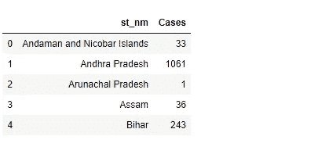
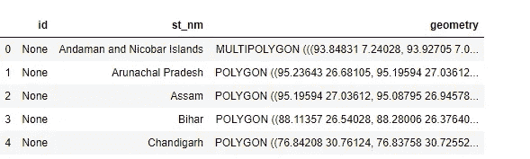
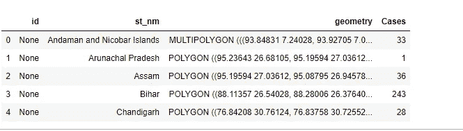
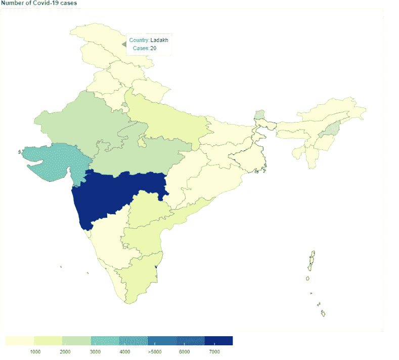

# 使用带有散景的冠状病毒(新冠肺炎)疫情数据生成交互式 choropleth 印度地图

> 原文：<https://medium.com/analytics-vidhya/generate-an-interactive-choropleth-india-map-using-corona-virus-covid-19-pandemic-data-with-bokeh-5623e974e585?source=collection_archive---------16----------------------->

本文中的 12 个简单步骤可以帮助你使用疫情(印度)和新冠肺炎(印度)的冠状病毒数据，以一种简化详细的方式制作一个交互式的 Choropleth 地图。确保您已经阅读了上一篇关于 [***静态 Choropleth 地图***](/@princenihith/generate-a-static-choropleth-india-map-using-corona-virus-pandemic-data-19e9cbf5a07d) 的文章

## 散景

它是当今互联网浏览器的直观感知库。它给出了灵活设计的精致、简短的开发，并承载了庞大或滔滔不绝的数据集上的精英智能。散景可以帮助任何想要快速有效地制作智能绘图、仪表盘和信息应用程序的人。

**互动 Choropleth 地图的 12 个简单步骤:**

**步骤 1 :** 导入代码所需的所有库

> # Import libraries
> Import pandas as PD
> Import numpy as NP
> Import geo pandas as GPD
> Import JSON
> 
> 从 bokeh.io 导入显示
> 从 bokeh.plotting 导入图形
> 从 bokeh.models 导入 GeoJSONDataSource，LinearColorMapper，ColorBar

**步骤 2** :使用 **pandas dataframe** 读取 excel 数据

> data _ df _ India = PD . read _ excel(r ' data _ ecxel . xlsx '，dtype = object)
> data _ df _ India . rename(columns = { ' Total Confirmed Cases ':' Cases '，' Name of State/ UT':'st_nm'}，in place = True)
> data _ df _ India . head()

为了方便起见，使用 pandas dataframe 读取 excel 数据并重命名列。

**步骤 3 :** 使用 **Geopandas** 库读取**形状文件**

> FP = r ' India-polygon . shp '
> SF _ India = GPD . read _ file(FP)
> SF _ India . head()

**步骤 4 :** 合并**公共列**上的数据文件和形状文件

> merged = SF _ India . merge(data _ df _ India，on = 'st_nm '，how = 'left')
> merged.head()

下面是常见的栏目 ***st_nm***

**第五步**:将数据读入 JSON 并转换成 GEOJSON 格式

> #读取数据到 JSON
> merged _ JSON = JSON . loads(merged . to _ JSON())
> 
> # Convert to str like object
> JSON _ data = JSON . dumps(merged _ JSON)
> geosource = GeoJSONDataSource(geojson = JSON _ data)

**步骤 6 :** 配置调色板

[***调色板***](https://docs.bokeh.org/en/latest/docs/reference/palettes.html#bokeh-palettes)***——****在散景的上下文中，调色板是一个简单的(十六进制)RGB 颜色字符串的普通 Python 列表。*

*例如* `*Blues8*` *调色板看起来像是被定义为:*

> palette = brewer[' YlGnBu '][8]
> #颠倒颜色顺序，使深蓝色为最高肥胖度。调色板=调色板[::-1]

**步骤 7 :** 实例化 [**颜色映射器**](https://docs.bokeh.org/en/latest/docs/reference/models/mappers.html?highlight=linearcolormapper#bokeh.models.mappers.LinearColorMapper) 和刻度标签

> color _ mapper = LinearColorMapper(palette = palette，low=merged['Cases']。min()，high =合并['Cases']。max()，nan _ color = ' # d9d 9 ')
> #为颜色条定义自定义刻度标签。
> tick _ labels = { ' 5000 ':'>5000 ' }

根据合并数据帧中的列“案例”,我们有低值和高值。我们在列合并中将 Nan 的颜色值指定为' # d9d9d9 '。

**步骤 8:** 添加**悬停工具**使地图更具互动性

[**悬停工具**](https://docs.bokeh.org/en/latest/docs/user_guide/tools.html#hovertool) —悬停工具是一种被动的检查工具。它通常一直处于打开状态，但可以在与工具栏相关联的检查器菜单中进行配置。

> #添加悬停工具
> hover = HoverTool(工具提示= [ ('Country '，' [@st_nm](http://twitter.com/st_nm) ')，(' Cases '，' [@Cases](http://twitter.com/Cases) ')])

我们添加了用于州名的列 *st_nm 和用于确诊病例的列 Cases，以显示特定指定州的数据。*

**第九步:**添加 [**彩条**](https://docs.bokeh.org/en/latest/docs/reference/models/annotations.html?highlight=colorbar#bokeh.models.annotations.ColorBar) 贴图

> #创建颜色栏。
> color _ bar = color bar(color _ mapper = color _ mapper，label_standoff=8，width = 500，height = 20，
> border_line_color=None，location = (0，0)，orientation = 'horizontal '，major _ label _ overrides = tick _ labels)

**步骤-10 :** 现在创建 [**图**对象 ](https://docs.bokeh.org/en/latest/docs/reference/plotting.html?highlight=figure#bokeh.plotting.figure.figure)

> p = figure(title = '新冠肺炎案件数'，plot_height = 600，plot_width = 950，toolbar_location = None，tools =[hover])
> p . xgrid . grid _ line _ color = None
> p . ygrid . grid _ line _ color = None

**步骤-11:** 给图添加 [**补丁**](https://docs.bokeh.org/en/latest/docs/reference/plotting.html?highlight=patches#bokeh.plotting.figure.Figure.patches)

> #向图形添加补丁渲染器。
> p.patches('xs '，' ys '，source = geosource，fill_color = {'field' :'Cases '，' transform' : color_mapper}，line_color = 'black '，line_width = 0.25，fill _ alpha = 1)
> # Specify layout
> p . add _ layout(color _ bar，' right ')

**Step-12:** 使用 [**显示**](https://docs.bokeh.org/en/latest/docs/reference/io.html?highlight=show#bokeh.io.show) 方法显示地块

> 显示(p)

# Github 链接:

您可以在 这里获得代码和文件