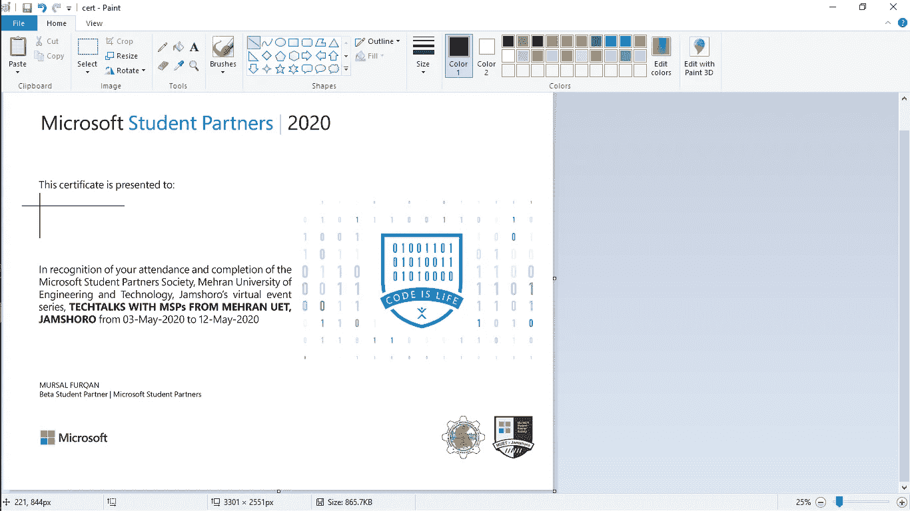

# 使用 Python 生成证书

> 原文：<https://medium.com/analytics-vidhya/generate-certificates-using-python-a7685985ed77?source=collection_archive---------9----------------------->

成为微软学生合作伙伴意味着我们每天都要和我们的开发者社区打交道。每天，我们都在努力教和学新的东西。2020 年 1 月，我被我的大学*麦兰工程技术大学* (MUET)选为 MSP。后来，我培训了一些其他的学生，包括大三学生、我的队友和老师，让他们成为来自 MUET 的 MSP。他们在 4 月份被吸纳为议员。从那以后，他们每天都努力学习和教授新的东西。


最近，我们，来自 MUET Jamshoro 的 MSP，与来自 MUET Jamshoro 的 MSP 进行了一系列的网络研讨会，**技术会谈。**全球近 340 多名参与者参加了此次会议。系列赛结束后，我们向他们承诺，他们都将获得参赛证书。但是创建这么多的证书对我们来说是一项繁忙的任务。这时候我想到用 **Python** 来做这个任务。

为此，我首先从 PIL 导入了 Image、ImageDraw 和 ImageFont。

```
from PIL import Image, ImageDraw, ImageFont
```

然后，因为我是基于我们的 ***反馈表*** 生成证书的，所以我也必须导入熊猫

```
import pandas as pd
```

导入熊猫为 ***pd*** 后，我用熊猫的 ***read_excel*** 函数读取我们的 excel 文件，保存到另一个变量 ***form*** 。

```
form = pd.read_excel(“feedback_form.xlsx”)
```

现在，我还需要两件事情来继续我们的真正任务，即使用 Python 生成批量证书。这两件事就是名字和把名字转换成一个列表。其他编程语言需要大约 50 多行代码来完成这项任务，您可能需要一两个循环来执行这项任务，但是在 Python 中，同样的任务只需要一行代码。

```
name_list = form[‘Name’].to_list()
```

现在，当我拥有了所有需要的东西后，我开始创建证书。但是我还需要最后一样东西，一个证书模板。我也搞定了。因为 MSP 程序也为我们提供了证书模板。


准备好证书模板后，我需要模板图像中的坐标来开始编写 python 代码。为此，我也可以使用其他工具，但是我选择使用可用的 simples 技巧。是的，我用了**颜料。**

好了，我把坐标整理出来了。如果有人不知道如何获得坐标，可以通过移动所需的位置来获得坐标，并且坐标会出现在画图窗口的左下角。我画了这两条线来告诉你我需要这两条线交点的坐标，因为我在截图中看不到鼠标光标。



现在，在批量创建证书之前，我需要为单个证书创建代码。为此，我创建了一个名为 *dummy_name 的虚拟列表。*然后，我首先必须打开图像，即我们的证书图像。我使用了从***【PIL】***导入的**图片**的 open()函数，并将它保存到另一个变量 im 中。

```
*dummy_list = [“Dummy”]
im = Image.open("cert.jpg")*
```

在那之后，我现在必须开始画我们的图像。为此，我使用了从 PIL***导入的 ***ImageDraw*** 。我使用 ImageDraw 的 Draw()函数来完成这个任务，并将其保存到另一个变量 d 中。***

```
d = ImageDraw.Draw(im)
```

现在，我将我们的坐标保存到一个变量中，location 后跟我希望证书上的文本颜色，并使用 RGB 配色方案将其保存到一个新变量 text_color 中。最后，在开始生成证书之前，我必须声明文本应该使用哪种字体。我使用了从*导入的 ***图像字体*** 并将其保存到字体变量中。*

```
*location = (215, 882)
text_color = (0, 137, 209)
font = ImageFont.truetype(“arial.ttf”, 150)*
```

*现在，我必须将这些属性嵌入到我的文本中。我用了 ImageDraw(d)的 text()函数。*

```
*d.text(location, dummy_list, fill=text_color, font=font)*
```

*现在在最后，我不得不将证书保存为 pdf 格式。使用 Python，您可以将输出文件保存在任何您想要的位置。我还想用每个人的名字保存每个证书。因此，我使用了下面的代码。*

```
*im.save(“certificate_” + dummy_list + “.pdf”)*
```

**

*以上代码的最终输出看起来就是这样。*

*这是单一证书的代码。在创建了上面给出的代码之后，我不必花费时间来批量生成证书。我只需要在适当的地方引入一个循环。*

*在声明 name_list 之后，我包含了一个循环，*

```
*for i in name_list:*
```

*然后将我代码的最后一行从*

```
*im.save(“certificate_” + dummy_list + “.pdf”)*
```

*到*

```
*im.save(“certificate_” + i + “.pdf”)*
```

*你可以在这里比较你的最终代码和我的:*

```
*from PIL import Image, ImageDraw, ImageFont
import pandas as pdform = pd.read_excel("feedback_form.xlsx")name_list = form['Name'].to_list()
for i in name_list:
    im = Image.open("cert.jpg")
    d = ImageDraw.Draw(im)
    location = (215, 882)
    text_color = (0, 137, 209)
    font = ImageFont.truetype("arial.ttf", 150)
    d.text(location, i, fill=text_color,font=font)
    im.save("certificate_"+i+".pdf")*
```

*最后！👏这就是我如何解决为我的活动参与者生成参与证书的问题。现在的问题是如何把这些证书分别发给每个人。我也为此创建了一个 python 程序。我将在下一篇文章中分享这一点。*