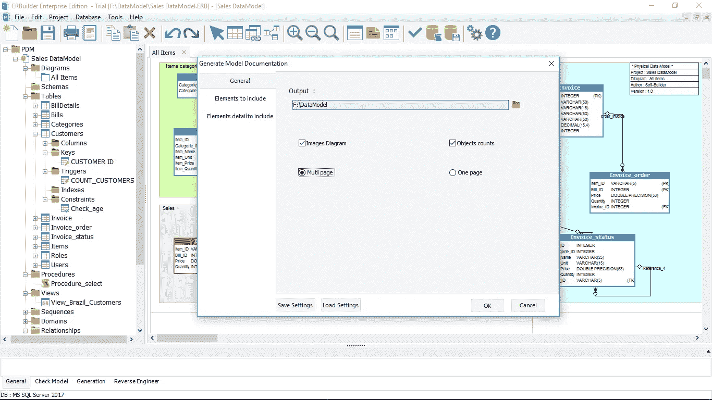

# 生成数据库文档

> 原文：<https://medium.com/analytics-vidhya/generate-database-documentation-e5438212a063?source=collection_archive---------20----------------------->

为什么要记录数据库？

管理复杂的数据库时，拥有关于数据库的详细文档是理解数据并简化数据库架构师、开发人员、业务分析师和管理员对重要信息的访问的最佳方式。

**什么是数据库的文档？**

数据库文档由关系图、表列表以及每个表包含的内容及其与其他表的关系的简要描述组成。

**如何记录现有的数据库？**

如果您想要记录一个现有的数据库，您必须对它进行逆向工程以生成数据库模式模型。([如何对现有数据库进行逆向工程？](/@kevin_r2020/how-to-reverse-engineer-an-existing-database-651f6422f0cc))

有很多方法来记录你的模型，你可以使用数据库管理工具，文档工具或者数据建模工具。我将推荐使用数据建模工具**(比如我将在本文中使用的**[**erBuilder**](https://soft-builder.com/erbuilder-data-modeler/)**)**，因为它们能够从现有数据库生成 ER 图。

[**ERBuilder**](https://soft-builder.com/erbuilder-data-modeler/) 是一个完整的数据建模工具，你可以用它对你的数据库进行逆向工程(支持的数据库: **Oracle，MS SQL Server，MySQL，PostgreSQL，Firebird，SQLite，Azure Database 和 Amazon Redshift** )。ERBuilder 还允许描述数据模型的每个对象，并生成 HTML 文档报告，包括图表和数据模型的所有对象。

要记录您的数据库，请按照下列步骤操作:

1-用 ERBuilder 逆向工程你的数据库([如何逆向工程一个已有的数据库？](/@kevin_r2020/how-to-reverse-engineer-an-existing-database-651f6422f0cc))

2-在逆向工程之后，您在工作区中获得了数据库的数据模型

3-浏览 TreeView explorer 以查看导入的模式对象。您现在可以添加对以下内容的描述:

*   表、列和关系(外键)
*   视图、触发器和存储过程
*   序列和结构域

4-现在，点击**“工具”**和**“生成模型文档”**，生成数据模型的文档

5-选择要在生成的文档中包含的模型元素

6-选择保存文档的文件夹，然后点击**“确定”**生成模型文档。如下图所示:

7-一旦文档生成，你可以用你最喜欢的导航器打开它。如下图所示:

包含 ER 图的文档主页(能够放大图的一部分)

使用左侧栏导航到生成的文档，左侧栏包含数据模型每个对象的菜单。

表视图包含关于表元数据的详细信息。

columns 视图包含数据模型中每一列的详细信息，以及到它们的表的链接。

特定列的详细信息视图。

relationship 视图包含关于数据模型的每个关系的细节。

视图细节包括实现脚本