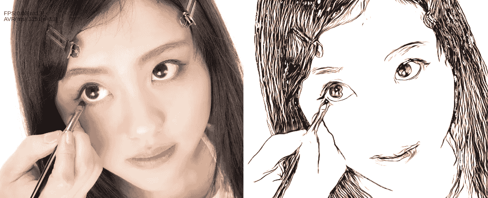
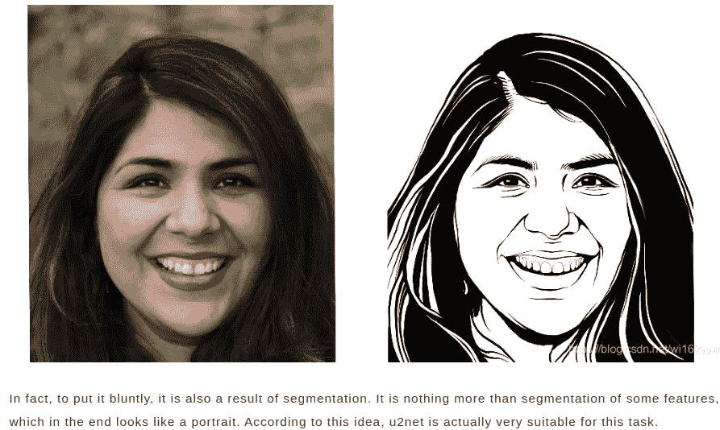
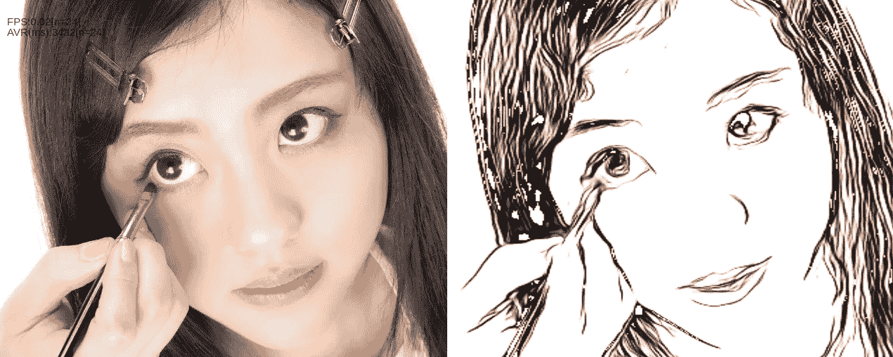
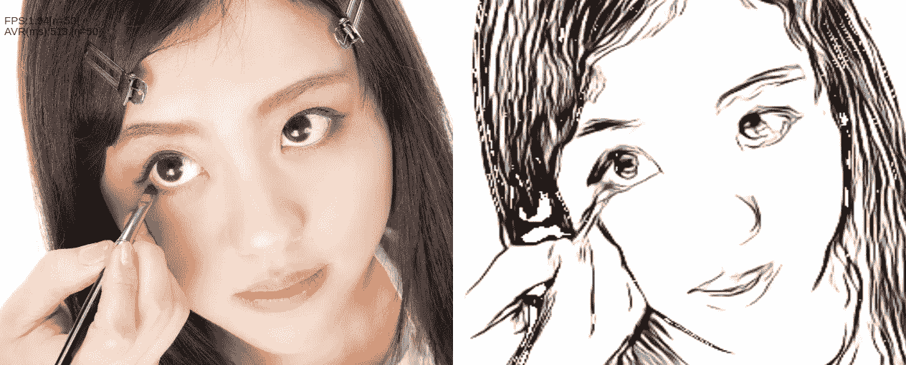
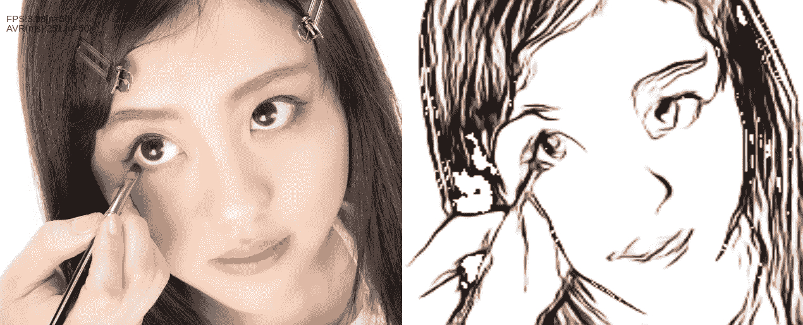
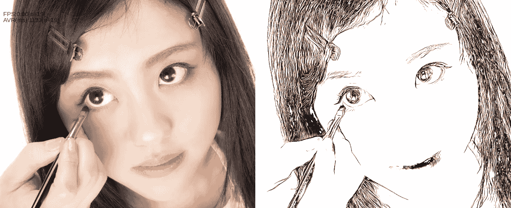

# 用 U -Net 在浏览器上生成肖像

> 原文：<https://medium.com/analytics-vidhya/generate-portrait-on-browser-with-u%C2%B2-net-71b4c682df44?source=collection_archive---------13----------------------->

注意:
这篇文章也可以在这里找到。
【https://zenn.dev/wok/articles/0007_u2net-portrait-drawing】T2

# 首先

我想在浏览器中轻松运行机器学习模型。所以我正在开发一个库，在 tensorflowjs 中运行各种模型([见这个库](https://github.com/w-okada/image-analyze-workers))。在本文中，我将尝试在浏览器中运行从照片生成肖像的函数。

例如，你可以从左边的图片生成右边的图片，就像这样。(像往常一样，左边的图片借用了 [Pakutaso](https://www.pakutaso.com/) 。这是河村先生。她总是很可爱。)



# 关于优信网的一点信息

这次我们将使用 U -Net 生成一个肖像。这是前阵子还在嗡嗡叫的那个。

似乎已经提出了几种使用机器学习生成人像的方法，包括 U -Net 引用的 [APDrawingGAN](https://github.com/yiranran/APDrawingGAN) 。由于肖像生成是图像生成方法之一，我有点把它看作是 GAN 的扩展。换句话说，正如 APDrawingGAN 所做的那样，它通过融合从整张脸的特征(如眼睛和鼻子的位置)重建的图像和从眼睛和鼻子的个体特征重建的图像来创建人像。然而，U -Net 采取了一种完全不同的方法:U -Net 实际上来自于显著对象检测领域的研究，即从背景中分离出图像中的感兴趣对象。因此，论文正文中根本没有提到肖像。

如果你参考 U -Net 知识库，你会发现作者在提交论文后就找到了使用他们的成果的新方法。他们说，“如果我们使用模仿照片绘制的肖像作为教师数据，我们可以创建一个模型来进行分割。我两种想法都有“真的吗？”和“也许那是真的”。但实际上是有效的，所以我只能说:“哇！".然而，这是可能的，因为 U -Net 网络能够捕捉多尺度和多层特征，我认为它不会很好地与使用其他后端的分段模型一起工作。(如果你想知道更多关于 U -Net 的架构和其他细节，请阅读论文。)



带有资源库链接的页面的英文翻译

在这篇文章中，我想尝试运行一个函数，在浏览器中使用这样一个有趣的模型和一个意想不到的背景来生成肖像。

# 在浏览器上使用 U -Net 模型

U -Net 目前只能作为 PyTorch 实现使用。所以为了在 Tensorflowjs 中运行它，我们需要转换模型。在 [PINTO 的文章](https://qiita.com/PINTO/items/ed06e03eb5c007c2e102)中详细介绍了将 PyTorch 模型转换为 Tensorflowjs 的方法。基本上，我不打算在这里解释太多，因为我是根据平托的这篇文章转换的。请参考平托的文章。在[的上一篇文章](https://dannadori.medium.com/convert-pytorch-model-to-tensorflowjs-fb3bc8e90589)中，我解释了如何在 docker 中运行转换过程，所以也请参考那篇文章。转换后并入 Tensorflowjs 就大功告成了。

# 转换和实现

在本节中，我们将假设您已经参考上一篇文章中的[构建了一个 docker 环境。](https://dannadori.medium.com/convert-pytorch-model-to-tensorflowjs-fb3bc8e90589)

(1)从 github 克隆 U -Net 库，下载训练好的模型。

```
$ git clone [https://github.com/NathanUA/U-2-Net.git](https://github.com/NathanUA/U-2-Net.git)
$ cd U-2-Net/
$ mkdir ./saved_models/u2net_portrait/
$ curl -sc /tmp/cookie "[https://drive.google.com/uc?export=download&id=1IG3HdpcRiDoWNookbncQjeaPN28t90yW](https://drive.google.com/uc?export=download&id=1IG3HdpcRiDoWNookbncQjeaPN28t90yW)" > /dev/null
$ CODE="$(awk '/_warning_/ {print $NF}' /tmp/cookie)"  
$ curl -Lb /tmp/cookie "[https://drive.google.com/uc?export=download&confirm=${CODE}&id=1IG3HdpcRiDoWNookbncQjeaPN28t90yW](https://drive.google.com/uc?export=download&confirm=${CODE}&id=1IG3HdpcRiDoWNookbncQjeaPN28t90yW)" -o saved_models/u2net_portrait/u2net_portrait.pth
```

(2)接下来，我们将执行转换过程。模型名`--model-name U2Net`和被训练模型的文件名`—weights saved_models/u2net_portrait.pth`不同，但基本流程和上一篇文章描述的 U -Net 的一样。pytorch_to_onnx.py 的输出文件名与[上一篇文章](https://dannadori.medium.com/convert-pytorch-model-to-tensorflowjs-fb3bc8e90589)中的文件名相同，进一步处理请参考上一篇文章。但是我认为执行 openvino2tensorflow 时出现了错误，无法创建 SavedModel。这可能是因为 SavedModel 应该小于 2GB ( [问题](https://github.com/tensorflow/tensorflow/issues/45041))。将生成一个冻结的模型，因此请将此模型转换为 tensorflowjs。总文件大小超过 150MB。

```
$ export PYTHONPATH=/U-2-Net
$ SIZE=512
$ python3 /opt/intel/openvino_2021/deployment_tools/tools/model_downloader/pytorch_to_onnx.py  \
 --import-module model.u2net   \
 --model-name U2NET   \
 --input-shape 1,3,${SIZE},${SIZE}   \
 --weights saved_models/u2net_portrait/u2net_portrait.pth   \
 --output-file u2netp_${SIZE}x${SIZE}.onnx   --input-names "x"   \
 --output-names "a/F.sigmoid(d0)"
```

(3)转换完成后，就可以放在自己的网站上，用 Tensorflowjs 加载使用了。基本用法与其他型号相同。请注意，需要对输入和输出进行归一化和阈值处理，以生成高精度的图像。关于我使用的阈值，请参考下面存储库中的源代码。

# 奔跑

现在让我们用它来生成一个肖像。像往常一样，我将改变输入图像的大小，以查看处理时间和质量。请注意，我们是在装有 GeForce GTX 1660 和 Chrome 的 Linux 电脑上进行实验的。

这是 320x320 的样子。这是一幅相当真实的画像。GPU 上每帧的处理时间约为 1.5 秒。它很重。



我试着把它做成 256x256。它已经坏了。处理时间约为 1.1 秒。



192x192 有点不切实际。处理时间约为每帧 0.4 秒。



做成 512x512。原来的训练好像是 512x512 做的，所以确实做的很好。眼睛看起来很吸引人。不幸的是，在我的环境中，GPU 没有足够的内存来处理它，所以我必须让 CPU 来处理它，每帧大约需要 4 分钟。在 CPU 上处理每帧大约需要 4 分钟。


我也试过 1024x1024，觉得好玩。也很好用。不过，512x512 也不错，所以人们可能会对哪个更好有不同的看法。顺便说一下，这也是用 CPU 做的。是我午睡醒来后做的。我想大概花了一个小时。



仅此而已。肖像的质量相当高，但是我认为处理时间太长了。

# 存储库和演示

这个演示存储在下面的存储库中。您也可以在以下站点运行演示。

*   储存库
    [https://github.com/w-okada/image-analyze-workers](https://github.com/w-okada/image-analyze-workers)
*   Demo
    [https://flext-lab-web . S3-us-west-2 . Amazon AWS . com/P01 _ wokers/t09 _ U2 net-portrait/index . html](https://flect-lab-web.s3-us-west-2.amazonaws.com/P01_wokers/t09_u2net-portrait/index.html)
    *关于 demo 的说明。
    ①速度很慢。请等待大约一分钟，第一幅图像就会出现。我把它设置成在 192x192 的 CPU 上运行。右上角的控制器可以让你切换到不同的分辨率和 GPU。
    (3)将 useTFWasmBackend 设置为 Off，按下 reload model 按钮进入 GPU 模式。
    (4)从 modelPath 下拉菜单中选择一种分辨率，并点击 reload model 按钮，以该分辨率处理图像。
    (5)您可以从输入更改要输入的图像。也可以用相机。
    (6)分辨率提高到 512x512 或更高时，最好不要使用 GPU 模式。存在内存溢出的风险。

# 最后

我试着在浏览器中运行人像创建功能，即使在配有 GPU 的机器上实时运行似乎也有点困难。如果负载这么高，使用服务器而不是浏览器可能会更好。

[](https://www.buymeacoffee.com/wokad)

我很渴！！