# 从 AWS CloudWatch 警报生成松弛通知

> 原文：<https://medium.com/analytics-vidhya/generate-slack-notifications-for-aws-cloudwatch-alarms-e46b68540133?source=collection_archive---------2----------------------->

在我尝试云计算的过程中，我决定尝试不同的东西，并将它们记录在一篇文章中。我的第一篇文章将关注使用 Slack Webhook 和 AWS Lambda 函数向 Slack 工作区发送 CloudWatch 通知。将用于实现这一点的 AWS 服务包括 EC2 实例、CloudWatch、 [AWS SNS](https://aws.amazon.com/sns/) (简单通知服务)、Lambda & AWS 系统管理器参数存储。

# AWS 云观察

[Amazon CloudWatch](https://aws.amazon.com/cloudwatch/) 是一个工具，可以捕获所有必要的信息来跟踪 AWS 云中托管的所有应用程序的性能。CloudWatch 跟踪诸如延迟、请求计数、应用程序日志、CPU 使用、&其他自定义指标等指标。CloudWatch 日志以接近实时的方式捕获，***cloud watch******Alarms***可用于根据指定的阈值观察您的指标，并主动做出决策，如在 CPU 使用率超过特定阈值时触发 EC2 实例自动关闭。

# 体系结构

EC2 实例将定期向 CloudWatch 发送其 CPU 使用情况。一旦 CPU 使用率超过特定阈值(40%)，CloudWatch 警报就会从“正常”变为“警报中”。当这种情况发生时，一条消息被发送到一个 SNS 主题，该主题又触发一个 lambda 函数，该函数从 SSM 参数存储中检索预先保存的 slack webhook URL，并向 slack 工作区发送通知。

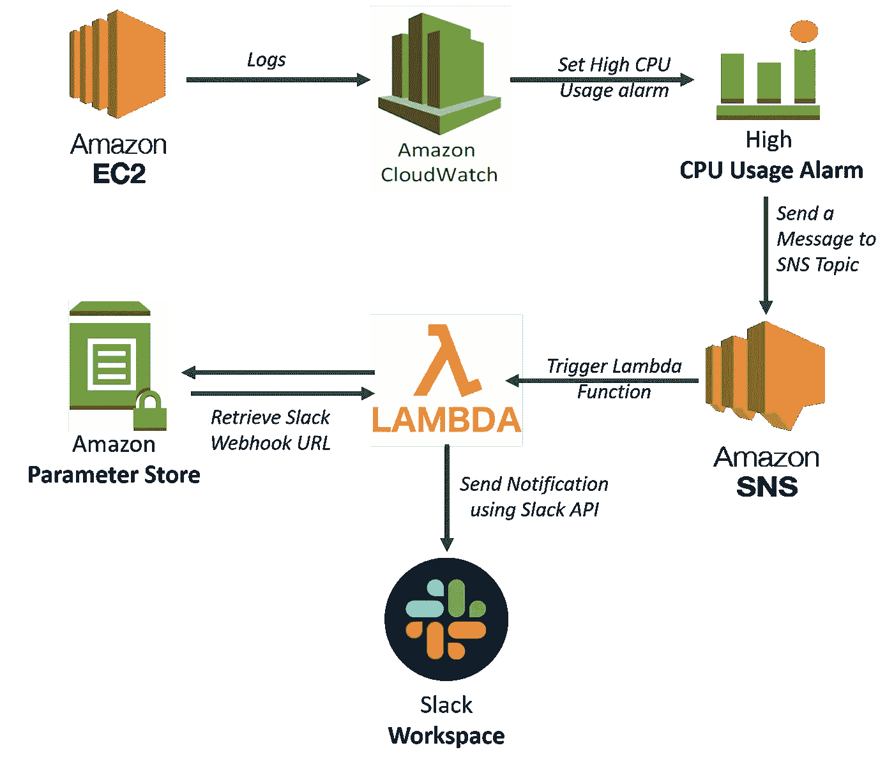

用于从 CloudWatch 创建松弛通知的架构

# 构建应用程序

以下是实现这一目标所需的步骤:

1.  **创建一个 Slack app** :首先，我们需要在[https://api.slack.com/apps/new](https://api.slack.com/apps/new)创建一个 Slack app，并为应用设置一个开发工作区。当 Slack 应用程序创建完成后，下一步就是激活即将到来的 webhooks。这将使我们能够将来自外部来源的消息发布到我们的 Slack 工作区中。激活传入的 webhook 后，我们通过点击页面底部的按钮向工作区添加一个新的 web hook。一旦集成完成，您将在 slack 通道中得到一个提示。集成成功后，我们复制页面底部的 webhook URL，并将其存储在 SSM 参数存储中。

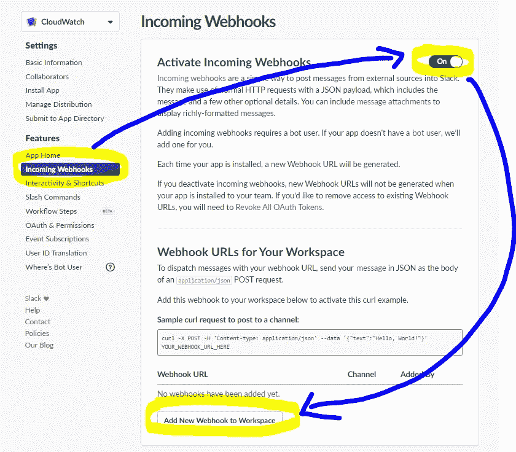

在空闲时激活 webhook。

2.**为我们的应用程序**创建一个 SNS 主题:接下来，我们将创建一个 SNS 主题，当 EC2 实例的 CPU 使用率超过某个阈值时，它将负责接收云观察消息。在 AWS 控制台上，导航到 Amazon SNS 并创建一个新主题。输入主题名称，然后单击“创建主题”,因为默认设置足以满足我们的期望。

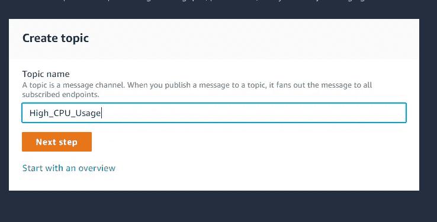

**或者**，您可以使用下面的命令从命令行创建一个 Amazon SNS 主题

```
aws sns create-topic --name High_CPU_Usage
```

3.**创建一个 EC2 实例**:接下来我们将启动一个 EC2 实例来生成将报告给 CloudWatch 的指标。我们将推出一个 t2.nano 类型、1 个 vCPU 和 0.5gb 内存的符合免费层条件的 LINUX 实例。因为这个实例只有一个实例，所以应该不难对 CPU 施加压力，这样我们就可以基于设置的阈值在 CloudWatch 上生成一个高警报消息。我们注意到了实例 id，因为我们将需要该实例 id 来创建 CloudWatch 警报。

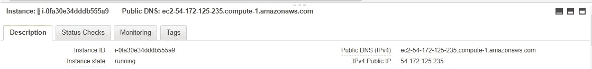

确保您的实例正在运行，然后单击 monitoring，并启用详细监控。为了方便起见，我们启用了详细的监控，这将允许我们跟踪每分钟从实例生成的指标。启用详细监控后，我们接着创建 CloudWatch 警报。

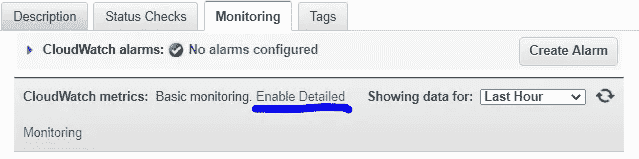

4.**创建一个 CloudWatch 警报**:接下来我们将创建一个 CloudWatch 警报来接收来自正在运行的实例的指标。在 AWS 控制台上，搜索 Cloudwatch，单击左侧面板上的 alarms，并创建一个警报。选择 metrics，选择 EC2 和每个实例的 metrics，粘贴我们刚刚创建的 EC2 实例的 ID，并选中 CPU utilization 复选框。

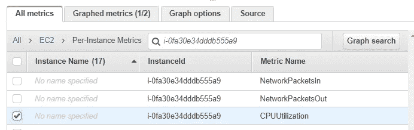

在“*指定指标和条件*”部分，我们将警报名称设置为 HighCpu，将阈值类型设置为*“静态”*，并将条件定义为大于 40。然后，我们选择我们之前创建的 SNS 主题作为当我们超过特定阈值时警报通知的接收者。

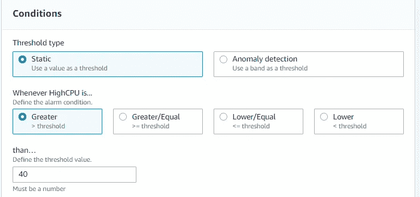

当您创建警报时，您会注意到其状态为*“数据不足”。*这是因为它没有从正在运行的实例中收集足够的数据。**或者**，您可以从命令行界面使用以下命令创建 CloudWatch 警报。

```
aws cloudwatch put-metric-alarm \
    --alarm-name HighCpu \
    --metric-name CPUUtilization \
    --namespace AWS/EC2 \
    --statistic Average \
    --period 60 \
    --evaluation-periods 1 \
    --threshold 40 \
    --comparison-operator GreaterThanThreshold \
    --dimensions Name=InstanceId,Value=i-0fa30e34dddb555a9 \
    --alarm-actions arn:aws:sns:us-east-1:123456789012:high-cpu-alarm \
    --unit Percent
```

5.**创建一个系统管理器参数**:我们的 slack webhook URL 对于我们的工作区是唯一的，我们不希望任何人都能访问它。因此，我们将把它像凭证一样存储在 AWS 参数存储中，并在需要时检索它。在 AWS 控制台上，我们导航到 AWS 系统管理器并单击参数存储。然后，我们创建一个新参数来保存 Slack webhook URL 的值。将参数名称设置为 slackwebhookurl，选择类型为“ *securestring* 加密密码，将 url 粘贴到 value 部分，点击 create parameter。

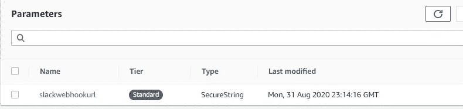

**或者**，你可以从命令行界面用下面的命令创建一个 SSM 参数，其中$WEBHOOK_URL 是存放 WEBHOOK 的变量。

```
aws ssm put-parameter --cli-input-json '{"Type": "SecureString", "KeyId": "alias/aws/ssm", "Name": "SlackWebHookURL", "Value": "'"$WEBHOOK_URL"'"}'
```

6.**创建 lambda 函数**:下一步是创建 Lambda 函数，它将把高警报通知推送到 slack。在创建 Lambda 函数之前，我们需要为函数创建一个 IAM 执行角色。我们从 AWS 控制台导航到 IAM 页面，然后单击 roles。点击 create role，选择*“AWS service”*作为实体的类型，选择 Lambda 作为服务。我们需要授予 Lambda 对 SSM 的完全访问权限，以及一个基本的执行角色。


现在，我们可以继续创建函数了。导航到 AWS Lambda 并单击创建函数。为您的函数指定一个名称，选择 python 运行时，并选择我们刚刚创建的角色。

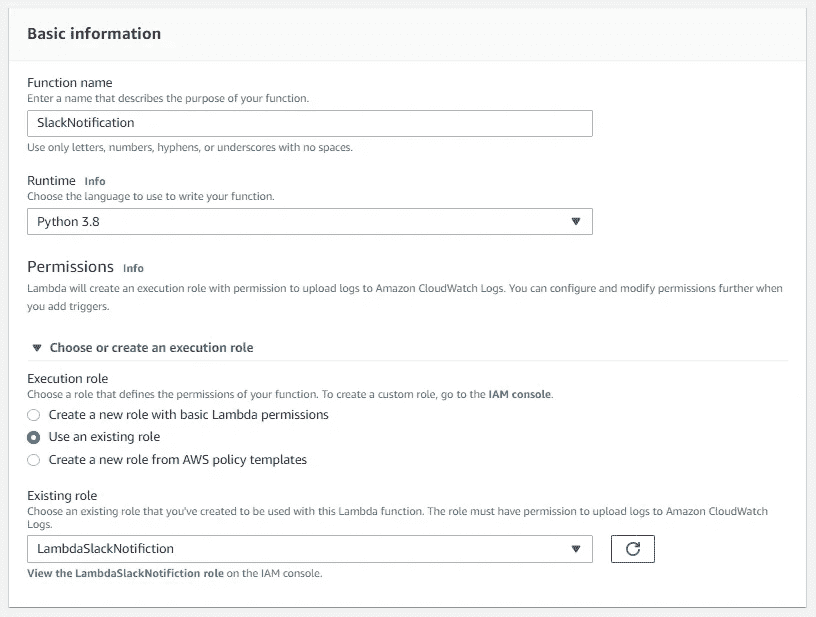

现在我们可以开始创建函数了。

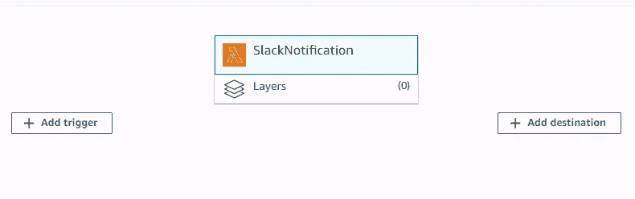

下一步是给我们的函数添加一个触发器。触发器是在满足特定条件时执行它们所附加的功能的服务。我们将选择从 CloudWatch 接收消息的 SNS 主题作为我们的触发器。请注意，您可以向 Lambda 函数添加多个触发器。

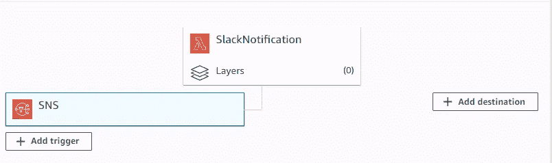

Lambda 函数将接收来自 SNS 主题的 JSON 格式的消息。然后，我们将提取实体，如变量中的警报名称、新状态值和当前状态的原因。然后，我们将创建一个包含上述实体信息的 slack 消息模板。接下来，我们将检索工作区的 webhook URL，并向 API 发出请求。请参见下面的代码片段。

```
import json
from urllib.error import HTTPError, URLError
from urllib.request import Request, urlopenimport boto3#Create a SSM Client to access parameter store
ssm = boto3.client('ssm')#define the function
def lambda_handler(event,context):
    #retrieve message from event when lamda is triggered from SNS
    print(json.dumps(event))

    message = json.loads(event['Records'][0]['Sns']['Message'])
    print(json.dumps(message))

    '''
    Retrieve Json vriables from message
    AlarmName is the name of the cloudwatch alarm tht was set
    NewStateValue is the state of the alarm when lambda is triggered which means it has 
                gone from OK to Alarm
    NewStateReason is the reason for the change in state
    '''

    alarm_name = message['AlarmName']
    new_state = message['NewStateValue']
    reason = message['NewStateReason']

    #Create format for slack message
    slack_message = {
        'text' = f':fire: {alarm_name} state is now {new_state}: {reason} from Nesq\n'
                 f'```\n{message}```'
                    }
    #retrieve webhook url from parameter store
    webhook_url = ssm.get_parameter(Name='slackwebhookurl', WithDecryption=True)

    #make  request to the API

    req = Request(webhook_url['Parameter']['Value'],
                    json.dumps(slack_message).encode('utf-8'))

    try:
        response = urlopen(req)
        response.read()
        print("Messge posted to Slack")
    except HTTPError as e:
        print(f'Request failed: {e.code} {e.reason})
    except URLError as e:
        print(f'Server Connection failed:  {e.reason})
```

# 测试我们的应用

现在我们将 SSH 到我们的 Linux 实例中。从 AWS 控制台导航到 EC2 页面，并使用独立客户端或基于浏览器的 SSH 连接连接到我们的。我个人更喜欢基于浏览器的 SSH 连接，因为它快速且无缝。


现在，我们将使用 Linux 压力实用程序对 CPU 施加压力，这将同时增加 CPU 的使用率。Stress 是一个简单的命令行工具，用于进行 CPU 内存和磁盘测试。现在，我们必须在我们的实例中安装一些额外的 Linux 包，以使这个实用程序可用。之后我们会施加压力。

```
# Install Extra Packages for Enterprise Linux
sudo amazon-linux-extras install epel# Install stress
sudo yum install -y stress
```

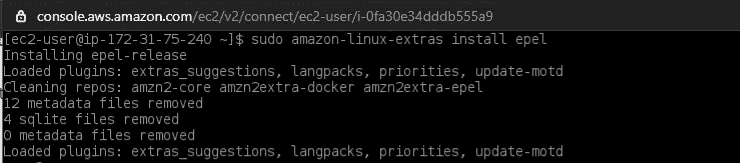

现在，我们要用下面的代码敲打 CPU 分钟；这将推动我们的 CPU 达到 100%的使用率。然后，当 CPU 承受压力时，我们将监控 CloudWatch 警报。

```
# Beat it up for 5 mins
stress --cpu 2 --timeout 300s
```

下面是我们的 CPU 使用情况和警报状态从“正常”变为“警报中”的图表

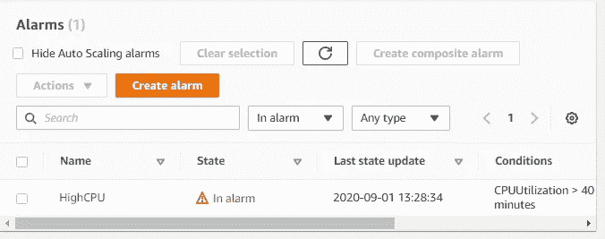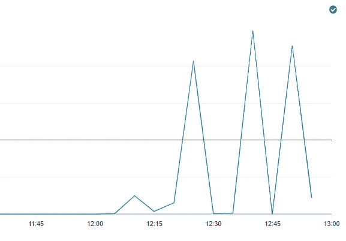

现在我们可以检查云日志，看看我们的函数是否已经成功执行。

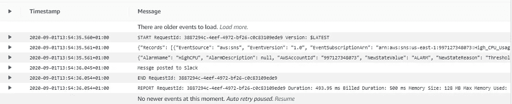

下面是 Lambda 被触发时 slack 上的通知。

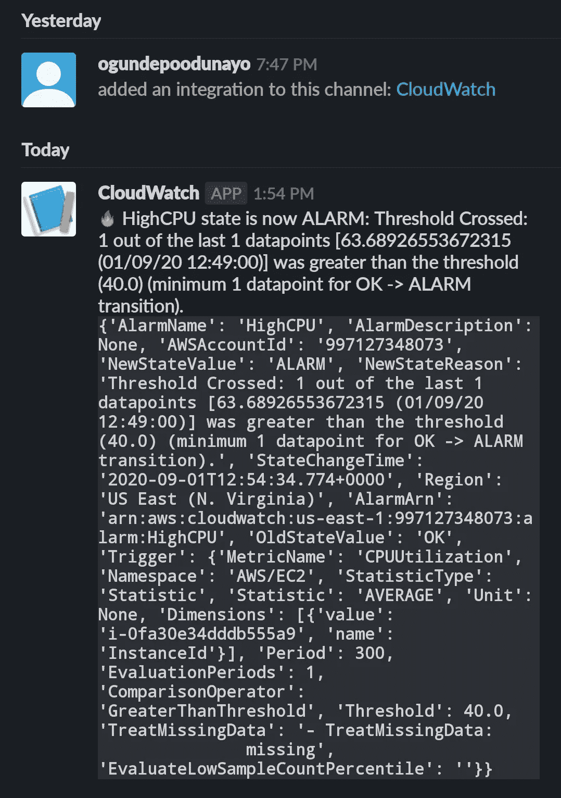

# 结论

在日常活动中使用多个 AWS 服务的组织可以利用这个应用程序，根据您设置的任何条件，从 slack 上的 CloudWatch 生成实时定制通知。

代码存储库:

[https://github.com/ToluClassics/Slack-AWS-Integration](https://github.com/ToluClassics/Slack-AWS-Integration)

参考资料:

https://linuxacademy.com/