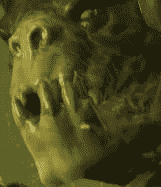
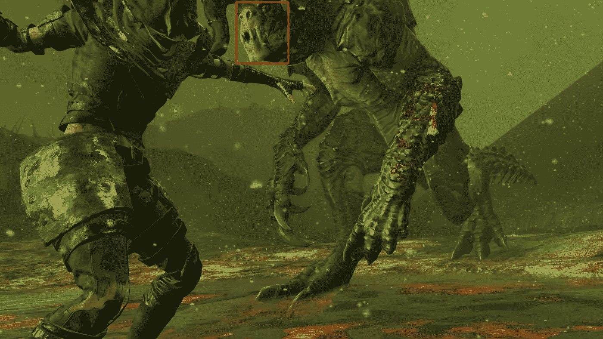
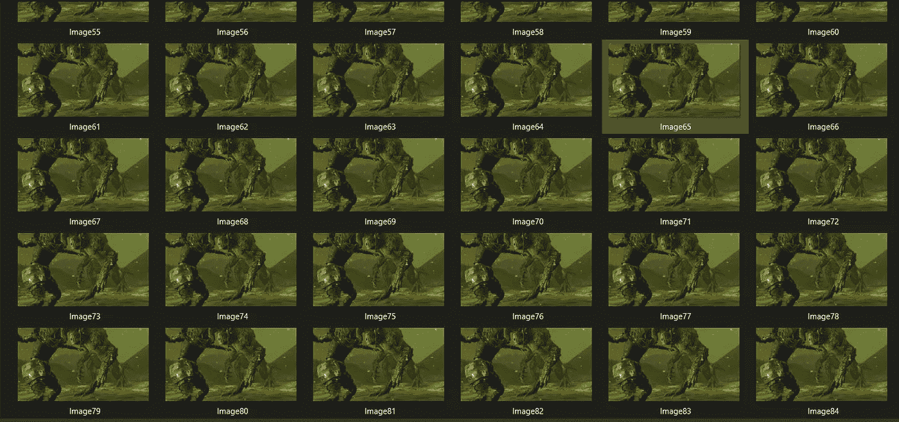
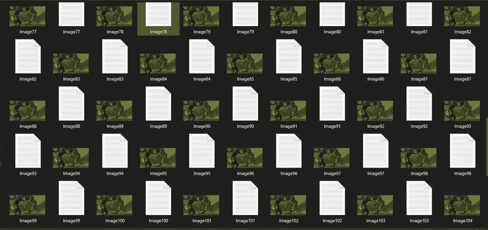
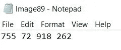

# 为卷积神经网络从视频生成图像的标记数据集第 2 部分:使用 SIFT-OpenCV 的自动标记

> 原文：<https://medium.com/analytics-vidhya/generating-a-labeled-data-set-of-images-from-a-video-for-convolutional-neural-networks-part-2-859cc4337568?source=collection_archive---------27----------------------->

# 介绍

在我之前的帖子中，我们看到了如何使用 ffmpeg 裁剪视频并从中提取图像，然后手动添加标签。然而，有时没有足够的时间来手动检查和标记所有生成的图像，或者甚至在第一时间等待从视频生成图像。

如果我们愿意为我们的模型牺牲一些精度点，我们可以使用 OpenCV 库中的尺度不变特征变换(SIFT)算法来自动化整个数据生成过程。SIFT 所做的是，它获取应该在图像中找到的对象的模板，并扫描给定的图像，以便定位该对象的位置。

SIFT 是一种机器学习算法，工作起来可能会很慢。然而，它在从视频或图像中检测相对静态或轻微变形的对象时非常精确。在本教程中，我们将看到如何使用 SIFT 为我们的学习模型生成数据集。

# 到代码上

我假设您已经下载了 Anaconda 并安装了 OpenCV，因为在这里我们将直接进入代码。我会给你一步一步的方法解释每个代码片段做什么。

首先，我们导入必要的包。请使用 OpenCV 的 3.4.2.16 版本，以便给定的模板匹配代码正常工作，因为无论出于什么原因，我们代码的某些元素在这个版本之后的版本中不受支持。

接下来，我们将输入模板图像并初始化 SIFT。这是我们将要使用的模板图像。警告:这是游戏《辐射 4》中的怪物。不要惊慌。还有，强烈推荐游戏！

我们漂亮的模板

现在，我们已经加载了模板图像，可以开始使用了。接下来，我们加载我们的视频，我们想要逐帧扫描来寻找模板。如果需要的话，我们还可以获得视频的外观尺寸以备将来使用。

现在我们要定义一个函数来完成整个模板匹配。本质上，我们将使用一种叫做“特征匹配和单应性”的东西来检查模板图像中值得注意的特征，并试图找到这些特征在视频帧中出现的位置。

我对《辐射 4》游戏视频片段执行了这段代码，它生成了一组图像。这是其中一个的样子。

检测到模板

一系列生成的图像

现在我们已经有了模板匹配，我们可以开始生成标签了。在大多数情况下，标签需要图像中检测矩形的(左上 x，左上 y)和(右下 x，右下 y)坐标。这最终是 SIFT 算法的主要目的——让我们知道找到模板匹配的图像区域的坐标。

现在剩下的就是编写代码，将坐标写入与相应图像同名的文本文件。

这里是所有相应的生成标签:-

图像和标签

每个标签文件都有这样的内容:-

一个生成的标签

现在你知道了！一个完全自动化的方法来生成图像和标签，同时输入到您的 CNN。