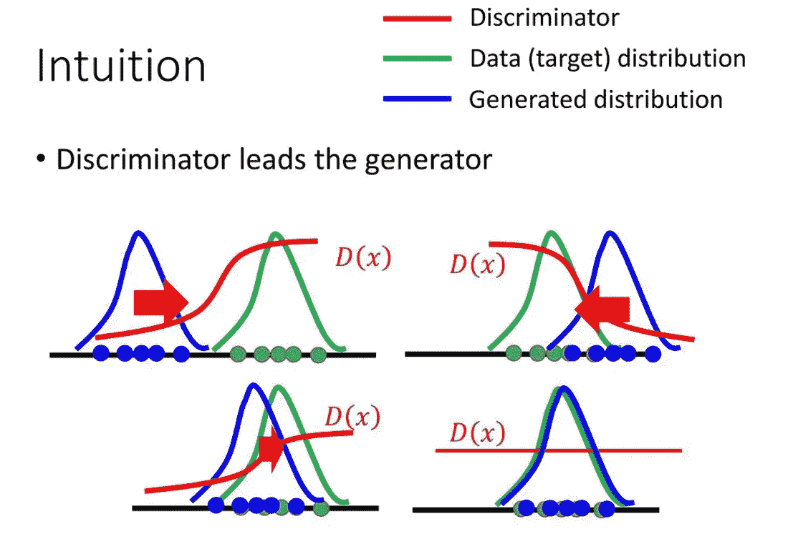
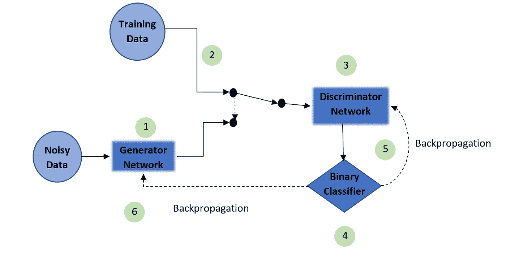
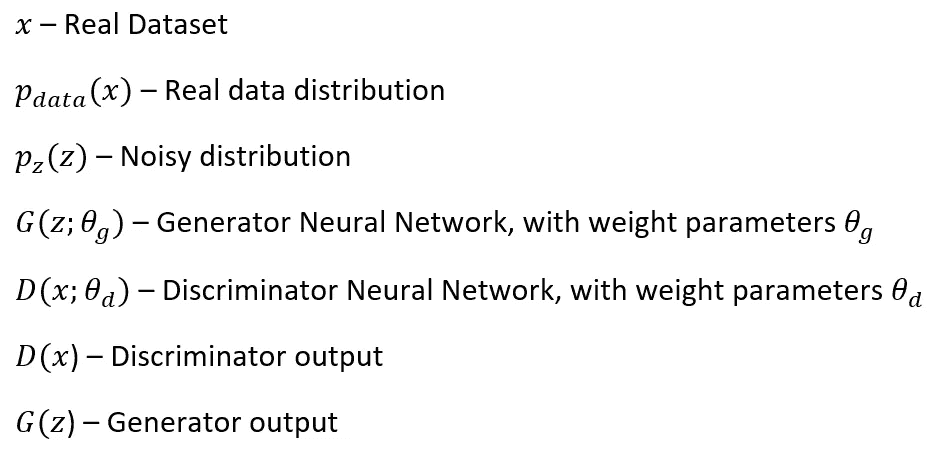
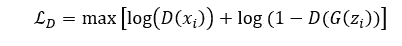
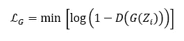
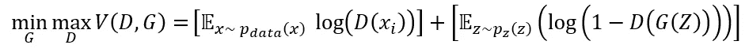
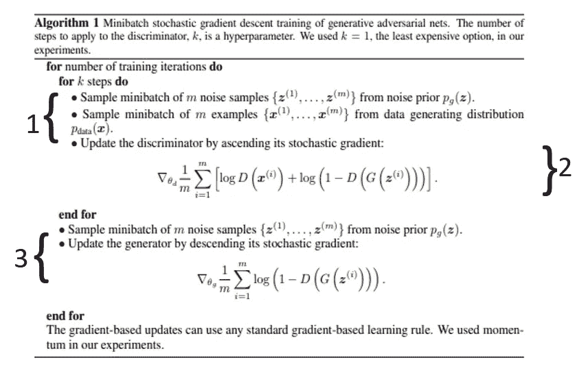

# 使用 GANs 生成徽标—第 1 部分

> 原文：<https://medium.com/analytics-vidhya/generating-app-icons-using-gans-4966f539783?source=collection_archive---------12----------------------->

# 1.介绍

说白了，一般的对抗性网络(GANs)都很难。一旦你完成了在详细数学的沼泽中导航，你就必须克服 TensorFlow 产生的神秘错误信息，这些信息就像你的 GAN 将产生的第一批图像一样有意义。但是这本身并不是不研究它们的充分理由，只需看看图 1 中已经完成的工作:

**图****1**:style gan 2[1]生成的人脸集合

事实上，这种数学、软件和数据科学的完美结合促使我个人将我的论文项目聚焦于它们。具体来说，我们能创造一个数据驱动的方法来设计一个标志吗？接下来的一系列博客文章将会关注这个问题。具体来说，我们将深入探讨:

1)数据清理和预处理

2)数据建模(实际的 GAN 部分)

3)模型评估

4)模型部署(为了不侵犯任何版权，我可能不得不考虑省去这一部分)

你会注意到我实际上直到第二阶段才开始关注实际的实现，我强烈推荐查看[迭戈的精彩博客](/ai-society/gans-from-scratch-1-a-deep-introduction-with-code-in-pytorch-and-tensorflow-cb03cdcdba0f)【2】。这对我很有帮助，我希望对你也是如此😊。

我对这一系列博客文章的期望是一步一步地详细描述上面概述的过程，其详细程度是一篇论文或一篇博客文章所不能达到的。希望它能启发其他酷项目，促进对一组酷算法的讨论，帮助其他陷入类似问题的人，或者三者兼而有之。这第一个作为香草甘斯的介绍，所以我相信我们都在同一页上。更复杂的实现已经被设计出来，我们将在以后的文章中讨论。

为了保持简洁，我将假设一些关于一般机器学习(ML)概念的现有领域知识，而不是关于 GANs 或一般图像处理的假设。如果我认为某个主题需要一些读者可能没有的背景阅读，我会留下一个链接来稍微探讨一下这个主题。

# 2.为什么是图标？

这个问题域的选择是在一个项目之后受到启发的，在那个项目中，我和我的团队当时的任务是为我们选择的业务域创建一个数据驱动的方法。我们选择了应用程序设计，具体来说，一个应用程序的哪些功能对应着更高的受欢迎程度？我们能根据这些特征预测应用程序的受欢迎程度吗？

在数据探索阶段，我们根据应用的受欢迎程度对其进行了细分。我们发现，除了补充其目标受众和应用环境之外，更受欢迎的应用在彩色内容方面有更活跃的应用图标。**令人震惊😱**。

我们将此归因于应用市场中的广大开发者，从业余爱好者到大公司，他们可能会资助整个团队进行应用图标设计。因此，我对这个项目的主要期望是有一个平台，不管可用的资金如何，都可以最大限度地减少花在设计图标上的时间。反过来，有希望有更多的时间让设计师专注于他们各自产品或服务的其他方面。

# 3.甘斯简介

这将有助于在高层次上介绍 gan，并逐渐深入到低层次的复杂性。从运营角度理解 GANs 的一个奇妙类比是伪币类比，由最初的 GANs 论文的作者提出[3]。

考虑一组伪造者试图制造假币。自然地，伪造者想让他们的假币尽可能地令人信服，这样他们就可以实际使用它。除了我们有另一个团队，警察，他们的目标是检测所说的假币。在第一种情况下，由于伪造者相对缺乏经验，货币很容易被检测为假币。沮丧的伪造者对他们的货币进行改进，只是为了让警察再次发现他们的假币。如此往复，直到我们到达一个点，对警察来说，假币现在实际上与真币无法区分。

这个简单的比喻浓缩了甘氏的精髓！我们有一个生成器(我们的伪造者团队)和一个鉴别器(我们的警察)锁定在一个游戏中。鉴别者正在寻找真的(真正的货币)和生成的(假的货币)之间的区别。相反，生成器的目标是在数据集的分布上迭代地校准自己，以使鉴别器确信其生成的输出确实是真实的数据集。迭代地应用，生成器将已经学习到真实数据集的最优分布，使得鉴别器不再能够区分生成器输出的分布与真实数据集的分布。图 2 给出了这个核心概念的可视化演示。

**图**图像的功劳归于[4]

# 4.氮化镓的结构

在讨论理论之前，我想先看看这个迭代过程是如何实现的，使用一个普通 GAN 的一般结构组件的视觉效果。

**图** **3** :通用 GAN 的结构部件

使用图 3，首先要注意的是生成器和鉴别器是神经网络。两者中最常用的网络是卷积神经网络(CNN)，这是由于 GANs 在图像处理问题中的流行。现在，我们可以假设它们都由一个标准的多层感知器来表示，因为这是它们在第一篇论文中是如何实现的。此外，两个节点之间的虚线表示某种切换。

有了这个基础，我们可以继续分阶段理解迭代过程:

1)首先对噪声分布进行采样，并将其馈入发电机网络，然后该网络给出相应的输出

2)然后获取训练数据的批量样本，其也不必是图像

3)鉴别器网络将发生器输出向量或来自训练数据样本的向量作为输入。它具有分类所需的概率输出。

4)鉴别器然后使用最后一点中概述的概率进行二元分类，关于数据的实例是从训练数据中采样的还是实际上是来自生成器的输出向量。

5)然后将反向传播应用于鉴别器。**注意**步骤 3-5 实际上被循环了几次**独立于发电机**。

6)最后，一旦我们退出所述循环，我们将反向传播应用于发电机网络。

# 5.GANs 的理论实现

第 5 节的符号

使用上面的符号，我们可以转移到如何在较低的层次上实现 GANs。直觉上，我们希望训练鉴别器来完善区分两种不同分布的艺术。因此，我们可以设计鉴别器的损失函数，使得正确识别属于真实分布的数据实例的概率最大化:

我们同时训练我们的生成器来最小化鉴别器检测到属于错误分布的实例的概率。我们可以用类似的方式来表示我们是如何做鉴别器的:

这两个网络将相互进行对抗游戏，因此我们在所有数据实例中结合这两个网络(通过取期望值),得到我们的价值函数:

既然我们已经完成了正式的定义，我们可以开始回顾训练 GAN 的实际过程(图 4)。我将算法分解成了各自的关键步骤，以使讨论更容易一些，参考图 3 应该也有帮助。

**图 4** :训练 GAN 的算法

**第一步**:

我们从它们各自的分布中获得数据的小批样本。请注意，噪声分布的性质并没有受到太多的重视。一个好的选择是均匀分布或高斯分布。

**第二步**:

接下来，我们通过反向传播和**梯度上升来更新我们的鉴别器参数，**记住，这里我们想要最大化我们正确识别属于真实数据集的实例的概率。我们使用发电机网络的损失函数的梯度向量来更新鉴别器的权重和偏差。注意 for 循环是如何嵌入的，生成器更新不是在这一步，而是在第 3 步。

**第三步**:

最后，我们使用从生成器的损失函数获得的梯度向量来更新我们的生成器参数。然而，这一次我们正在降低成本曲线，因为我们希望将甄别器检测到虚假数据样本的概率降至最低。

# 6.结论:

总之，这是一系列博客文章中的第一篇，将详细介绍我尝试创建和部署一个能够生成新徽标的模型的经历，希望这对徽标设计师有用。将讨论作为实践/理论考虑结果的代码和设计选择，完整的代码将逐步发布到我的 GitHub。

最后，我希望你们都喜欢阅读这篇文章，就像我喜欢写它一样。请继续关注我剩下的帖子，但最重要的是祝你有美好的一天！

# 7.参考资料:

[1] Karras，t .等.分析和改善 stylegan 的图像质量。来自:[https://arxiv.org/abs/1912.04958](https://arxiv.org/abs/1912.04958)

[2]莫斯克拉，D. (2018)甘斯从无到有 1:深度介绍。用 PyTorch 和 TensorFlow 的代码。*中等*。【在线】。可从:[https://medium . com/ai-society/gans-from-scratch-1-a-deep-introduction-with-code-in-py torch-and-tensor flow-CB 03 CDC DBA 0f](/ai-society/gans-from-scratch-1-a-deep-introduction-with-code-in-pytorch-and-tensorflow-cb03cdcdba0f)

[3] Goodfellow，I .等人(2014)。生成对抗网络。在:*辊隙*。[在线]可从以下网址获得:[https://papers . nips . cc/paper/5423-generative-adversarial-nets . pdf](https://papers.nips.cc/paper/5423-generative-adversarial-nets.pdf)

[4]史密斯，S. (2019) *提高生成对抗网络(GAN)* 。可在:[https://slideplayer.com/slide/12699282/](https://slideplayer.com/slide/12699282/)