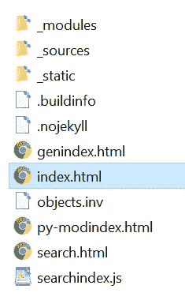

# 用 Sphinx 为 Python 程序生成自动文档

> 原文：<https://medium.com/analytics-vidhya/generating-auto-documentation-for-python-programs-with-sphinx-2093b6aa9784?source=collection_archive---------7----------------------->

作为一个希望提高我的 python 技能集并记录源代码以遵循良好实践的人，我偶然发现了 Sphinx，并为同船的人设置了这个指南，用 6 个步骤记录源代码。

我正在使用我在这篇[文章](/@pranavkapur/automating-python-unit-testing-using-travis-ci-be4fc965c1c0)中谈到的同一个 Python 程序来运行使用 Travis CI 和 GitHub 库的自动化测试，可以在这里[找到](https://github.com/prkapur/arithmetic/tree/development)

第一步:*皮普安装斯芬克斯*

第 2 步: *sphinx-quickstart* 带您完成一系列步骤，其中大多数非常简单。我选择将源代码和构建目录放在同一个文件夹中。

步骤 3:确保生成了 Makefile 和 windows 命令文件，

这就创建了一个类似这样的目录结构。

第 4 步:打开 conf.py 和 index.rst 文件进行一些修改。取消 conf.py 中第 15、16、17 行的注释，并编辑绝对路径。

在 index.rst 中，添加 automodule 并将其指向包含该模块的目录，在我的例子中是 src . algorithm，并将 autofunction 指向算术模块中的算术类。

步骤 5:运行 make html 命令来生成 html 文档，

可以在 docs\_build\html\目录下找到。选择 index.html

文件，看起来像这样。单击 source 将显示该方法的代码。

这只是一个开始，使用 Sphinx 还可以做更多的事情。点击查看斯芬克斯[。](https://www.sphinx-doc.org/en/master/usage/quickstart.html)