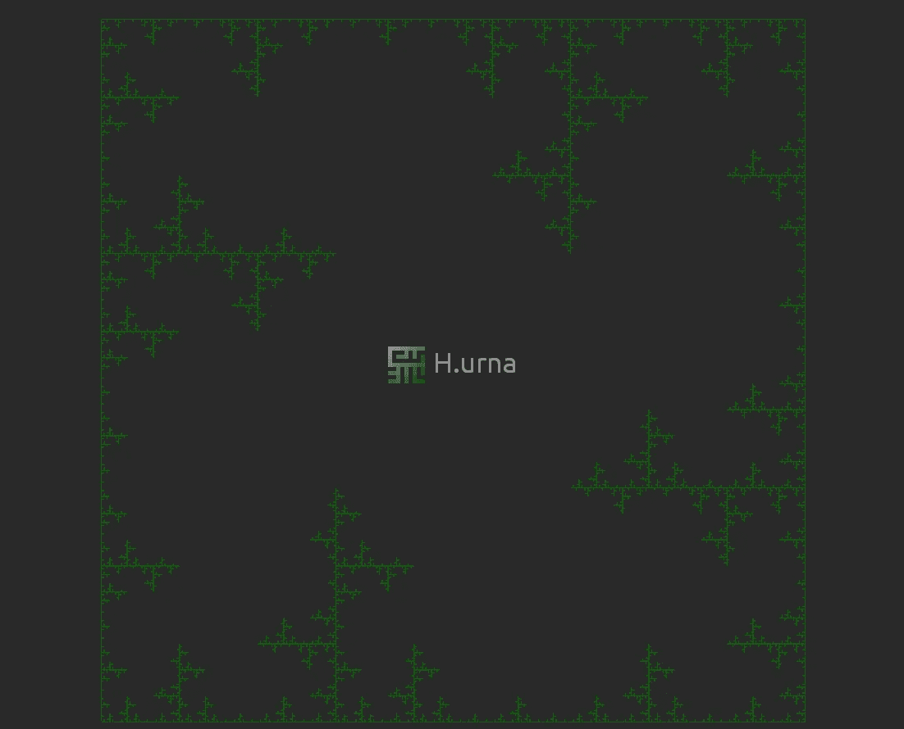
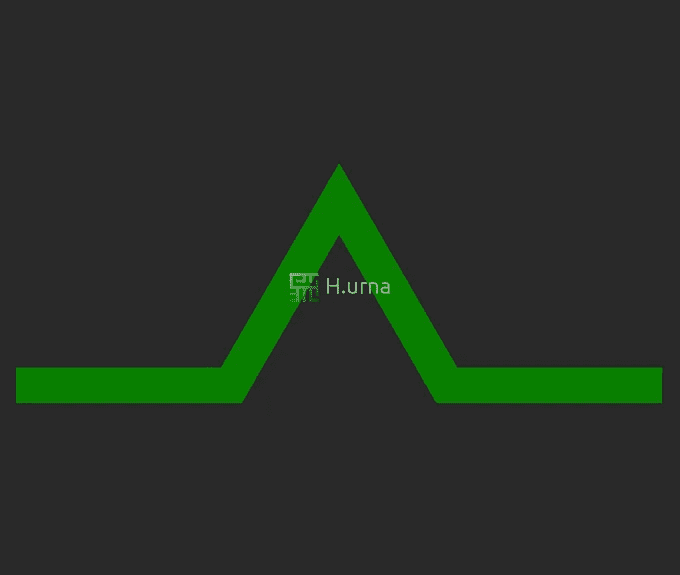

# 使用 Lindenmayer 系统生成分形

> 原文：<https://medium.com/analytics-vidhya/generating-fractals-using-lindenmayer-systems-6214dddbe223?source=collection_archive---------0----------------------->


# 描述

1968 年，匈牙利植物学家 Aristid Lindenmayer 开发了一个基于语法的系统来模拟植物的生长模式。最初，**L-系统**(linden Mayer 系统的简称)被设计用来提供简单多细胞有机体发展的正式描述，同时说明植物细胞之间的邻近关系。后来，这个系统被扩展到描述高等植物和复杂的分支结构。

植物生长的逼真建模对生物学、物理学以及计算机图形学都有很高的价值(例如，视频游戏正在使用并仍在使用它来改善植物/森林的渲染)。

我们将看到它是如何工作的，并用它们来生成各种递归分形图案。它们非常有趣，因为它们为**跟踪分形结构**提供了一种机制，而分形结构需要复杂和多面的产生规则。



# 如何构建

# 作文

让我们快速看一下 L 系统的组成，它涉及四个主要组件:

*   **字母:**包含可管理的有效符号。例如，我们可以说字母表是{'F '，' X '，' Y'}，这意味着这三个字符**中的任何一个都可以根据规则**进行替换。
*   **常量:**不会被替换的符号。大多数时候常量至少包含**！**、**、**、**、**、 **+** 、—(参照目视判读)，用于图形指令。
*   **公理:**公理描述了系统的**初始状态**(迭代 0 时)。例如，它可以是“F”、“FX”、“F-F-F”或其他任何值。
*   **规则:**规则简单来说就是**一个以符号为参数**的变换。这些规则依次应用于公理的每个符号，然后在每次迭代中反复应用。如果我们采用“A → AB”规则:每当在当前状态中发现一个“A”符号，它就被替换为“AB”。

我们现在已经具备了构建一个简单示例的所有条件；让我们来研究林登迈耶最初用于模拟藻类生长的系统。

# 例子

*   **字母表:** A，B
*   **常量:** *无*
*   **公理:** A
*   **规则:** (A → AB)，(B → A)

系统从公理“A”开始(迭代 0 ),有两个结果，一个用于 A，一个用于 B；看看前五次迭代:

*   迭代 0 : A
*   迭代 1 : AB
*   迭代 2 : AB A
*   迭代 3 : AB A AB
*   迭代 4 : AB A AB AB A


对于第一次迭代，我们简单地为 A 应用第一个规则。在第二次迭代中，我们必须为 A 和 B 应用规则，等等。等等。
**导数呈指数增长**因为在每次迭代中，一个字母经常被两个或更多的字母代替。

# 伪代码

```
string LSystem(axiom, rules, depth)
{
  string production; // For each iteration:
  for (auto level = 0; level < depth; ++level)
  {
    // Initialize production to empty string at each iteration
    production = ''; // Iterate over each symbols/characters of the current axiom
    for (auto symbol = axiom.begin(); symbol < axiom.end(); ++symbol)
    {
      // Transform it if a rule applies
      if (rules.has(symbol))
        production += rules.get(symbol);
      // Add it without change otherwise
      else
        production += symbol;
    } // Update the axiom to its new content
    axiom = production
  } return production;
}
```

L 系统规则的**递归性质**导致**自相似性**，从而**类分形形式**。
现在，让我们看看那些字符串是如何变成曲线的描述的！

# 视觉表现

递归 L 系统，如上所述，经常产生错综复杂的模式，这些模式在多个尺度上是自相似的。

> 人类几乎不可能从一长串符号中直接感知这些图案。与许多类型的数据一样，图形表示可能会暴露它们。

最常见的表示 L 系统的图形方式是基于**海龟解释**(作为 LOGO 编程，一种非常古老的[1967]用海龟教授计算机科学的孩子友好的方式)，通过**在笛卡尔平面**中命令海龟来绘制。

> 想象一只乌龟坐在你的电脑屏幕上，你可以对它发出一系列命令:前进、左转、右转、画线等等。

现在，我们可以**将每个符号关联到一个命令**；以下字典通常用于 L 系统:

*   **F** :向前划一条线(演示默认方向向东前进)
*   **G** :向前移动(不划线)
*   **+** :左转(一定角度)
*   **-** :右转(一定角度)
*   **[** :推送当前位置
*   **】**:弹出位置

# 例子

我们来解读一下**旋转 90 度**和**开始朝北**的字符串 **F — F — F — F** 。虽然你已经可以想象出最后的画了，但这是乌龟画的:


> ！是时候产生一个分形了！

# 可视化分析

我们将逐步创建一个**科赫三角形**分形(如上所述)。

*   **字母表:** F
*   **角度转:**60°
*   **常量:**无
*   **公理:** F
*   **规则:** F → F+F — F+F



1.第一次迭代是公理‘F’:
-向前画

*2。然后线“F”(公理)按照规则
F→F+F—F+F:
--“F”:向前画
-“+”:向左转 60°
--“F】:向前画
-“-”:向右转 120°(x2)
--“F”:向前画
-“+”:向左转 60°
-“F”:向前画*

3.再一次:在每一个片段上应用规则。同样的主题以较小的规模重复出现。

4.深度为 4 的“科赫三角形”分形，但我们可以继续无限细化分形。

让自己试一试吧！(在线演示)

# l 系统类型

我们在这里已经看到了最简单的 L-系统来处理；然而，更先进的系统是存在的，并且可能被建造。以下是可能使用的不同类型的列表:

*   **确定性上下文无关系统或 D0L-系统:**如果每个符号恰好有一个产生式规则，那么称 L-系统是确定性的。如果每个产生式规则只涉及一个单独的符号，而不涉及它的邻居，那么 L-系统就是上下文无关的。
*   **随机上下文无关系统(context-free System)或 S0L-Système** 如果一个符号有几个产生式规则以一定概率被选择，那么它就是随机 L 系统。
*   **上下文敏感系统，IL-系统，或(k，l)-系统:**上下文敏感语法不仅查看它所修改的符号，还查看它之前和/或之后出现的符号
*   **参数 L-系统:**在参数文法中，字母表中的每个符号都有一个与之相关联的参数列表。一个符号和它的参数列表被称为一个模块，参数语法中的一个字符串是一系列模块。