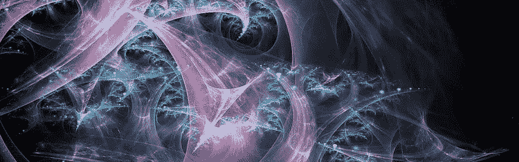

# 用递归生成分形:Python 和 Processing.py 版

> 原文：<https://medium.com/analytics-vidhya/generating-fractals-with-recursion-python-and-processing-py-edition-d788d32a5e5d?source=collection_archive---------8----------------------->

*在 github.com/robotgyal/generating-fractals-with-recursion***找到文章的所有代码、图片和文档。**

*为了让你在这里成功，你要么对递归、分形感兴趣，要么对用代码制作的酷图像感兴趣。我的目标是在我们的旅程结束时让你对以上所有内容感兴趣。*