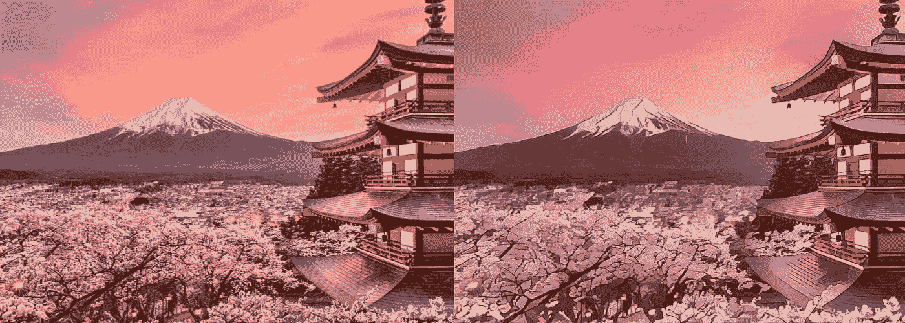

# 使用 GANs 的艺术风格图像卡通化

> 原文：<https://medium.com/analytics-vidhya/generating-japanese-style-animation-using-deep-learning-not-cyclegans-or-neural-style-transfer-1b48faeba931?source=collection_archive---------9----------------------->

原创(左)与卡通化(右)

# **简介:**

最近，《 [***学习使用白盒卡通表示法***](https://openaccess.thecvf.com/content_CVPR_2020/papers/Wang_Learning_to_Cartoonize_Using_White-Box_Cartoon_Representations_CVPR_2020_paper.pdf) 》的论文由 UTokyo，Style2Paints 研究员，Jinze Yu 发表在 **CVPR2020** 上，其结果令人震惊，它胜过了像 **CycleGANs，神经风格转移**等技术。可以清楚的看到上面的**结果**。