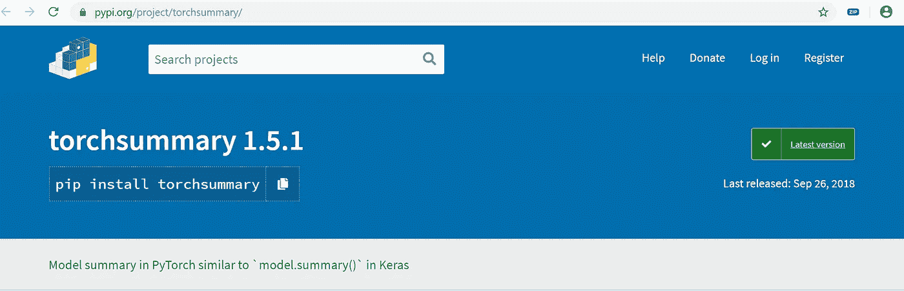

# 在 PyTorch 中生成类似模型摘要的 Keras

> 原文：<https://medium.com/analytics-vidhya/generating-keras-like-model-summary-in-pytorch-110cb37c2cc1?source=collection_archive---------4----------------------->


[Webaroo.com.au](https://unsplash.com/@webaroo?utm_source=medium&utm_medium=referral)在 [Unsplash](https://unsplash.com?utm_source=medium&utm_medium=referral) 上拍照

如果你是一个热情的 keras 用户，并且最近正在迁移到 PyTorch，我敢肯定你会错过很多 Keras 的功能。向[致敬](https://www.google.com/search?safe=strict&client=ubuntu&hs=eGg&channel=fs&sxsrf=ACYBGNSBLhLecE1T_PCvNeejWDadspbuow:1572002688856&q=Fran%C3%A7ois+Chollet&stick=H4sIAAAAAAAAAONgVuLVT9c3NMwwSk_Lys4oXMQq6FaUmHd4eX5msYJzRn5OTmoJAEyaoxIlAAAA&sa=X&ved=2ahUKEwjCo-uuprflAhUNUI8KHV6bCVgQmxMoATAkegQIDRAL)为[干杯](https://keras.io/)。

其中一个令人惊奇的特性是使用 Keras model.summary()快速获得模型摘要，并立即理解您开发的架构

```
from keras.datasets import mnist
from keras.models import Sequential
from keras.layers import Dense, Dropout, Flatten
from keras.layers import Conv2D, MaxPooling2Dmodel = Sequential()
model.add(Conv2D(32, kernel_size=(3, 3),
                 activation='relu',
                 input_shape=input_shape))
model.add(Conv2D(64, (3, 3), activation='relu'))
model.add(MaxPooling2D(pool_size=(2, 2)))
model.add(Dropout(0.25))
model.add(Flatten())
model.add(Dense(128, activation='relu'))
model.add(Dropout(0.5))
model.add(Dense(num_classes,activation='softmax'))model.summary()_________________________________________________________________
Layer (type)                 Output Shape              Param #   
=================================================================
conv2d_4 (Conv2D)            (None, 222, 222, 32)      896       
_________________________________________________________________
conv2d_5 (Conv2D)            (None, 220, 220, 64)      18496     
_________________________________________________________________
max_pooling2d_1 (MaxPooling2 (None, 110, 110, 64)      0         
_________________________________________________________________
dropout_1 (Dropout)          (None, 110, 110, 64)      0         
_________________________________________________________________
flatten_1 (Flatten)          (None, 774400)            0         
_________________________________________________________________
dense_10 (Dense)             (None, 128)               99123328  
_________________________________________________________________
dropout_2 (Dropout)          (None, 128)               0         
_________________________________________________________________
dense_11 (Dense)             (None, 10)                1290      
=================================================================
Total params: 99,144,010
Trainable params: 99,144,010
Non-trainable params: 0
_________________________________________________________________
```

上面的片段来自 Keras，我们可以看到我们可以多么容易地看到输出形状和参数数量的整个模型摘要。

PyTorch 中有类似的功能吗？？？是的。！！

这是第八届火炬节图书馆



**安装**

安装非常简单

```
pip install torchsummary
```

**使用火炬摘要**

```
summary(model,input_shape)
```

让我通过一个例子来说明，为了进行说明，我将导入一个在 [ImageNet](http://www.image-net.org/) 数据集上训练的预训练 [Alexnet](https://papers.nips.cc/paper/4824-imagenet-classification-with-deep-convolutional-neural-networks.pdf) 模型

```
from torchvision import models
from torchsummary import summary# import the pretrained alexnet
model = models.alexnet(pretrained=True)
summary(model,(3,224,224))# And you should see something like this
----------------------------------------------------------------
        Layer (type)               Output Shape         Param #
================================================================
            Conv2d-1           [-1, 64, 55, 55]          23,296
              ReLU-2           [-1, 64, 55, 55]               0
         MaxPool2d-3           [-1, 64, 27, 27]               0
            Conv2d-4          [-1, 192, 27, 27]         307,392
              ReLU-5          [-1, 192, 27, 27]               0
         MaxPool2d-6          [-1, 192, 13, 13]               0
            Conv2d-7          [-1, 384, 13, 13]         663,936
              ReLU-8          [-1, 384, 13, 13]               0
            Conv2d-9          [-1, 256, 13, 13]         884,992
             ReLU-10          [-1, 256, 13, 13]               0
           Conv2d-11          [-1, 256, 13, 13]         590,080
             ReLU-12          [-1, 256, 13, 13]               0
        MaxPool2d-13            [-1, 256, 6, 6]               0
          Dropout-14                 [-1, 9216]               0
           Linear-15                 [-1, 4096]      37,752,832
             ReLU-16                 [-1, 4096]               0
          Dropout-17                 [-1, 4096]               0
           Linear-18                 [-1, 4096]      16,781,312
             ReLU-19                 [-1, 4096]               0
           Linear-20                 [-1, 1000]       4,097,000
================================================================
Total params: 61,100,840
Trainable params: 61,100,840
Non-trainable params: 0
----------------------------------------------------------------
Input size (MB): 0.57
Forward/backward pass size (MB): 8.31
Params size (MB): 233.08
Estimated Total Size (MB): 241.96
----------------------------------------------------------------
```

**带 Cuda**

如果您有 cuda，您可能需要将您的模型导出到 cuda，如果您得到如下所示的运行时错误

```
model = models.alexnet(pretrained=True)
summary(model,(3,224,224))RuntimeError: Input type (torch.cuda.FloatTensor) and weight type (torch.FloatTensor) should be the same#instead do thismodel = models.alexnet(pretrained=True)
model.cuda()
summary(model,(3,224,224))----------------------------------------------------------------
        Layer (type)               Output Shape         Param #
================================================================
            Conv2d-1           [-1, 64, 55, 55]          23,296
              ReLU-2           [-1, 64, 55, 55]               0
         MaxPool2d-3           [-1, 64, 27, 27]               0
            Conv2d-4          [-1, 192, 27, 27]         307,392
              ReLU-5          [-1, 192, 27, 27]               0
         MaxPool2d-6          [-1, 192, 13, 13]               0
            Conv2d-7          [-1, 384, 13, 13]         663,936
              ReLU-8          [-1, 384, 13, 13]               0
            Conv2d-9          [-1, 256, 13, 13]         884,992
             ReLU-10          [-1, 256, 13, 13]               0
           Conv2d-11          [-1, 256, 13, 13]         590,080
             ReLU-12          [-1, 256, 13, 13]               0
        MaxPool2d-13            [-1, 256, 6, 6]               0
AdaptiveAvgPool2d-14            [-1, 256, 6, 6]               0
          Dropout-15                 [-1, 9216]               0
           Linear-16                 [-1, 4096]      37,752,832
             ReLU-17                 [-1, 4096]               0
          Dropout-18                 [-1, 4096]               0
           Linear-19                 [-1, 4096]      16,781,312
             ReLU-20                 [-1, 4096]               0
           Linear-21                 [-1, 1000]       4,097,000
================================================================
Total params: 61,100,840
Trainable params: 61,100,840
Non-trainable params: 0
----------------------------------------------------------------
Input size (MB): 0.57
Forward/backward pass size (MB): 8.38
Params size (MB): 233.08
Estimated Total Size (MB): 242.03
----------------------------------------------------------------
```

**一个 3DCNN 模型的概要**

这里，输入形状将具有帧数的额外维度。我正在使用来自 Kensho Hara-[https://github . com/kenshohara/video-class ification-3D-CNN-py torch](https://github.com/kenshohara/video-classification-3d-cnn-pytorch)的 3D CNN ResNet 进行视频分类

它是一个 3D ResNet-18 架构，输入形状为(3，16，112，112)

```
model = generate_model(opt)
summary(model,(3,16,112,112))----------------------------------------------------------------
        Layer (type)               Output Shape         Param #
================================================================
            Conv3d-1       [-1, 64, 16, 56, 56]          65,856
       BatchNorm3d-2       [-1, 64, 16, 56, 56]             128
              ReLU-3       [-1, 64, 16, 56, 56]               0
         MaxPool3d-4        [-1, 64, 8, 28, 28]               0
            Conv3d-5        [-1, 64, 8, 28, 28]         110,592
       BatchNorm3d-6        [-1, 64, 8, 28, 28]             128
              ReLU-7        [-1, 64, 8, 28, 28]               0
            Conv3d-8        [-1, 64, 8, 28, 28]         110,592
       BatchNorm3d-9        [-1, 64, 8, 28, 28]             128
             ReLU-10        [-1, 64, 8, 28, 28]               0
       BasicBlock-11        [-1, 64, 8, 28, 28]               0
           Conv3d-12        [-1, 64, 8, 28, 28]         110,592
      BatchNorm3d-13        [-1, 64, 8, 28, 28]             128
             ReLU-14        [-1, 64, 8, 28, 28]               0
           Conv3d-15        [-1, 64, 8, 28, 28]         110,592
      BatchNorm3d-16        [-1, 64, 8, 28, 28]             128
             ReLU-17        [-1, 64, 8, 28, 28]               0
       BasicBlock-18        [-1, 64, 8, 28, 28]               0
           Conv3d-19       [-1, 128, 4, 14, 14]         221,184
      BatchNorm3d-20       [-1, 128, 4, 14, 14]             256
             ReLU-21       [-1, 128, 4, 14, 14]               0
           Conv3d-22       [-1, 128, 4, 14, 14]         442,368
      BatchNorm3d-23       [-1, 128, 4, 14, 14]             256
             ReLU-24       [-1, 128, 4, 14, 14]               0
       BasicBlock-25       [-1, 128, 4, 14, 14]               0
           Conv3d-26       [-1, 128, 4, 14, 14]         442,368
      BatchNorm3d-27       [-1, 128, 4, 14, 14]             256
             ReLU-28       [-1, 128, 4, 14, 14]               0
           Conv3d-29       [-1, 128, 4, 14, 14]         442,368
      BatchNorm3d-30       [-1, 128, 4, 14, 14]             256
             ReLU-31       [-1, 128, 4, 14, 14]               0
       BasicBlock-32       [-1, 128, 4, 14, 14]               0
           Conv3d-33         [-1, 256, 2, 7, 7]         884,736
      BatchNorm3d-34         [-1, 256, 2, 7, 7]             512
             ReLU-35         [-1, 256, 2, 7, 7]               0
           Conv3d-36         [-1, 256, 2, 7, 7]       1,769,472
      BatchNorm3d-37         [-1, 256, 2, 7, 7]             512
             ReLU-38         [-1, 256, 2, 7, 7]               0
       BasicBlock-39         [-1, 256, 2, 7, 7]               0
           Conv3d-40         [-1, 256, 2, 7, 7]       1,769,472
      BatchNorm3d-41         [-1, 256, 2, 7, 7]             512
             ReLU-42         [-1, 256, 2, 7, 7]               0
           Conv3d-43         [-1, 256, 2, 7, 7]       1,769,472
      BatchNorm3d-44         [-1, 256, 2, 7, 7]             512
             ReLU-45         [-1, 256, 2, 7, 7]               0
       BasicBlock-46         [-1, 256, 2, 7, 7]               0
           Conv3d-47         [-1, 512, 1, 4, 4]       3,538,944
      BatchNorm3d-48         [-1, 512, 1, 4, 4]           1,024
             ReLU-49         [-1, 512, 1, 4, 4]               0
           Conv3d-50         [-1, 512, 1, 4, 4]       7,077,888
      BatchNorm3d-51         [-1, 512, 1, 4, 4]           1,024
             ReLU-52         [-1, 512, 1, 4, 4]               0
       BasicBlock-53         [-1, 512, 1, 4, 4]               0
           Conv3d-54         [-1, 512, 1, 4, 4]       7,077,888
      BatchNorm3d-55         [-1, 512, 1, 4, 4]           1,024
             ReLU-56         [-1, 512, 1, 4, 4]               0
           Conv3d-57         [-1, 512, 1, 4, 4]       7,077,888
      BatchNorm3d-58         [-1, 512, 1, 4, 4]           1,024
             ReLU-59         [-1, 512, 1, 4, 4]               0
       BasicBlock-60         [-1, 512, 1, 4, 4]               0
        AvgPool3d-61         [-1, 512, 1, 1, 1]               0
           Linear-62                  [-1, 400]         205,200
           ResNet-63                  [-1, 400]               0
================================================================
Total params: 33,235,280
Trainable params: 33,235,280
Non-trainable params: 0
----------------------------------------------------------------
Input size (MB): 2.30
Forward/backward pass size (MB): 133.72
Params size (MB): 126.78
Estimated Total Size (MB): 262.80
----------------------------------------------------------------
```

我希望这篇文章有用！！

在那之前，继续学习！继续探索神经元！