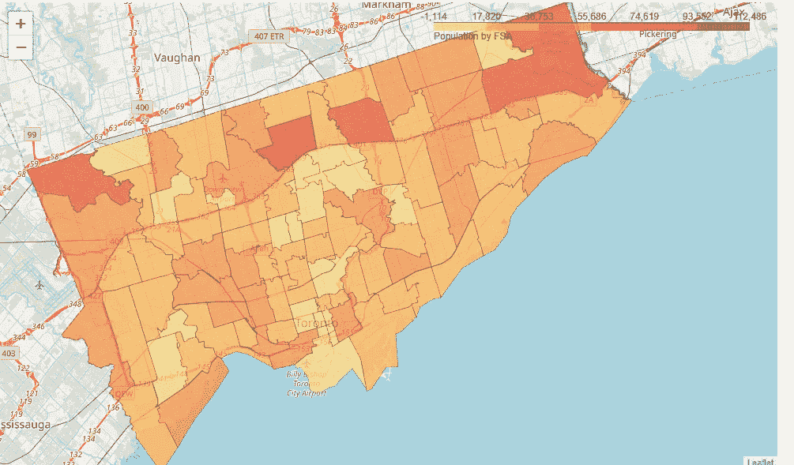
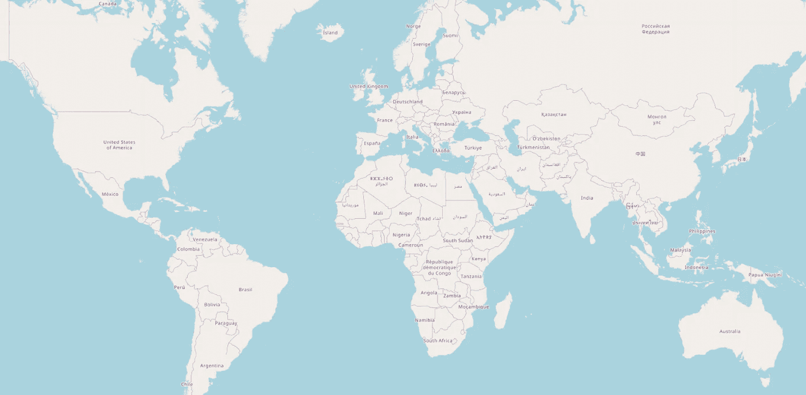
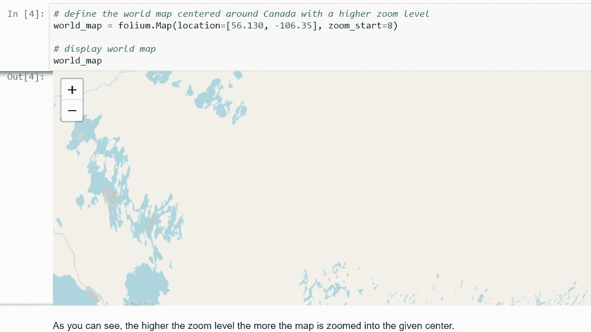
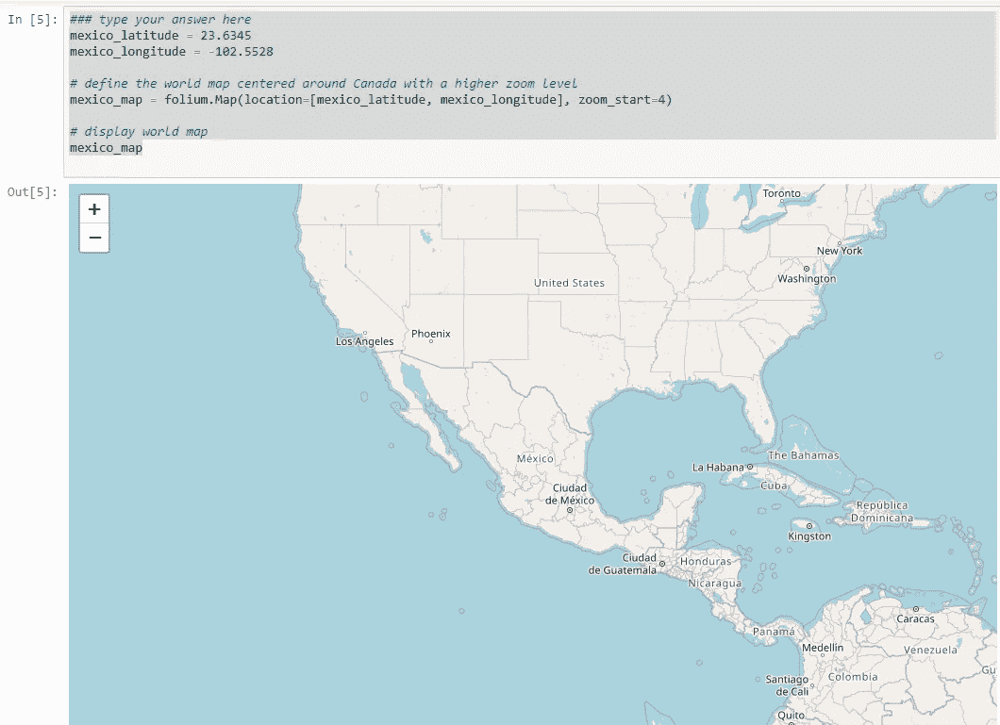
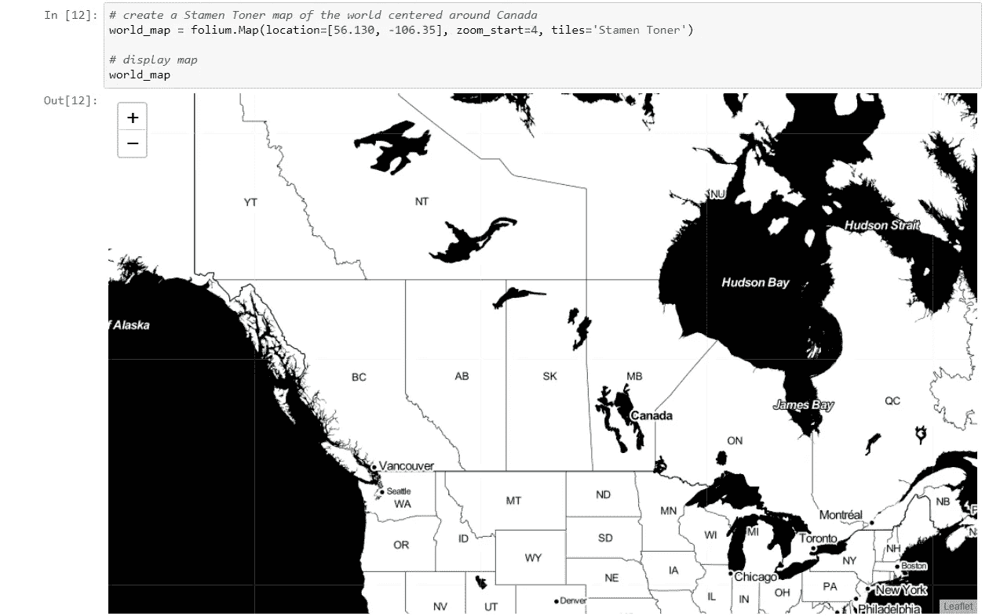
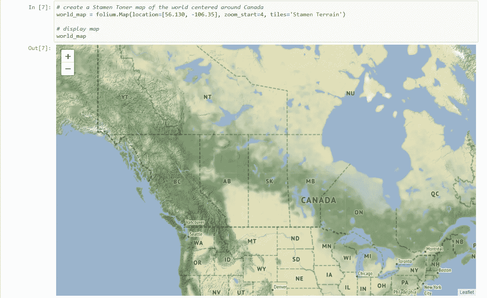

# 用 Python 生成地图:“叶子介绍”——第 1 部分

> 原文：<https://medium.com/analytics-vidhya/generating-maps-with-python-an-introduction-to-folium-part-1-9f254e5bd4c6?source=collection_archive---------8----------------------->



图片来源:[介质](/dataexplorations/map-this-comparing-choropleth-maps-in-folium-and-tableau-public-9c15f09f5e79)

# **简介**

> 在这个博客中，你将学习如何为不同的目标创建地图。为此，我们将与 Matplotlib 分道扬镳，使用另一个 Python 可视化库，即 ***叶子*** 。关于*的好处在于它是为可视化地理空间数据的唯一目的而开发的。虽然其他库也可用于可视化地理空间数据，如 ***Plotly*** ，但它们可能会限制您在一个定义的时间范围内可以调用多少 API。*则完全免费。**

# ****目录****

**第一部分。叶子介绍**

**第二部分。带标记的地图**

**第三部分。Choropleth 地图**

# ****第 1 部分——叶子介绍****

> **“follow 是一个强大的 Python 库，可以帮助您创建多种类型的传单地图。事实上，follow 结果是交互式的，这使得这个库对于仪表板的构建非常有用。”**

**从官方的 leav 文档页面:**

1.  **Folium 建立在 Python 生态系统的数据优势和 **Leaflet.js** 库的映射优势之上。在 Python 中处理您的数据，然后通过 leav 在活页地图上将其可视化。**
2.  **Folium 使得在交互式**活页地图**上可视化用 Python 处理的数据变得容易。它既可以将数据绑定到 choropleth 可视化地图，也可以将 **Vincent/Vega** 可视化地图作为标记进行传递。**
3.  **该库具有来自 **OpenStreetMap** 、 **Mapbox** 和 **Stamen** 的多个内置 tileset，并支持带有 Mapbox 或 **Cloudmade API** 键的自定义 tileset。Folium 支持 **GeoJSON** 和 **TopoJSON** 覆盖图，以及将数据绑定到这些覆盖图，以使用颜色-brewer 配色方案创建 **choropleth 地图**。**

> ****现在，让我们安装叶子****

```
****!conda install -c conda-forge folium=0.5.0 --yes
import folium****
```

**在*叶子*中生成世界地图很简单。你只需创建一个*叶子* **贴图**对象，然后显示它。叶子地图的吸引力在于它们是交互式的，所以不管初始缩放级别如何，你都可以放大到任何感兴趣的区域。**

```
**# define the world map
**world_map = folium.Map()**# display world map
**world_map****
```

****

> **现在，让我们创建一个以加拿大为中心的地图，并使用缩放级别来查看它如何影响渲染的地图。**

```
**# define the world map centered around Canada with a low zoom level
**world_map = folium.Map(location=[56.130, -106.35], zoom_start=4)**# display world map
**world_map****
```

****

```
****mexico_latitude = 23.6345 
mexico_longitude = -102.5528**# define the world map centered around Canada with a higher zoom level
**mexico_map = folium.Map(location=[mexico_latitude, mexico_longitude], zoom_start=4)**# display world map
**mexico_map****
```

****

**一个**叶子**的另一个很酷的特性是你可以生成不同的地图样式，如下所示:**

*****1。雄蕊调色图。*****

*****2。雄蕊地形图。*****

**让我们分别来了解一下。**

## ****A .雄蕊调色图****

> **这些是高对比度的 B+W(黑白)地图。它们非常适合数据混搭和探索河流蜿蜒和沿海地区。**

**现在，让我们创建一个缩放级别为 4 的加拿大雄蕊调色剂地图。**

```
**# create a Stamen Toner map of the world centered around Canada
**world_map = folium.Map(location=[56.130, -106.35], zoom_start=4, tiles='Stamen Toner')**# display map
**world_map****
```

****

# **B.雄蕊地形图**

> **这些是以山丘阴影和自然植被颜色为特色的地图。它们展示了双车道道路的高级标签和线条综合。**

**现在，让我们创建一个缩放级别为 4 的加拿大雄蕊地形图。**

```
**# create a Stamen Toner map of the world centered around Canada
**world_map = folium.Map(location=[56.130, -106.35], zoom_start=4, tiles='Stamen Terrain')**# display map
**world_map****
```

****

# **感谢观看**

**更多此类内容[点击此处](/@kalamanoj989)**