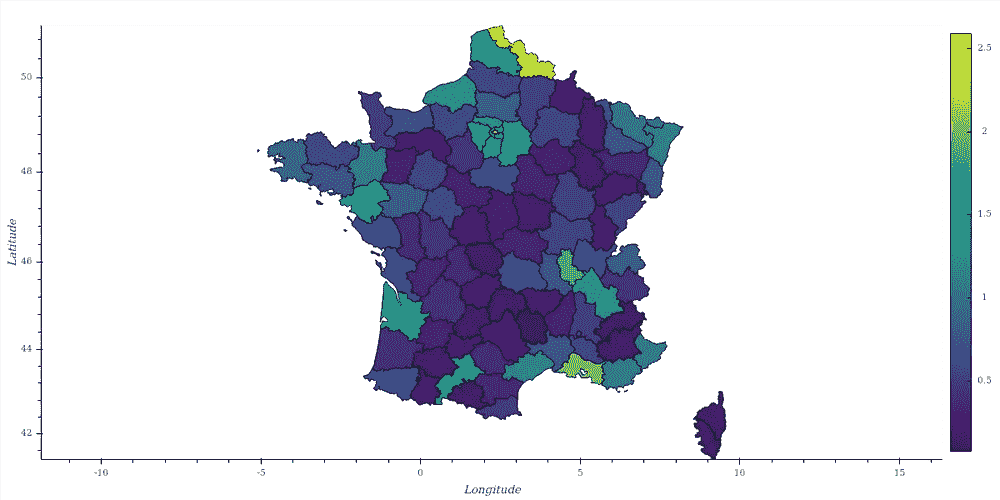

# 用 Python 生成地图:“Choropleth 地图”——第 3 部分

> 原文：<https://medium.com/analytics-vidhya/generating-maps-with-python-choropleth-maps-part-3-f361bd02b334?source=collection_archive---------17----------------------->

# Choropleth 地图

> ***Choropleth*** 地图是一种专题地图，其中的区域按照地图上显示的统计变量(如人口密度或人均收入)的测量值成比例地进行阴影化或图案化。***choropleth*地图提供了一种简单的方法来可视化一个地理区域的测量值是如何变化的，或者它显示了**的等级…