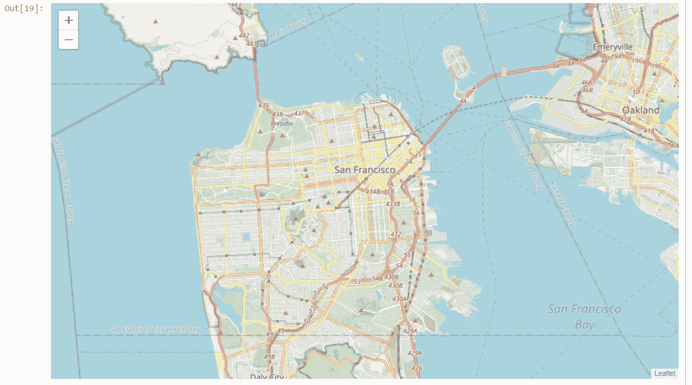

# 用 Python 生成地图:“带标记的地图”——第 2 部分

> 原文：<https://medium.com/analytics-vidhya/generating-maps-with-python-maps-with-markers-part-2-2e291d987821?source=collection_archive---------5----------------------->


作者图片

# 带标记的地图

让我们使用 **pandas** `read_csv()`方法下载并导入警察局事件的数据。

> 下载数据集并读入**熊猫**数据帧:

```
**df_incidents = pd.read_csv('**[**https://s3-api.us-geo.objectstorage.softlayer.net/cf-courses-data/CognitiveClass/DV0101EN/labs/Data_Files/Police_Department_Incidents_-_Previous_Year__2016_.csv'**](https://s3-api.us-geo.objectstorage.softlayer.net/cf-courses-data/CognitiveClass/DV0101EN/labs/Data_Files/Police_Department_Incidents_-_Previous_Year__2016_.csv')**)****print('Dataset downloaded and read into a pandas dataframe!')**
```

> 让我们看看数据集中的前五项。

```
**df_incidents.head()**
```


所以每一行由 13 个特征组成:
1。**事件编号**:事件编号
2。**类别**:犯罪或事件的类别
3。**描述**:犯罪或事件的描述
4。 **DayOfWeek** :事件发生的那一周的某一天
5。**日期**:事件发生的日期
6。时间:事件发生的当天的时间。警察局辖区 8。**决议**:根据犯罪者是否被捕来解决犯罪问题。9。**地址**:距离事件发生地最近的地址
10。 **X** :案发地点的经度值
11。 **Y** :案发地点的纬度值
12。**位置**:经纬度值
13 的元组。 **PdId** :警察部门 Id

> 让我们看看数据集中有多少条目。

```
**df_incidents**.shape
```

*(150500，13)*

所以这个数据框架包含了 150，500 起犯罪，发生在 2016 年。以便降低计算成本。

> 让我们只处理这个数据集中的前 100 个事件。

```
# get the first 100 crimes in the df_incidents dataframe
**limit = 100
df_incidents = df_incidents.iloc[0:limit, :]**
```

> 现在我们把数据简化了一点，让我们想象一下这些犯罪发生在旧金山的什么地方。我们将使用默认样式，并将缩放级别初始化为 12。

```
# San Francisco latitude and longitude values
**latitude = 37.77
longitude = -122.42**# create map and display it
**sanfran_map = folium.Map(location=[latitude, longitude], zoom_start=12)**# display the map of San Francisco
**sanfran_map**
```



> 现在让我们把犯罪地点叠加到地图上。在**叶子**中的方法是创建一个具有自己特征和风格的**特征组**，然后将其添加到 **sanfran_map** 中。

```
#instantiate a feature group for the incidents in the dataframe**incidents = folium.map.FeatureGroup()**#loop through the 100 crimes and add each to the incidents feature group**for lat, lng, in zip(df_incidents.Y, df_incidents.X):
 incidents.add_child(
 folium.features.CircleMarker(
 [lat, lng],
 radius=5, # define how big you want the circle markers to be
 color=’yellow’,
 fill=True,
 fill_color=’blue’,
 fill_opacity=0.6
 )
)**# add incidents to map
**sanfran_map.add_child(incidents)**
```


您还可以添加一些弹出文本，当您将鼠标悬停在标记上时会显示这些文本。

> 让我们将鼠标悬停在每个标记上时，显示犯罪的类别。

```
# instantiate a feature group for the incidents in the dataframe
**incidents = folium.map.FeatureGroup()**# loop through the 100 crimes and add each to the incidents feature group**for lat, lng, in zip(df_incidents.Y, df_incidents.X):
 incidents.add_child(
 folium.features.CircleMarker(
 [lat, lng],
 radius=5, # define how big you want the circle markers to be
 color=’yellow’,
 fill=True,
 fill_color=’red’,
 fill_opacity=0.6
   )
 )**# add pop-up text to each marker on the map
**latitudes = list(df_incidents.Y)
longitudes = list(df_incidents.X)
labels = list(df_incidents.Category)****for lat, lng, label in zip(latitudes, longitudes, labels):
 folium.Marker([lat, lng], popup=label).add_to(sanfran_map)** 
# add incidents to map
**sanfran_map.add_child(incidents)**
```


这真的很酷吗？现在，您可以知道每个标记处发生的犯罪类别。

如果您发现地图上的所有标记都很拥挤，有一个解决这个问题的方法:

1.  正确的补救方法是将标记分组到不同的簇中。然后，每个聚类由每个邻域中的犯罪数量表示。这些集群可以被认为是旧金山的小块区域，您可以单独对其进行分析。

> 为了实现这一点，我们首先实例化一个 **MarkerCluster** 对象，并将 dataframe 中的所有数据点添加到该对象中。

```
**from folium import plugins**# let’s start again with a clean copy of the map of San Francisco
**sanfran_map = folium.Map(location = [latitude, longitude], zoom_start = 12)**# instantiate a mark cluster object for the incidents in the dataframe
**incidents = plugins.MarkerCluster().add_to(sanfran_map)**# loop through the dataframe and add each data point to the mark cluster
**for lat, lng, label, in zip(df_incidents.Y, df_incidents.X, df_incidents.Category):
 folium.Marker(
 location=[lat, lng],
 icon=None,
 popup=label,
 ).add_to(incidents)**# display map
**sanfran_map**
```


请注意，当你一直缩小时，所有标记都被分组到一个集群中，**全球集群**，由 **100 个标记**或**犯罪**组成，这是我们数据框中的犯罪总数。一旦你开始放大，**全局集群**将开始分解成**更小的集群**。一直放大会产生单独的标记。

# 感谢观看

欲了解更多此类内容，请点击此处